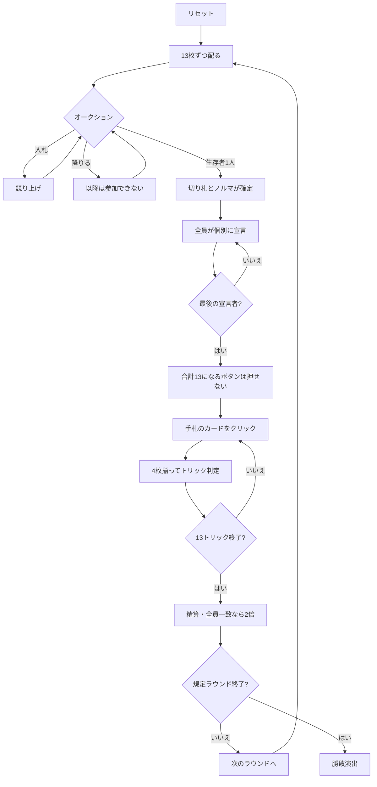

# イスラエリホイスト（Web版）遊び方

## ゲーム概要

イスラエル発祥の競り型トリックテイキング。52枚を4人に13枚ずつ配る**個人戦**です。**入札が2段階あります**——まずオークションで切り札と最低ノルマを競り落とし、そのあと落札者を含む**全員が改めて自分の目標トリック数を宣言**します。落札者が買うのは「契約」ではなく「切り札を選ぶ権利」です。

## 起動方法

```sh
go run ./cmd/trumpcards web  # CLI経由でWebサーバーを起動
go run ./cmd/server          # 直接Webサーバーを起動
```

ブラウザで `http://localhost:8080` にアクセスし、ナビゲーションバーから「イスラエリホイスト」を選択します。
ナビバーのJA/ENボタンで日本語・英語を切り替えられます。

## ルール

- **52枚**、**4人個人戦**、13枚ずつ
- **1段階目（オークション）**: 「n トリック + 切り札スート」で競り上げる。最低は **5**。競り上げは「数が上」または「同数でスートが上」で、スートの序列は **♣ < ♦ < ♥ < ♠**。降りたら戻れず、**誰も入札しないまま最後の1人になったら降りられません**
- **2段階目（宣言）**: 落札者から順に、**全員が改めて** 0〜13 を宣言する。**落札者はノルマ以上**、**最後の宣言者は合計13になる数を選べません**
- 得点: 的中 **+(宣言² + 10)**、0宣言の的中は **+25**、外しは **-(10 × 過不足)**
- **全員的中／全員外しは、どちらも2倍**（発動したラウンドの終了時に専用のバナーが出ます）
- フォロー義務あり。切り札 > リードのスート > その他
- 規定ラウンド（既定4）を終えた時点の累計得点が最も高い人の勝ち

> 得点表は出典が割れるため、写さずに一貫した形を選んでいます。

## ゲームの流れ



## 画面の操作方法

| 操作 | 説明 |
|------|------|
| 入札ボタン（数×スート） | オークションで「n トリック + 切り札」を宣言する |
| 降りるボタン | オークションを降りる（**降りられないときは表示されません**） |
| 宣言ボタン（0〜13） | 目標トリック数を宣言する（**ノルマ未満と禁止値は押せません**） |
| 手札のカードをクリック | そのカードを出す（出せる札だけ押せます） |
| 次のラウンドへボタン | ラウンド終了後、次のラウンドを配る |
| ヒントボタン | 入札・宣言、または打つべき札を提示する |
| ギブアップボタン | 投了する |
| リセットボタン | 確認ダイアログのうえで最初からやり直す |
| CLI トグル | 同じゲームをコマンド入力で操作するモードに切り替える |

**押せない宣言は最初から無効になります。** 落札者のノルマ未満と、合計が13になる値はサーバが必ず拒否するためです。

## 画面構成

- **上部**: ラウンド数、トリック数、オークションの最高入札または確定した切り札
- **得点帯**: 的中が2乗で跳ねること、全員一致で2倍になること
- **中央上**: 各プレイヤーの立場（落札／降り／入札中）、宣言、獲得数、累計得点
- **中央**: 現在のトリック
- **下部**: 自分の手札。**フォロー義務を満たす札だけ**に印が付きます

## 遊び方のコツ

- **競り落とすのは切り札を選ぶ権利。** 長いスートがあるなら、ノルマを背負ってでも取る価値があります
- **ノルマは下限であって目標ではありません。** 落札後にそれ以上を宣言できます
- **降りるのは早いほうが安全。** 一度降りたら戻れません
- **宣言は2乗で効きます。** 7を当てれば59点、3なら19点
- **全員的中・全員外しの2倍は、他人の宣言を見てから狙えます**
