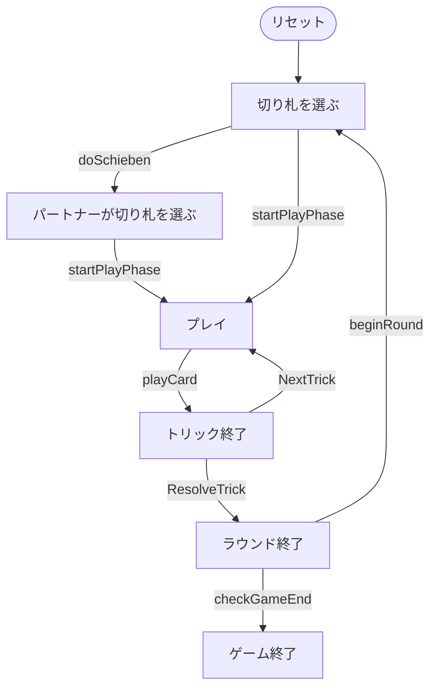

# ヤス（シーバー）（Web版）遊び方

## ゲーム概要

Jass（ヤス、Schieber＝シーバー）はスイスの国民的トリックテイキングゲームです。36枚デッキ（6〜A × 4スート）を使う4人2チーム制で、切り札のJ（Bauer＝20点）と9（Nell＝14点）を最強とする独自の得点体系で、先に1000点を取ったチームが勝利します。Web版では3つのCPUと自動的に組み合わせられ、ボタン操作でビッドとプレイができます。

## 起動方法

```sh
go run ./cmd/trumpcards web  # CLI経由でWebサーバーを起動
go run ./cmd/server          # 直接Webサーバーを起動
```

ブラウザで `http://localhost:8080` にアクセスし、ナビゲーションバーから「ヤス（シーバー）」を選択します。
ナビバーのJA/ENボタンで日本語・英語を切り替えられます。

## ルール

### 基本ルール

- プレイヤーは4人（人間1 + CPU3）。プレイヤー0と2、プレイヤー1と3が同チーム。
- 36枚デッキ（6,7,8,9,10,J,Q,K,A × 4スート）を使用。各プレイヤーに9枚配る。各ラウンドは9トリック。

### ビッド（Schieber）

フォアハンド（ディーラーの左隣）が切り札スートを選ぶか、「シーベン」してパートナーに委ねます。委ねられたパートナーは必ず切り札を選びます。

### トリックの強さ

- 切り札: J > 9 > A > K > Q > 10 > 8 > 7 > 6
- 非切り札: A > K > Q > J > 10 > 9 > 8 > 7 > 6
- リードスートに従う義務があります。フォローできない場合は任意のカード（切り札含む）を出せます。

### 得点

- 切り札: J=20, 9=14, A=11, 10=10, K=4, Q=3、それ以外0
- 非切り札: A=11, 10=10, K=4, Q=3, J=2、それ以外0
- 最終トリック +5（合計157点）
- Weis（連続・同位4枚）と Stöck（切り札 K+Q）でボーナス点

### 勝敗

各ラウンドの合計点を累計し、先に1000点（変更可）に達したチームが勝利します。

## ゲームの流れ

ゲームの進行は `internal/domain/Jass.go` のフェーズ機械そのものです。各ノードは同ファイルの `JassPhase` 定数、矢印ラベルはその遷移を行うメソッド名です。



## 画面の操作方法

- 切り札スートボタンで切り札を選択、または「シーベン」ボタンでパートナーに委譲。
- 自分の手番では、出せるカードがハイライトされます。クリックでプレイします。
- トリック終了後は「次のトリック」、ラウンド終了後は「次のラウンド」ボタンで進めます。
- 「ヒント」ボタンで推奨手を確認できます。

## 画面構成

上から順に、ページのコンポーネント構成そのままの並びです。

```
┌──────────────────────────────────────────────────┐
│  ヤス／シーバー                                         │
│  ラウンド: 1  トリック: 1  切り札: ♣（メイカー: チーム1）  チーム0: 0点  チーム1: 0点
├──────────────────────────────────────────────────┤
│  設定パネル（CPU難易度・目標点など）             │
├──────────────────────────────────────────────────┤
│  場（現在のトリック）                            │
│    CPU1 [♠A]   CPU2 [♠9]   CPU3 [♠8]             │
│  直前のトリック（勝者つき）                      │
│  ラウンド得点アナウンス（ラウンド終了時）        │
├──────────────────────────────────────────────────┤
│  メッセージ / ヒント                             │
├──────────────────────────────────────────────────┤
│  棋譜（アクションログ）                          │
├──────────────────────────────────────────────────┤
│  あなたの手札                                    │
│  [♠K][♠Q][♣Q][♣10][♥J][♥10][♥9][♥7][♦J]        │
│  [シーバー] [カードを出す] [次のトリック] [ヒント]
│  [リセット]                                      │
└──────────────────────────────────────────────────┘
```

- **ヘッダー**: ラウンド数・トリック数・切り札スートとそれを選んだチーム（メイカー）・両チームの累積点
- **設定パネル**: CPU 難易度と目標点
- **場**: 現在のトリックに出ているカードと、直前のトリック（勝者つき）
- **ラウンド得点アナウンス**: ラウンド終了時に Weis と獲得点の内訳を表示します
- **シーバー**: 切り札選択をパートナーに委ねるボタン。`bidTrump` フェーズでのみ押せます- **メッセージ / ヒント**: 直前の操作の結果と、ヒントボタンを押したときの推奨手
- **棋譜（アクションログ）**: これまでの手の履歴。折りたたみ式
- **あなたの手札**: 出せるカードだけが押せます。出せない札は淡く表示されます
- **リセット**: 新しいゲームを開始します
- **CLIモード切替**: 画面右上のトグルで、CUI 版と同じテキスト表示に切り替えられます（`CliToggle` / `CliTerminal`）
