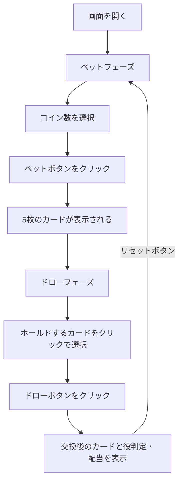

# ジョーカーポーカー（Web版）遊び方

## ゲーム概要

1人用カジノカードゲームです。53枚のトランプ（52枚+ジョーカー1枚）を使い、5枚のカードでポーカーの役を作ります。ジョーカーがワイルドカードとして扱われ、他の任意のカードの代わりになります。Joker Poker専用のペイテーブルに基づいて配当が支払われます。

## 起動方法

```sh
go run ./cmd/trumpcards web        # CLI経由でWebサーバーを起動
go run ./cmd/server                # 直接Webサーバーを起動
```

ブラウザで `http://localhost:8080` にアクセスし、ナビゲーションバーから「ジョーカーポーカー」を選択します。
ナビバーのJA/ENボタンで日本語・英語を切り替えられます。

## ルール

### 基本ルール

- 53枚のトランプ（52枚+ジョーカー1枚）を使用
- ジョーカーがワイルドカード
- 1〜5コインをベットしてゲーム開始
- 5枚のカードが配られる
- 残したいカード（ホールド）を選び、残りを交換
- 最終的な5枚の手札で役を判定し、配当を支払い

### 配当表（Joker Poker）

| 役 | 1コイン | 2コイン | 3コイン | 4コイン | 5コイン |
|----|---------|---------|---------|---------|---------|
| ナチュラルロイヤルフラッシュ | 250 | 500 | 750 | 1000 | 4000 |
| ファイブカード | 200 | 400 | 600 | 800 | 1000 |
| ワイルドロイヤルフラッシュ | 100 | 200 | 300 | 400 | 500 |
| ストレートフラッシュ | 50 | 100 | 150 | 200 | 250 |
| フォーカード | 20 | 40 | 60 | 80 | 100 |
| フルハウス | 7 | 14 | 21 | 28 | 35 |
| フラッシュ | 5 | 10 | 15 | 20 | 25 |
| ストレート | 3 | 6 | 9 | 12 | 15 |
| スリーカード | 2 | 4 | 6 | 8 | 10 |
| ツーペア | 1 | 2 | 3 | 4 | 5 |
| キングスオアベター | 1 | 2 | 3 | 4 | 5 |

### ワイルドカード

- ジョーカーは任意のカードとして扱える
- ナチュラルロイヤルフラッシュ: ワイルドなしのロイヤルフラッシュ（最高配当）
- ワイルドロイヤルフラッシュ: ジョーカーを含むロイヤルフラッシュ
- ファイブカード: ジョーカーを使って同じランク5枚

### キングスオアベター

- K、Aのワンペア以上が配当の最低条件
- Q以下のワンペアは配当なし（ツーペアは配当あり）

## ゲームの流れ



## 画面の操作方法

### ベットフェーズ

1. **コイン数選択**: コインセレクター（1〜5）でベット額を設定
2. **「ベット」ボタン**: クリックでベットを確定し、5枚のカードが配られる

### ドローフェーズ

1. **カード選択**: ホールドしたいカードをクリックして選択（選択したカードはハイライト表示）
2. **再クリック**: 選択を解除
3. **「ドロー」ボタン**: ホールドしていないカードを交換し、役を判定

### 結果フェーズ

1. 最終的な5枚のカードと役名が表示されます
2. 配当額が表示されます
3. **「リセット」ボタン**: 新しいラウンドを開始
4. **「棋譜を見る」ボタン**: アクションログを表示

### キーボードショートカット

| キー | アクション | 有効条件 |
|------|-----------|---------|
| `b` | ベット | ベットフェーズのみ |
| `d` | ドロー | ドローフェーズのみ |
| `r` | リセット | 結果フェーズのみ |
| `1`〜`5` | 各カードのホールド切替 | ドローフェーズのみ |

※ テキスト入力欄にフォーカスがある場合、ショートカットは無効になります。

## 画面構成

```
┌────────────────────────────────────────────┐
│           チップ: 100                       │
├────────────────────────────────────────────┤
│  配当表                                     │
│  ナチュラルロイヤルフラッシュ 250 500 750 1000 4000 │
│  ...                                       │
│  キングスオアベター          1   2   3   4    5    │
├────────────────────────────────────────────┤
│                                            │
│  [♠A] [★JK] [♦K] [♣3] [♠J]             │
│  HOLD  HOLD  HOLD                          │
│                                            │
│  スリーカード  配当: 6                       │
├────────────────────────────────────────────┤
│  [ドロー] [棋譜を見る]                      │
└────────────────────────────────────────────┘
```

## 遊び方のコツ

- 5コインベットでナチュラルロイヤルフラッシュの配当が大幅に増える（250→4000）ため、可能なら最大ベットがお得
- ジョーカーは常にホールドする
- ジョーカーを持っている場合、スリーカード以上を狙いやすい
- ジョーカーなしの場合はキングスオアベター（K以上のペア）が最低配当条件なので注意
- ツーペアも配当があるため、ペアが2つある場合はホールドする
