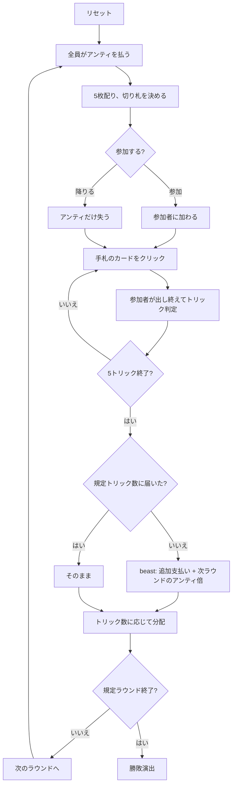

# フレペ（Web版）遊び方

## ゲーム概要

スペインで遊ばれる**ポット式**トリックテイキング（ラムス系）。**3〜5人**という可変人数が特徴で、ピケット32枚から5枚ずつ配る。毎ラウンド、手札を見て**参加するか降りるか**を選ぶ。降りれば失うのはアンティだけ。**参加して規定トリック数に届かないと「beast」となり、ポットへ追加で支払ったうえ、次ラウンドのアンティが倍**になる。規定トリック数は**参加人数で変わる**（5トリックを参加者で割った切り上げ）ので、何人が残るかまで読むのがこのゲームの勘所。

## 起動方法

```sh
go run ./cmd/trumpcards web  # CLI経由でWebサーバーを起動
go run ./cmd/server          # 直接Webサーバーを起動
```

ブラウザで `http://localhost:8080` にアクセスし、ナビゲーションバーから「フレペ」を選択します。
ナビバーのJA/ENボタンで日本語・英語を切り替えられます。

## ルール

- **ピケット32枚**を **3〜5人**（既定4人）に**5枚ずつ**。1ラウンド5トリック
- 配り切ったあとの**1枚が切り札**を決める
- ラウンド開始時に全員が**3チップ**をポットへ
- 手札を見て**参加（in）か降りる（out）**かを選ぶ。参加者だけでトリックを戦う
- **切り札が最強**、次いでリードのスート。フォロー義務あり
- **参加して規定トリック数に届かなければ「beast」**。ポットへ追加で5チップ払い、**次ラウンドのアンティが倍**になる
- 規定トリック数は参加人数で決まる: 2人なら3、3〜4人なら2、5人なら1
- トリックを取った人は**獲得数に応じてポットを分ける**
- 端数と全員降りたぶんは**次のラウンドへ持ち越し**。最終ラウンドでは配り切る
- 規定ラウンド終了時、**チップが最も多い**プレイヤーの勝ち

## ゲームの流れ



## 画面の操作方法

| 操作 | 説明 |
|------|------|
| 参加するボタン | このラウンドに参加する（配り直後のみ） |
| 降りるボタン | このラウンドは降りる（配り直後のみ） |
| 手札のカードをクリック | そのカードを出す（出せる札だけ押せます） |
| 次のラウンドへボタン | ラウンド終了後、次のラウンドを配る |
| ヒントボタン | 参加可否、または打つべき札を提示する |
| ギブアップボタン | 投了する |
| リセットボタン | 確認ダイアログのうえで最初からやり直す |
| CLI トグル | 同じゲームをコマンド入力で操作するモードに切り替える |

## 画面構成

- **上部**: ラウンド数、トリック数、**参加人数**
- **ポット表示**: 取り合っている額。参加者の追加支払いで増えます
- **切り札表示**: 表向きになった1枚。参加判断の最大の材料
- **リスク帯**: 規定トリック数と、届かなかったときに払う額・次ラウンドの倍払いの明示
- **中央上**: 各プレイヤーの持ちチップ、参加状況（未定 / 参加 / 降り）、獲得トリック数。**このラウンドの親には `親` バッジ**が付きます（参加判断もリードも親の左隣から始まります）
- **中央**: 現在のトリック
- **下部**: 自分の手札。**フォロー義務を満たす札だけ**に印が付きます

## 遊び方のコツ

- **切り札のA・Kがあれば参加してよい。** ただし免れるのは「規定トリック数」に届いたときだけ。参加者が少ないほど規定は上がります
- **切り札も平のエースも無い手は降りる。** アンティだけの損で済みます
- **人数が多いほど規定トリック数は下がる**（5人なら1）。そのぶん参加者が増えて競争は激しくなり、ポットも大きくなります
- **狙いはまず規定トリック数。** beast を避けるのが最優先です。届かないと次ラウンドの掛け金まで倍になるので、損は1ラウンドで終わりません
- **持ち越しでポットが膨らんだラウンドは参加の価値が上がる**
