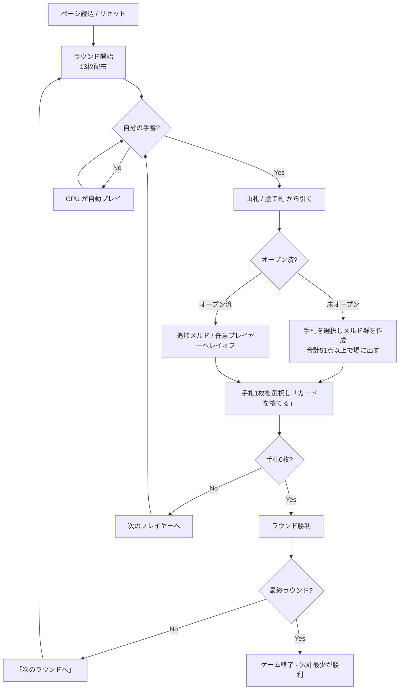

# カルーキ（Web版）遊び方

## ゲーム概要

人間1人＋CPU1〜3人（合計2〜4人）で進行するコントラクトラミー系の場メルドゲーム。山札からドローし、手札をメルド（セット／ラン）として場に出し、手札を最も早く出し切る（上がる）とそのラウンドに勝利する。各ラウンドで他プレイヤーの手札残り（デッドウッド）がペナルティとして累計に加算され、累計スコアが最も少ないプレイヤーが勝利する。

## 起動方法

```sh
go run ./cmd/trumpcards web         # CLI経由でWebサーバーを起動
go run ./cmd/trumpcards web --open  # サーバー起動 + ブラウザを開く
go run ./cmd/server                 # 直接Webサーバーを起動
```

ブラウザで `http://localhost:8080` にアクセスし、ナビゲーションバーから「カルーキ」を選択します。
ナビバーのJA/ENボタンで日本語・英語を切り替えられます。

## ルール

### 基本ルール

- 2デッキ（52枚 × 2 = 104枚）にジョーカー2枚を加えた106枚を使用。
- 初期配布: 各プレイヤーに13枚ずつ。残りは山札、最初の1枚を捨て札に。
- 各ターン: 山札 or 捨て札トップから1枚引く → 任意でメルド / レイオフ → 1枚捨ててターン終了。
- 最初に場へ出すメルドは合計が**オープン点数（既定51点）以上**である必要がある。
- オープン後は**任意のプレイヤーのメルド**にレイオフ（カード追加）できる。
- 手札を全て出し切るとそのラウンドの勝利（上がり）。

### オープン点数とジョーカーの扱い

- 場に出す最初のメルド（群）の合計点が**オープン点数（既定51点）以上**でなければオープンできない。複数メルドをまとめて出して合計を満たしてもよい。
- 得点計算の基準: A=15点、2〜9=額面、10/J/Q/K=10点。
- ジョーカーはワイルドカードとして使え、ジョーカーを含むメルドは合計点が**1.5倍**で評価される（ジョーカー入りメルドは価値が高い）。

### 得点

- 上がったプレイヤー: 0点。
- 他プレイヤー: 手札に残ったカード（デッドウッド）のペナルティが累計に加算（A=15、2〜9=額面、10〜K=10、ジョーカーは高ペナルティ）。
- 累計スコアが少ないほど良い。

### ゲーム終了

規定ラウンド数の終了時点で、累計ペナルティが最少のプレイヤーが勝利する。

## ゲームの流れ



## 画面の操作方法

- **設定パネル（開始前）**: プレイヤー人数（2〜4人）、オープン点数（既定51点）、CPU難易度を選んでゲームを開始する。
- **ドローフェーズ**: 「山札から引く」「捨て札を取る」のいずれかをクリック。
- **プレイフェーズ（未オープン）**:
  1. 手札からカードをクリックして選択し、メルド群を組み立てる（複数枚選択可）。
  2. 選択中のメルドの合計点がオープン点数（51点）以上かをヒント表示で確認する。
  3. 条件を満たしたら「メルドを場に出す」を押してオープンする。
  4. 不要な手札1枚を選択して「カードを捨てる」でターン終了。
- **プレイフェーズ（オープン済）**:
  - 追加メルドは手札からカードを選択 → 「メルドを場に出す」。
  - レイオフはまず**任意のプレイヤー**のメルド行をクリック → 自分の手札1枚を選択 → 「レイオフ」。
- **ラウンド終了**: 「次のラウンドへ」を押すと次のラウンドが配られる。

## 画面構成

- **画面上部**: 山札残枚数、捨て札トップ、オープン点数のヒント。
- **中段**: 各プレイヤーのメルド行（達成済みメルド一覧）。オープン済みプレイヤーには「オープン」バッジが付き、累計スコアが表示される。
- **手札エリア**: 自分の手札がカード画像で表示される。クリックで選択／解除し、メルド群を組み立てる。
- **JOKER バッジ**: ジョーカーには手札でも卓上メルドでも `JOKER` の目印が付く（ジョーカー入りメルドは1.5倍で評価されるため、見落とすと点数計算がずれる）。
- **アクションボタン**: 現在のフェーズに応じて操作可能なボタンが表示される。
- **フッター**: リセット、棋譜表示など。

## 遊び方のコツ

- オープンには51点以上が必要なため、高得点のカード（A・絵札）やジョーカー入りメルドを意識して組むとオープンしやすい。
- ジョーカー入りメルドは1.5倍評価なので、ジョーカーは積極的にオープンや高得点メルドへ活用する。
- オープン後はどのプレイヤーのメルドにもレイオフできるので、相手のメルド行も確認して手札を一気に減らす。
- 上がれない見込みのときは、A や絵札などペナルティの高いカードを早めに捨ててデッドウッドを軽くしておく。
