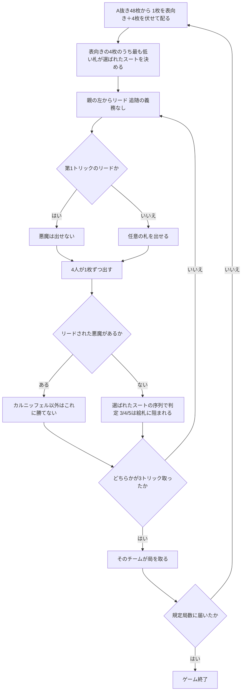

# カルニッフェル（Web版）遊び方

## ゲーム概要

**1426 年の文献に名前が残る、現存最古の名前付きカードゲーム。**ドイツ発祥の 4 人 2 対 2 のトリックテイキングで、**A を除いた 48 枚**を **1 人 5 枚**ずつ配ります。「選ばれたスート」の中だけ、通常とはまったく違う不規則な序列が生じます。

出典: [Wikipedia: Karnöffel](https://en.wikipedia.org/wiki/Karn%C3%B6ffel) ／ [pagat.com の Karnöffel 系](https://www.pagat.com/karnoeffel/)

## 起動方法

```sh
go run ./cmd/trumpcards web  # CLI経由でWebサーバーを起動
go run ./cmd/server          # 直接Webサーバーを起動
```

ブラウザで `http://localhost:8080` にアクセスし、ナビゲーションバーから「カルニッフェル」を選択します。
ナビバーのJA/ENボタンで日本語・英語を切り替えられます。

## ルール

### デッキ（**A を除いた 48 枚**）

52 枚から **A を 4 枚抜いた 48 枚**です。ドイツ式の König / Ober / Unter / Banner はフランス式の **K / Q / J / 10** に対応します。**A が無いことが平スートの序列の前提**なので、A を残したままでは成り立ちません。

### 配り方と「選ばれたスート」

**1 人 5 枚**です。**最初の 1 枚だけを各自の前に表向きに置き、残り 4 枚を伏せて配ります。**

そして **表向きになった 4 枚のうち最も低い札**が、この局の「選ばれたスート」を決めます。山からめくるのではなく、**配られた札そのものが決める**のがこのゲームの形です。

（48 ÷ 4 = 12 でちょうど配り切ってしまうので、「12 枚ずつ配って最後の 1 枚をめくる」ことは物理的にできません。）

### 選ばれたスート内の序列（**ここが本題**）

| 順位 | 札 | 呼び名 | 備考 |
|---|---|---|---|
| 1 | **J** | **カルニッフェル** | **全札に勝つ** |
| 2 | **7** | **悪魔** | **リードされたときだけ**カルニッフェル以外に勝つ |
| 3 | 6 | 法王 | |
| 4 | 2 | 皇帝 | |
| 5 | 3 | オーバーシュテッヒャー | **K には負ける** |
| 6 | 4 | ウンターシュテッヒャー | **K・Q には負ける** |
| 7 | 5 | ファルベンシュテッヒャー | **絵札すべてに負ける** |
| 8〜 | K > Q > 10 > 9 > 8 | | 特権の無い切札 |

**最強はカルニッフェル、つまり J です。6 ではありません。**

### 悪魔（7）の挙動

**リードされたときだけ**、カルニッフェル以外のすべてに勝ちます。**追随して出した場合は、いちばん弱い平札にすら負けます。**さらに**第 1 トリックのリードには使えません。**

強力ですが、使いどころが 1 局に一度あるかどうかという札です。

### 部分切札（3・4・5）

「選ばれたスートを出せば平札は無力化される」という単純な話ではありません。**3 は K に、4 は K・Q に、5 は絵札すべてに負けます。**切札でありながら、格上の平札には通用しません。

### プレイ

**追随の義務はありません。**好きな札を出せます。ただし追随していない平札はトリックを取れません（切札か、リードスートに追随した札だけが争います）。

**5 トリック中 3 トリック**を先に取ったチームがその局を取ります。3 トリック取った時点で局は決まるので、5 トリック全部を打つとは限りません。

規定局数（既定 3 局）を先に取ったチームの勝ちです。



## 操作方法

| 操作 | 説明 |
|------|------|
| 手札のカードをクリック | 出す 1 枚を選びます。**押せない札があるのは、第 1 トリックのリードに悪魔が使えないときだけ**です |
| **出す** ボタン | 選択中の 1 枚を出します |
| **次の局へ** ボタン | 局の結果を読んだあと、次の局へ進みます |
| **CLI** トグル | ターミナル風の操作に切り替えます |

## 画面構成

- **ヘッダー**: 局数と選ばれたスート、そして**それがどう決まったか**の説明
- **序列**: **常時表示**。カルニッフェル・悪魔・部分切札の扱いをここで確認できます
- **スコア**: 両チームの取得局数と今局のトリック数、勝利条件
- **プレイヤー**: チーム（T0 / T1）、`[親]`、**表向きの札**、取得トリック数
- **場**: 出ている札
- **局の結果**: どちらが取ったか。**3 トリックに届かなかった場合はその旨**が出ます
- **アクションログ**: 進行を後から追えます

## 遊び方のコツ

- **カルニッフェル（J）は 1 枚だけの絶対札です。**取りたいトリックまで温存できます
- **悪魔（7）はリードして初めて働きます。**追随で出すのは捨て札と同じです。しかも第 1 トリックには使えないので、2 トリック目以降にリードを取る算段が要ります
- **3・4・5 は絵札に弱いことを忘れないでください。**「切札だから勝てる」と思って出すと、K 一枚に止められます
- **追随の義務が無いので、切札を温存しつつ捨てるのが自由です。**逆に、相手も自由に捨てられます
- **3 トリックで局が決まります。**5 トリック全部を計算に入れる必要はありません
