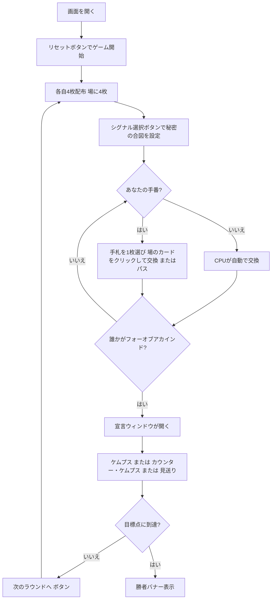

# ケムプス（Web版）遊び方

## ゲーム概要

Kemps（ケムプス）は4人を2チームに分けて遊ぶ**マッチングゲーム**です。各プレイヤーは手札4枚を持ち、毎ターン手札1枚を全員共有の**場のカード**1枚と交換しながら、同じランク4枚（**フォーオブアカインド**）を目指します。フォーオブアカインドが揃ったら、パートナーに事前に決めた**秘密のシグナル**を送り、チームで「**ケムプス！**」と宣言すると1点。相手チームがシグナルを見抜けば「**カウンター・ケムプス！**」で横取り（成功で+1点、外すと-1点）。先に5点（目標点）に達したチームの勝利です。

## 起動方法

```sh
go run ./cmd/trumpcards web  # CLI経由でWebサーバーを起動
go run ./cmd/server          # 直接Webサーバーを起動
```

ブラウザで `http://localhost:8080` にアクセスし、ナビゲーションバーから「ケムプス」を選択します。
ナビバーのJA/ENボタンで日本語・英語を切り替えられます。

## ルール

### デッキと配布

- **デッキ**: 52枚（標準デッキ）
- **プレイヤー**: 4人（あなた + CPU3人）
- **チーム**: 2チーム。偶数席（あなたと2席のCPU）がチームA、奇数席（1席・3席）がチームB。
- **配布**: 各プレイヤー4枚。場に4枚を表向きで置きます。

### 交換と宣言

- **交換フェーズ**: 手番では手札1枚を選び、場のカード1枚と交換します。交換したくなければパスもできます。フォーオブアカインドを揃えるのが目標です。
- **宣言フェーズ**: 誰かがフォーオブアカインドを揃えると宣言ウィンドウが開きます。自陣なら「ケムプス！」で得点、相手の合図を見抜いたら「カウンター・ケムプス！」で横取りを狙います。

### シグナル

- あなたの**秘密のシグナル種別**（音／瞬き）を画面下の選択ボタンで設定します。
- パートナーがフォーオブアカインドを揃えたら、このシグナルでそれを知らせる想定です。

### 勝利条件

- 先に**目標点（デフォルト5点）**に達したチームの勝利です。

### CPU難易度

- **Easy（0）**: 反応が鈍く合図を見抜きにくい。
- **Normal（1）**: 標準的な反応。
- **Hard（2）**: 反応が速く合図を見抜きやすい。

## ゲームの流れ



## 画面の操作方法

### 交換フェーズ

- あなたの手番になると、フッターの**手札4枚がクリック可能なボタン**になります。
- まず交換したい手札を**1枚クリック**して選択し（枠がハイライトされます）、次に**場のカードを1枚クリック**すると交換が実行されます。
- 交換したくない場合は「**パス（交換しない）**」ボタンを押します。

### シグナル選択

- フッターの**「あなたの秘密のシグナル」**から「音（咳払い）」または「瞬き」を選びます。選択中のボタンがハイライトされます。

### 宣言フェーズ

- 宣言ウィンドウが開くと「**ケムプス！**」ボタンと、相手各席への「**カウンター・ケムプス！**」ボタンが現れます。
- パートナーが合図しているときは「パートナーが合図を送っています！」のヒントが（あなたにだけ）表示されます。相手が合図しているかもしれないときは、控えめなヒントが表示されます。

### ラウンド終了・結果

- ラウンドが終わると「次のラウンドへ」ボタンが表示されます。
- いずれかのチームが目標点に達するとゲーム終了。勝者バナーが表示されます。

### キーボードショートカット

| キー | アクション | 有効条件 |
|------|-----------|---------|
| （なし） | マウス／タップ操作のみ | — |

## 画面構成

```
┌────────────────────────────────────────────┐
│  ケムプス           [フェーズ] [CLI切替]    │
├────────────────────────────────────────────┤
│  ラウンド 1   チームA: 0  チームB: 0  目標: 5点│
│                                            │
│  プレイヤー                                 │
│   あなた — チームA                          │
│   CPU 1 — チームB                           │
│   CPU 2 — チームA                           │
│   CPU 3 — チームB                           │
│                                            │
│  場のカード（手札選択後にクリックで交換）    │
│   [5♠] [6♥] [7♣] [8♦]                      │
├────────────────────────────────────────────┤
│  あなたの手札（クリックで選択）              │
│   [A♠] [2♥] [3♣] [4♦]                      │
│  あなたの秘密のシグナル: [音] [瞬き]         │
│  [パス] [ケムプス！] [カウンター…] [リセット]│
└────────────────────────────────────────────┘
```

- **上部バー**: ゲーム名・現在のフェーズ・CLIモード切替。
- **情報行**: ラウンド数・両チームの得点・目標点。
- **プレイヤー一覧**: 各プレイヤーの所属チームとフォーオブアカインドの状態。
- **場のカード**: 全員共有の4枚（手札を選んだ後にクリックで交換）。
- **フッター**: あなたの手札・シグナル選択・宣言／パス／次のラウンド／リセットの各ボタン。

## 遊び方のコツ

- **揃いかけを残す**: フォーオブアカインドを狙うなら、ペアになっているランクを残し、不要なカードから場に出しましょう。
- **合図を活かす**: パートナーが揃えた瞬間を逃さず、素早く「ケムプス！」を宣言しましょう。
- **相手を読む**: 相手チームの動きが怪しければカウンター・ケムプスで横取り。ただし外すと減点なので慎重に。
- **難易度で調整**: Hard のCPUは合図を見抜くのが得意です。慣れないうちは Easy で練習しましょう。
