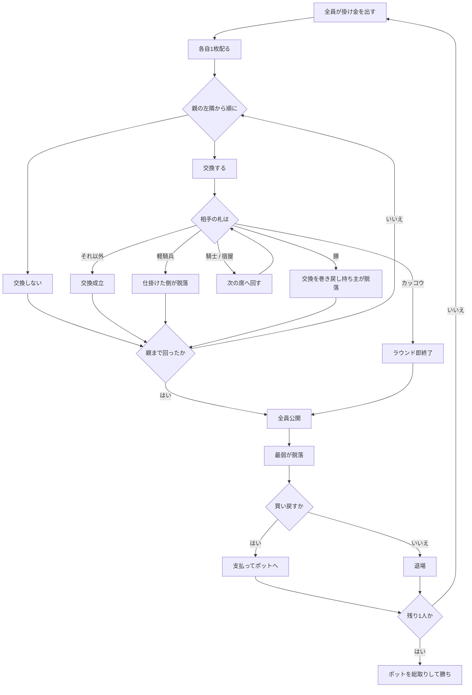

# キッレ（Web版）遊び方

## ゲーム概要

スウェーデンのカックー系ゲーム。**専用の 42 枚デッキ**（21 種 × 2 枚、スートは 1 つだけ）を使い、各自の手札はたった **1 枚**です。最後まで残った 1 人が勝ちます。

出典: [Wikipedia: Kille (card game)](https://en.wikipedia.org/wiki/Kille_(card_game))

## 起動方法

```sh
go run ./cmd/trumpcards web  # CLI経由でWebサーバーを起動
go run ./cmd/server          # 直接Webサーバーを起動
```

ブラウザで `http://localhost:8080` にアクセスし、ナビゲーションバーから「キッレ」を選択します。
ナビバーのJA/ENボタンで日本語・英語を切り替えられます。

## ルール

### デッキ

**トランプ 52 枚ではありません。**21 種類が 2 枚ずつ、合計 42 枚。**スートは 1 種類しかない**ので、強さは種類だけで決まります。

| 区分 | 種類 | 枚数 |
|---|---|---|
| 絵札（効果あり） | Harlequin, Cuckoo, Hussar, Pig, Cavalier, Inn | 6 種 |
| 数札 | 1 〜 12 | 12 種 |
| 下位札 | Wreath, Flowerpot, Mask | 3 種 |

強さは上から **Harlequin > Cuckoo > Hussar > Pig > Cavalier > Inn > 12 > … > 1 > Wreath > Flowerpot > Mask**。

### 1 ラウンドの流れ

1. 全員が掛け金を 1 口ずつポットに置きます
2. 各自 **1 枚**配られます
3. **親の左隣**から順に、**交換する**か**しない**かを選びます
4. 親まで回ったら全員が公開し、**最弱の 1 人が脱落**します

### 交換

- 交換相手は**左隣の 1 人だけ**です。拒否はできません
- **親だけは山札と交換します。**親は誰にも仕掛けられない代わりに、引いた札をそのまま受け入れます

### 絵札の 5 つの効果

**issue #4383 の記述は 2 つとも逆で、3 つが抜けています。**

| 札 | 起きること |
|---|---|
| **Cuckoo（カッコウ）** | 交換は成立せず、**その場でラウンドが終わり**全員が公開します。issue の「交換強制」は逆です |
| **Hussar（軽騎兵）** | **仕掛けた側**が脱落します |
| **Pig（豚）** | 交換が取り消され、**豚を持っていた本人**が脱落します。豚がそれまでの交換で動いていた場合、その交換も巻き戻ります |
| **Cavalier（騎士） / Inn（宿屋）** | 交換相手が**さらに次の席**へ回されます。一周して自分に戻ったら交換は成立しません |
| **Harlequin（道化）** | 拒否はできません。**表向きに交換され**、配られた／山から引いたものは**最強**、**交換で渡ってきたものは最弱**になります |

### 脱落と買い戻し

**ライフ制ではありません。**負ければ脱落し、払って戻ります。

| 回数 | 支払う額 |
|---|---|
| 1 回目 | 掛け金 1 口 |
| 2 回目 | **ポットの半分** |
| 3 回目 | **ポット全額** |

4 回目はありません。3 回使い切って脱落したらそこで退場です。

### 決着

残り 1 人になったらその人がポットを総取りして終わりです。



## 画面の操作方法

| 操作 | 説明 |
|------|------|
| **交換する** ボタン | 左隣と交換を仕掛けます（親のときは山札と交換します） |
| **交換しない** ボタン | 手札をそのまま残します |
| **買い戻す** ボタン | 脱落したあと、表示された額を払って戻ります |
| **次のラウンドへ** ボタン | 公開を読んだあと、次のラウンドを配ります |
| **CLI** トグル | ターミナル風の操作に切り替えます |

## 画面構成

- **ヘッダー**: ラウンド数、ポット、山札の残り
- **デッキ早見**: 21 種の強さ順。**単一スートなので種類だけで強さが決まります**
- **プレイヤー**: 収支、手札 1 枚、買い戻し回数。**自分の札だけが表向き**で、他家は公開まで伏せられます
- **親の印**: 親は山札と交換するため、**誰にも仕掛けられません**
- **交換の記録**: このラウンドで誰が誰に仕掛け、何が起きたか（カッコウ・軽騎兵・豚・回された、など）
- **公開**: 全員の札と、**なぜ落ちたか**（最弱／軽騎兵／豚）
- **アクションログ**: 進行を後から追えます

## カードの見た目

専用デッキなので**トランプの絵は使いません**。札は記号と名前で描かれ、**効果を持つ 5 種は色で見分けられます**。

| 札 | 色 |
|---|---|
| Harlequin | 紫 |
| Cuckoo | 青 |
| Hussar | 赤 |
| Pig | 金 |
| Cavalier / Inn | 緑 |
| そのほか | 黒 |

## 遊び方のコツ

- **数札の 6 あたりが分かれ目です。**それ以下なら交換、それ以上なら残すのが基本線です
- **交換で受け取った Harlequin は最弱です。**最強の札を引いたつもりで負けるのがこのゲームの罠です
- **仕掛けるほど絵札に当たる危険が増えます。**軽騎兵と豚は交換した側が損をします
- **親は交換を仕掛けられません。**親番のラウンドは相対的に安全です
- **3 回目の買い戻しはポット全額です。**ここまで来たら降りる判断も要ります
