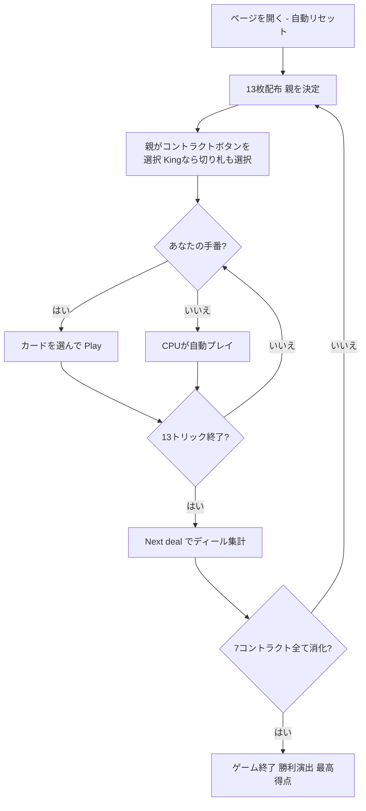

# キング（Web版）遊び方

## ゲーム概要

King（キング）はギリシャやブラジルで親しまれている**トリック回避系のコンペンディウム（複合契約）ゲーム**です。標準52枚デッキを4人（あなた＋CPU3人、個人戦）でプレイします。1マッチはちょうど**7ディール**。各ディールで**親（ディーラー）**がまだ使っていない**7つのコントラクト**の1つを選び、13トリックを**マストフォロー**で戦い、選ばれたコントラクトのルールで得点します。7つのコントラクトを1回ずつ消化した時点で、**合計点が最も高い（＝失点が最も少ない）**プレイヤーがマッチ勝利です。あなたは席0としてプレイします。

## 起動方法

```sh
go run ./cmd/trumpcards web         # CLI経由でWebサーバーを起動
go run ./cmd/trumpcards web --open  # サーバー起動 + ブラウザを開く
go run ./cmd/server                 # 直接Webサーバーを起動
```

ブラウザで `http://localhost:8080` にアクセスし、ナビゲーションバーから「キング」を選択します。
ナビバーのJA/ENボタンで日本語・英語を切り替えられます。

## ルール

### デッキと配布

- **デッキ**: 標準52枚（2〜10, J, Q, K, A × 4スート）
- **プレイヤー**: 4人（あなた = 席0、CPU1〜3）
- **配布**: 各プレイヤー13枚。ウィドウ（伏せ札）はありません。

### 親とコントラクト選択

各ディールの開始時、**親**がまだこのマッチで選ばれていない**7つのコントラクトから1つ**を選びます。Web では選択可能なコントラクトがボタンとして並び、押して確定します。コントラクト6（King）を選んだ場合のみ、続けて**切り札スート**を選びます。7ディールで7つのコントラクトを1回ずつすべて消化します。

### コントラクト一覧

| No. | コントラクト | 得点 |
|-----|--------------|------|
| 0 | No Tricks（トリックなし） | 取ったトリック1つにつき −2 |
| 1 | No Hearts（ハートなし） | 取ったハート1枚につき −2 |
| 2 | No Queens（クイーンなし） | 取ったQ1枚につき −6 |
| 3 | No King of Hearts（ハートのK） | K♥を取ると −20 |
| 4 | No Last Two Tricks（最後の2トリック） | 最後の2トリックそれぞれを取ると −10 |
| 5 | No Men（男札なし） | 取ったJまたはK1枚につき −3 |
| 6 | King（切り札） | 取ったトリック1つにつき +5（唯一のプラス契約。親が切り札を指定） |

コントラクト0〜5（6つの**マイナス契約**）はすべて**切り札なし（ノートランプ）**でプレイします。コントラクト6（King）だけが**プラス契約**で、切り札があります。

### カードの強さ・フォロー義務

- **強さ**: A > K > Q > J > 10 > 9 > … > 2。King契約では**切り札が非切り札に勝ちます**（マイナス契約は切り札なし）。
- **フォロー義務**: リードスートを持っていれば必ず従い、ボイド時は任意の札を出せます（**オーバートランプ義務なし**）。プレイ可能な札はハイライト表示されます。

### 得点計算と勝利条件

各ディール終了時、選ばれたコントラクトのルールで4人それぞれの得点を計算し累積点に加算します。マイナス契約は失点、King契約は加点です。7ディール（＝7コントラクト）すべてが終わった時点で、**累積点が最も高い**プレイヤーがマッチ勝利です。

## ゲームの流れ



## 画面の操作方法

### コントラクト選択フェーズ

親のとき（あなたが親の場合）、画面に**未使用コントラクトのボタン**が並びます。契約を選んで確定します。**King** を選んだ場合は続けて**切り札スート（♠/♥/♦/♣）**のボタンを押します。CPUが親のときは自動で選ばれます。

### プレイフェーズ

あなたの手番になると、フォロー義務を満たす**プレイ可能な札がハイライト**されます。札を選んで **「Play」** で出します。4人が出し終えると勝者が決まり、次のトリックへ進みます。

### 結果フェーズ

13トリックが終わるとディールが集計され、**「Next deal」** で次のディールへ進みます。7ディール終了で最終結果（勝利演出）が表示されます。

### キーボードショートカット

| キー | アクション | 有効条件 |
|------|-----------|---------|
| Enter | 次のトリック／ディールへ進む | 結果表示中 |

## 画面構成

```
┌────────────────────────────────────────────┐
│ ヘッダー: King  Deal 3/7  Phase  [CLI] [JA/EN] │
├───────────────┬────────────────────────────┤
│ 情報サイドバー │        中央エリア          │
│  各プレイヤー  │   現在のトリック（場札）   │
│  累積得点      │   親バッジ / コントラクト  │
│  親バッジ      │   切り札表示（King時）     │
│  コントラクト  │                            │
│  ディール結果  │                            │
├───────────────┴────────────────────────────┤
│ フッター: 手札（プレイ可能札ハイライト）     │
│  アクションボタン（Contract/Play/Next/Reset）│
└────────────────────────────────────────────┘
```

- **ヘッダー**: ゲーム名・ディール番号・フェーズ表示・CLI 切り替え・言語切り替え
- **情報サイドバー**: 各プレイヤーの累積得点・親バッジ・現在のコントラクト・切り札・ディール結果
- **中央**: 現在のトリック（場に出た札）
- **フッター**: あなたの手札（プレイ可能札がハイライト）・アクションボタン（Contract/Play/Next deal/Reset）

## 遊び方のコツ

- 親のときは、自分の手札で失点を抑えやすいコントラクトを選びましょう（ハート・Q・K♥ が少ない手ならそれらのマイナス契約、強い手なら King）。
- No Queens や No King of Hearts では、危険札（Q・K♥）を安全に押し付けるか、ボイドを作って捨てられるよう立ち回ります。
- No Tricks / No Last Two Tricks では、序盤に高い札を安全に処理してトリックを取らないようにします。
- King契約だけは発想が逆で、切り札と高ランク札で積極的にトリックを取りにいきます。
- ヒント（設定でON）は、コントラクト選択・プレイの各フェーズで推奨アクションを提示します。
