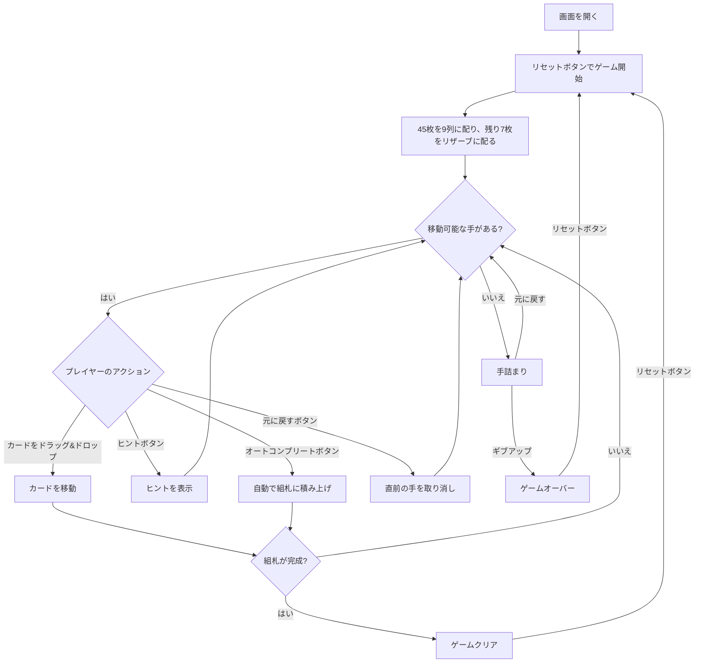

# キング・アルバート（Web版）遊び方

## ゲーム概要

1人用のソリティアカードゲームです。1デッキ（52枚）を使用し、開始時にすべてのカードを表向きで配ります。9列のオープンなタブロー（列0は1枚、列1は2枚……列8は9枚＝計45枚）に加え、**「ローレンス」と呼ばれる7枚のリザーブ**が1枚ずつ表向きで並びます。組札（ファンデーション）は最初は空で、ストックやウェイストはありません。リザーブのカードはタブローや組札へ出せますが、**一度出すと二度とリザーブには戻せません（一方通行）**。4つの組札へA→Kの順にすべて積み上げきればクリアです。

## 起動方法

```sh
go run ./cmd/trumpcards web  # CLI経由でWebサーバーを起動
go run ./cmd/server          # 直接Webサーバーを起動
```

ブラウザで `http://localhost:8080` にアクセスし、ナビゲーションバーから「キング・アルバート」を選択します。
ナビバーのJA/ENボタンで日本語・英語を切り替えられます。

## ルール

### 基本ルール

- 1デッキ（52枚、ジョーカーなし）を使用
- **組札（ファンデーション）は開始時は空**（プレイヤー自身がAを組札へ動かす）
- 45枚を9列のタブローへ表向きで配る（列Nは N+1 枚＝1,2,3,…,9）
- 残りの7枚をリザーブ（ローレンス）へ1枚ずつ表向きで配る
- 4つの組札（ファンデーション）はスート別にA→Kの順に積み上げる
- タブローでは**赤黒交互**に、ランクが1つ下のカードに重ねる（例: 黒の♠5の上に赤の♥4または♦4）
- 移動できるのは1枚ずつのみ（複数枚の同時移動は不可）
- **空の列には任意のカードを置ける**
- **リザーブは一方通行**: リザーブのカードはタブローや組札へ出せるが、リザーブへは何も戻せない

### ゲームクリア

- 4つの組札すべてにA→Kまで13枚ずつ積み上げるとゲームクリア

### ゲームオーバー

- これ以上移動可能な手がない場合は手詰まり（アンドゥやオートコンプリートで打開可能）

## ゲームの流れ



## 画面の操作方法

### カードを移動する

1. 移動元のカード（タブロー列の最上段、またはリザーブのカード）をクリックまたはドラッグして選択します
2. 移動先のカード（またはエリア）をクリックまたはドロップして移動を確定します
3. タブローへは赤黒交互で、ランクが1つ下のカードにのみ重ねられます
4. 空のタブロー列には任意のカードを置けます
5. 1枚ずつしか移動できません
6. リザーブのカードは出すだけで、リザーブへは戻せません

### アンドゥ（元に戻す）

**「元に戻す」** ボタンまたは `z` キーで直前の操作を取り消せます。何度でも元に戻せます。

### ヒント・オートコンプリート

1. **「ヒント」** ボタンをクリックすると、次に可能な手を提案します
2. **「オートコンプリート」** ボタンをクリックすると、組札に安全に移動できるカードを自動で移動します

### キーボードショートカット

ゲーム中、以下のキーボードショートカットが使用できます。

| キー | アクション | 有効条件 |
|------|-----------|---------|
| `z` | 元に戻す（アンドゥ） | プレイ中 |
| `h` | ヒント | プレイ中 |
| `a` | オートコンプリート | プレイ中 |
| `g` | ギブアップ | プレイ中 |

※ テキスト入力欄にフォーカスがある場合、ショートカットは無効になります。

## 画面構成

```
┌────────────────────────────────────────────────┐
│  手数: 5                                       │
├────────────────────────────────────────────────┤
│  リザーブ ♦7 ♣9 ... (7枚)   │  組札 ♠ ♣ ♥ ♦  │
├────────────────────────────────────────────────┤
│  9列のタブロー                                 │
│  [0][1][2][3][4][5][6][7][8]                    │
│  ...                                            │
├────────────────────────────────────────────────┤
│  [元に戻す] [ヒント] [オートコンプリート]      │
│  [ギブアップ] [リセット]                       │
└────────────────────────────────────────────────┘
```

- **リザーブ（ローレンス）**: 7枚の表向きカード（一方通行：出すだけ）
- **組札エリア**: 4つのスート別の組札（開始時は空）
- **タブロー（9列）**: オープンなカード列（すべて表向き、列Nは N+1 枚）
  - 最上段（右端）カード: クリックで選択・移動
- **ボタン**:
  - 「元に戻す」: 直前の操作を取り消す
  - 「ヒント」: 次の一手を提案
  - 「オートコンプリート」: 自動で組札へ移動
  - 「ギブアップ」: 現在のゲームを終了
  - 「リセット」: 新しいゲームを開始

## 遊び方のコツ

- まずはタブローやリザーブからAを探し出して組札へ上げ、続けてスート別の2を狙いましょう
- リザーブは戻せないので、空きタブロー列や赤黒交互の連結を活かして計画的に消化しましょう
- 空列は任意のカードを置けるため、戦略的に列を空けると非常に強い手になります
- ヒントボタンで詰まった時のアドバイスを得られます
- 手詰まりになったら「元に戻す」で戻ってリトライしましょう
