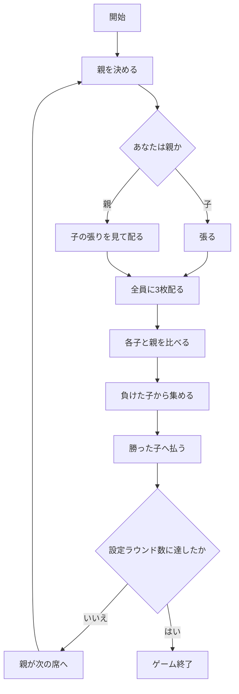

# キンゴ（Web版）遊び方

## ゲーム概要

キンゴは、株札（かぶふだ）を使う日本の勝負事です。おいちょかぶと同じ 40 枚の札を使いますが、**競うものが違います**。

- **おいちょかぶ** … 合計の**下一桁**で競う
- **キンゴ** … **同じ数字を何枚そろえたか**で競う

役の判定に合計は一切出てきません。合計が同じ 15 でも、そろえたほうが勝ちます。

親は席を順に回ります。**親は張らず、子の張りを受ける側**です。

## 起動方法

```sh
go run ./cmd/trumpcards web  # CLI経由でWebサーバーを起動
go run ./cmd/server          # 直接Webサーバーを起動
```

サーバ起動後、ブラウザで `http://localhost:8080/kingo` を開きます。

## ルール

- **株札 40 枚**（1〜10 が 4 枚ずつ）。トランプ 52 枚ではありません。
- 2〜5 席（既定 4 席）で、席 0 があなた。親は 1 ラウンドごとに席を移ります。
- 各ラウンド:
  1. **子が張ります**（既定 10 から、10 刻み）。親は張りません。
  2. 全員に **3 枚ずつ**配ります。
  3. 各子と親を 1 対 1 で比べ、精算します。
  4. 親が次の席へ移り、次のラウンドへ。
- **役**（強い順）:

  | 役 | 内容 | 配当 |
  |----|------|------|
  | 嵐 | 同じ数字 3 枚 | **3 倍** |
  | 2枚そろい | 同じ数字 2 枚 | 等倍 |
  | 役なし | そろわない | 等倍 |

- **同じ役どうしは、そろえた数字の大きいほうが勝ちます。** それも同じなら残りの札で比べます。
- **払う額は勝った側の役で決まります。** 親が嵐なら 3 倍取り、子が嵐なら 3 倍受け取ります。
- ラウンド数は**席数以上**でなければなりません（既定 10）。少ないと親を一度もやらない席が出てしまうためです。
- 設定ラウンド数を終えるか、あなたが張れなくなったら終了です。

### 配当を 3 倍にした理由

株札 40 枚から 3 枚を引いたとき、実際に出る割合はこうです。

| 役 | 通り数 | 割合 |
|----|--------|------|
| 嵐 | 40 | 0.40% |
| 2枚そろい | 2160 | 21.86% |
| 役なし | 7680 | 77.73% |

嵐は 2 枚そろいの **54 分の 1** しか出ません。同じ配当にすると「そろえに行く意味」が消えてしまうので、嵐だけ 3 倍にしています。

## ゲームの流れ



## 画面の操作方法

| 操作 | 説明 |
|------|------|
| 張り額の入力 ＋「張る」 | 子のとき、10 から 10 刻みで張ります |
| 「配る」 | 親のとき、子の張りを見てから配ります |
| 「次のラウンドへ」 | 決着後、次のラウンドを始めます |
| ヒントボタン | いまの場面の助言を表示します |
| 棋譜ボタン | これまでの行動ログを表示します |
| リセットボタン | ゲームを最初からやり直します |

**押せる手はサーバが決めています。** あなたが親か子かで求められる操作が変わるので、押せないときはボタンが出ません。

## 画面構成

- **ラウンド表示**: 何ラウンド目か / 全体で何ラウンドか
- **親の印**: そのラウンドの親の席に印が付きます
- **配当の表示**: 嵐 3 倍 / 2枚そろい 等倍。サーバが送る値をそのまま出しています
- **席の一覧**: 名前・チップ・張り額。**親の張りは空欄**です（張らないため）
- **手札と役**: **配る前は誰の手札も出ません**。キンゴに「自分だけ見える手札」はありません
- **決着**: 全員の 3 枚と役、そのラウンドの収支

## 遊び方のコツ

- **張るときは何も見えていません。** 配る前に張るので、額を決める材料はありません。手持ちに対して重すぎないかだけを考えてください。
- **親の回は受ける側です。** 張らずに、子全員を同時に相手にします。子が 3 人とも勝てば 3 人ぶん払うことになります。
- **嵐は 0.4% しか出ません。** 狙って出るものではないので、出たときの 3 倍を素直に喜ぶゲームです。
- **同じ役なら数字の大きさで決まります。** 10 のペアと 1 のペアでは勝敗が変わります。
