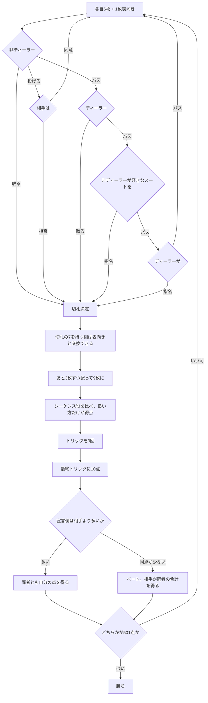

# クラバーヤス（Web版）遊び方

## ゲーム概要

**2 人用**のトリックゲーム。32 枚（7〜A）を使い、各自 **9 枚**だけ配ります。ベロート／クラベルヤス／ピノクルといったジャス系の**祖型**にあたります。

出典: [pagat.com: Clobyosh / Bela](https://www.pagat.com/jass/bela.html) ／ [Wikipedia: Klaberjass](https://en.wikipedia.org/wiki/Klaberjass)

## 起動方法

1. `go run ./cmd/trumpcards web` でサーバーを起動します
2. ブラウザで `http://localhost:8080` を開きます
3. ゲーム一覧から **クラバーヤス** を選ぶか、`/klaberjass` へ直接アクセスします

## ルール

### 配り方とビッド

1. 各自 **6 枚**（3 枚ずつ 2 回）配り、1 枚を**表向き**にします
2. **非ディーラー**が、そのスートを切札にするか決めます。断ればディーラーが決めます
3. 両者が断ったら、**表向き以外の**好きなスートを指名できます（非ディーラーから）
4. 両者がここも断ったら**配り直し**です
5. 切札が決まったら、あと **3 枚ずつ**配って **9 枚**になります

**表向きのカードは配られません。**山札の残りとあわせて、そのディールでは使いません。だから **32 枚のうち 18 枚しか場に出ません。**

### dix（切札の 7 の交換）

切札が**表向きカードのスートに決まったとき**だけ、切札の **7** を持っている側はそれを**表向きカードと交換**できます。第 2 ラウンドで別のスートが切札になった場合は交換できません。

### schmeiss（投げ）

ビッドのとき「この配りを流そう」と提案できます。

- 相手が**同意**すれば配り直し
- 相手が**拒否**すれば、**提案した側が**表向きのスートで宣言側にされます

投げ得にはなりません。

### カードの強さと点数

**切札だけ順序が違います。**J と 9 が A の上に割り込みます。

| | 切札 | 平のスート |
|---|---|---|
| J | **20 点（Jass、最強）** | 2 点 |
| 9 | **14 点（Menel、2 番目）** | 0 点 |
| A | 11 点 | 11 点（最強） |
| 10 | 10 点 | 10 点 |
| K | 4 点 | 4 点 |
| Q | 3 点 | 3 点 |
| 8 / 7 | 0 点 | 0 点 |

32 枚の総点は **152 点**、最終トリックの 10 点を足して **162 点**です。ただし前述のとおり**半分ほどしか配られない**ので、1 ディールで争う点数は配りごとに変わります。

### シーケンス役

同じスートの**連続 3 枚以上**。

| 長さ | 点数 |
|---|---|
| 3 枚 | 20 点 |
| 4 枚以上 | **50 点**（5 枚でも 50 点のまま） |

**良い方だけが得点します。**長い方が強く、同じ長さなら最上位札が高い方が強い。**勝った側は自分の役を全部数えます**（1 つだけではありません）。完全に引き分けたときは**どちらも得点しません**。

**並びは素のランク順（7-8-9-10-J-Q-K-A）です。**点数順ではありません。切札の J が 20 点でも、並びの上では 10 と Q の間にあります。A は最上位で、A-7-8 は並びになりません。

### ベラ

切札の **K と Q** を両方持っていれば **20 点**。それぞれを出すときに宣言します。**連続して出す必要はありません。**

### プレイ

**追随・切札・上乗せはすべて強制です。**

- 出されたスートを持っていれば必ず出す
- 持っていなければ**切札を出さねばならない**
- 切札がリードされたら、**勝てる切札があるかぎり上乗せ**する

最終トリックを取った側に **10 点**。

### 精算とベート

**宣言側は相手より「多く」取らねばなりません。**

| 結果 | 精算 |
|---|---|
| 宣言側 > 相手 | 両者とも自分の点を得る |
| 宣言側 ≦ 相手 | **ベート。**宣言側は 0 点、相手が**両者の合計**を得る |

**同点はベートです。**

先に **501 点**に届いた方の勝ちです。

## 操作方法

| 操作 | 説明 |
|------|------|
| **取る** ボタン | 表向きカードのスートを切札にします |
| **♠ ♣ ♥ ♦** ボタン | 第 2 ラウンドで切札を指名します（表向きのスートは選べません） |
| **パス** ボタン | ビッドを見送ります |
| **投げる** ボタン | この配りを流すことを提案します |
| **同意する / 拒否する** ボタン | 投げの提案に答えます |
| 手札のカードをクリック | 出す 1 枚を選びます。**出せない札は押せません** |
| **次のディールへ** ボタン | 精算を読んだあと、次のディールへ進みます |
| **CLI** トグル | ターミナル風の操作に切り替えます |

## 画面構成

- **ヘッダー**: ディール数、目標点、切札
- **切札の点数表**: **J=20 / 9=14** が A の上に来ることを常時表示します。ここを間違えると読みが全部ずれます
- **表向きカード**: ビッド中のみ。切札が決まると消えます
- **プレイヤー**: 通算点、このディールの点、`[親]` と `[宣言]`。**相手の手札は精算まで伏せられます**
- **場**: 出ている札
- **手札**: 自分の手札。**追随・切札・上乗せが強制**なので、出せない札は選べません
- **精算**: 両者の点と、ベートしたかどうか
- **アクションログ**: 進行を後から追えます

## 遊び方のコツ

- **切札の J と 9 で 34 点**あります。この 2 枚をどちらが持つかで勝敗がひっくり返ります
- **宣言するなら切札を 4 枚以上**欲しいところです。同点でも負けなので、五分では足りません
- **シーケンスは「勝った側が全部」です。**弱い役しか無いときは、相手に良い役があると 1 点も入りません
- **並びは点数順ではありません。**切札の J が 20 点でも、9 と Q の間を埋めるのは 10 です
- **上乗せ強制**なので、切札のリードで相手の高い切札を引きずり出せます
