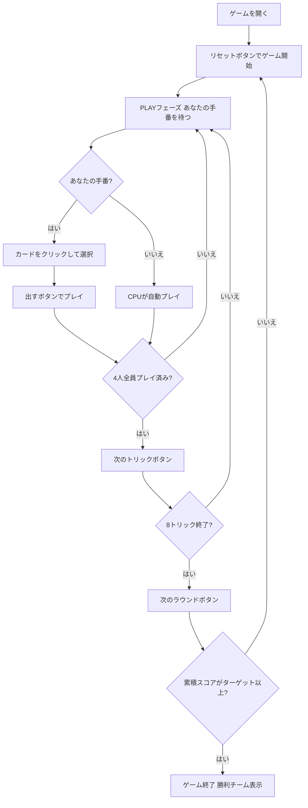

# クラヴァヤス（Web版）遊び方

## ゲーム概要

Klaverjas（クラヴァヤス）はオランダで広く親しまれているJassファミリーのトリックテイキングゲームです。32枚のデッキを4人（2チーム制、席0&2 対 席1&3）でプレイします。切り札スートは配布時に決まり、マスト・フォロー＋強制オーバートランプ義務（クラヴァヤス義務）の下で8トリックを争います。カード点数にローム（メルド）と最終トリックボーナスが加算され、先にターゲット（デフォルト1501点）に達したチームが勝ちます。あなたは席0（チームA）としてプレイします。

## 起動方法

```sh
go run ./cmd/trumpcards web        # REST API + Web GUI サーバを起動
go run ./cmd/trumpcards web --open # 起動してブラウザを開く
```

ブラウザで `/klaverjas` にアクセスします。

## ルール

### デッキと配布

- **デッキ**: 32枚（7,8,9,10,J,Q,K,A × 4スート）
- **プレイヤー**: 4人（あなた = 席0、CPU1〜3）
- **チーム**: 席0&2（あなたのチーム）対 席1&3
- **配布**: 各プレイヤー8枚
- **切り札**: 最後に配られたカードのスートが切り札スートとなる

### カードの強さと点数（Jassランキング）

**切り札スート**（強い順）: **J(Jas) > 9(Nel) > A > 10 > K > Q > 8 > 7**

切り札カード点数: **J=20点、9=14点、A=11点、10=10点、K=4点、Q=3点、8/7=0点**

**非切り札スート**（強い順）: **A > 10 > K > Q > J > 9 > 8 > 7**

非切り札カード点数: **A=11点、10=10点、K=4点、Q=3点、J=2点、9/8/7=0点**（4スート合計152点）

最終（8枚目）トリックには **+10点ボーナス**があります。

### マスト・フォロー＋クラヴァヤス義務

1. リードされたスートを持っている場合は必ずそのスートを出す
2. リードスートがない場合（ボイド）は切り札を持っていれば必ず切り札を出す
3. 場に切り札があり、より強い切り札を持っている場合は必ずオーバートランプする
4. 切り札が一切なければ任意のカードを捨て札として出せる

### ローム（メルド / Roem）

各ラウンド開始時にゲームが初期手札のメルドを自動検出し、チームに加算します:

- **同スート3枚連番（3枚ラン）**: 20点
- **同スート4枚連番（4枚ラン）**: 50点
- **同ランク4枚（7・8を除く）**: 100点

宣言フェーズはなく、自動的にスコアに加算されます。

### 勝利条件

カード点数 + ローム点数 + 最終トリックボーナス（+10点）がラウンドごとに累積され、先にターゲット（デフォルト **1501点**）に達したチームがマッチ勝利となります。

## ゲームの流れ



## 画面の操作方法

### PLAYフェーズ

- あなたの手番のとき、手札のカードをクリックして選択します。
- **「出す」ボタン**: 選択したカードをプレイします。クラヴァヤス義務（マスト・フォロー＋強制オーバートランプ）に従う必要があります。
- **「次のトリック」ボタン**: トリックが解決したら次へ進みます。
- **「次のラウンド」ボタン**: 8トリック終了後にスコアを集計して次のラウンドへ進みます。

### キーボードショートカット

このゲームではキーボードショートカットはありません。すべての操作はボタンまたはカードのクリックで行います。

## 画面構成

```
┌─────────────────────────────────────────────┐
│  Klaverjas (クラヴァヤス) [JA/EN] [CLI]     │
├─────────────────────────────────────────────┤
│  ラウンド: 1  トリック: 1  フェーズ: PLAY   │
│  切り札: ♥  チームスコア: あなた=0 相手=0   │
├──────────┬──────────────────────────────────┤
│  CPU1    │                                   │
│  CPU2    │     現在のトリック表示エリア       │
│  CPU3    │     （各プレイヤーの出したカード）  │
│          │                                   │
├──────────┼──────────────────────────────────┤
│  チームA │  メッセージ / 結果表示            │
│  チームB │  ラウンド結果・ローム・スコア情報  │
├──────────┴──────────────────────────────────┤
│  あなたの手札（クリックで選択）               │
│  [A♠][10♠][K♥][J♠][Q♣]...                 │
│  [出す] [次のトリック] [次のラウンド]         │
└─────────────────────────────────────────────┘
```

- **ヘッダー**: ゲーム名・フェーズ表示・言語切り替えトグル・CLI切り替えトグル。
- **ラウンド／トリック表示**: 現在のラウンド番号・トリック番号・切り札スート。
- **チームスコア**: 各チームの累積スコア（カード点数 + ローム + 最終トリックボーナスの合算）をリアルタイムで表示。
- **プレイヤー表示エリア（左）**: CPU各プレイヤーの手札枚数・取得トリック数・チームを表示。
- **トリック表示エリア（中央）**: 場に出ているカードと出したプレイヤー名。
- **メッセージボックス**: フェーズ・ラウンド結果（カード点数・ローム点数・スコア）・勝敗の案内。
- **フッター（手札エリア）**: あなたの手札と操作ボタン（出す／次のトリック／次のラウンド）。

## 遊び方のコツ

- **Jas（J切り札=20点）とNel（9切り札=14点）が最強**: 切り札のJとQは通常とは別のランクになります。特にJasは20点で最強の切り札です。温存するタイミングが勝敗に直結します。
- **クラヴァヤス義務を理解する**: オーバートランプ義務があるため、場に切り札が出ると強い切り札を強制的に使わされます。この義務を逆用して相手の強い切り札を引き出す作戦も有効です。
- **ローム（メルド）の確認**: ラウンド開始時にローム点数が自動加算されます。メルドが加算されたローム点数はメッセージエリアで確認できます。
- **最終トリック（+10点）を狙う**: 8トリック目を取ったチームに+10点が加算されます。接戦の局面では最終トリックが勝敗を分けることがあります。
- **チームプレイ**: 席0&2が同じチームです。パートナーが高得点のトリックを取る局面では低いカードで協力しましょう。
- **切り札A・10の価値**: 切り札のA=11点・10=10点は点数が高く、かつJas/Nelに次ぐ強さを持ちます。これらを取るか守るかの判断がゲームの鍵です。
- **ボイドスートを作る**: 特定のスートを早めに使い切ることで、そのスートがリードされた時に切り札を出せるようになります。
- **1501点目標の長期戦**: Klaverjasは複数ラウンド続く長期戦です。序盤から累積スコアを意識し、ラウンドごとに獲得点数を最大化する戦略を立てましょう。
