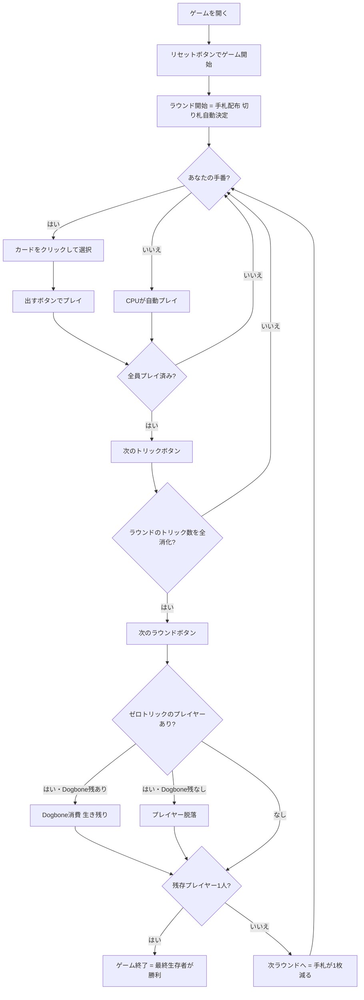

# ノックアウト・ホイスト（Web版）遊び方

## ゲーム概要

Knockout Whist（ノックアウト・ホイスト）はイギリスで古くから親しまれているサバイバル型トリックテイキングゲームです。52枚の標準デッキを4人（あなた = 席0、CPU1〜3）でプレイします。ラウンドごとに手札が1枚ずつ減り（ラウンド1は7枚→最終は1枚）、各ラウンドでトリックを1つも取れなかったプレイヤーは **Dogbone トークン**（初期1枚）を消費して生き残りますが、トークンが尽きた状態でゼロトリックになると **脱落（ノックアウト）** します。最後まで残ったプレイヤーが勝利します。

## 起動方法

```sh
go run ./cmd/trumpcards web        # REST API + Web GUI サーバを起動
go run ./cmd/trumpcards web --open # 起動してブラウザを開く
```

ブラウザで `/knockoutwhist` にアクセスします。

## ルール

### デッキと配布

- **デッキ**: 52枚（標準デッキ、A高）
- **ランク**: A > K > Q > J > 10 > 9 > 8 > 7 > 6 > 5 > 4 > 3 > 2
- **プレイヤー**: 4人（あなた = 席0、CPU1〜3）
- **手札枚数**: ラウンド1=7枚、ラウンド2=6枚、…、ラウンド7=1枚（handSize = 8 − ラウンド番号）

### 切り札

前ラウンドの勝者（最多トリック獲得者）の**最長スートが自動的に切り札**として選択されます。ラウンド1の最初のリーダーはディーラーの左隣のプレイヤーです。

### トリックプレイ

- リードプレイヤーが任意のカードを1枚出します
- 続くプレイヤーは **マスト・フォロー** ルール — リードスートを持っていれば必ずそのスートを出します
- リードスートがなければ任意のカードを出せます（切り札を含む）
- **勝者の決定**: 切り札が出た場合は最高位の切り札が勝ち、切り札がなければリードスートの最高カードが勝ち
- トリックの勝者が次のトリックをリードします

### Dogbone ルール（脱落条件）

各ラウンド終了時、トリックを1つも取れなかったプレイヤーは：

- **Dogbone トークンを1つ消費**して次のラウンドへ進む（各プレイヤーの初期枚数は1）
- **Dogbone が残っていない場合は脱落** — 以降のラウンドには参加しない

### 勝利条件

最後まで生き残った1人が勝利。最終ラウンドまで複数人が残った場合はそのラウンドの勝者が勝利。

## ゲームの流れ



## 画面の操作方法

### PLAYフェーズ

- あなたの手番のとき、手札のカードをクリックして選択します。
- **「出す」ボタン**: 選択したカードをプレイします。マスト・フォローが適用されるため、リードスートを持っている場合はそのスートのカードのみ選択可能になります（他のカードはグレーアウト）。
- **「次のトリック」ボタン**: トリックが解決したら次へ進みます。誰がトリックを取ったかを確認してから進みましょう。
- **「次のラウンド」ボタン**: 全トリック終了後にラウンドを集計して次のラウンドへ進みます。ゼロトリックのプレイヤーの Dogbone 消費や脱落情報が表示されます。

### キーボードショートカット

このゲームではキーボードショートカットはありません。すべての操作はボタンまたはカードのクリックで行います。

## 画面構成

```
┌─────────────────────────────────────────────────┐
│  Knockout Whist [JA/EN] [CLI]                   │
├─────────────────────────────────────────────────┤
│  ラウンド: 1  トリック: 1/7  切り札: ♠           │
│  アクティブプレイヤー: 4人                        │
├──────────┬──────────────────────────────────────┤
│  CPU1    │                                       │
│  Dogbone │     現在のトリック表示エリア            │
│  CPU2    │     （各プレイヤーの出したカード）      │
│  CPU3    │                                       │
├──────────┼──────────────────────────────────────┤
│  あなた  │  メッセージ / ラウンド結果             │
│  Dogbone │  脱落プレイヤー通知                    │
├──────────┴──────────────────────────────────────┤
│  あなたの手札（クリックで選択）                   │
│  [A♠][K♥][Q♦][J♣][10♠][9♥][8♦]               │
│  [出す] [次のトリック] [次のラウンド]             │
└─────────────────────────────────────────────────┘
```

- **ヘッダー**: ゲーム名・言語切り替えトグル・CLI切り替えトグル。
- **ラウンド／トリック表示**: 現在のラウンド番号・トリック番号・切り札スート（♠/♣/♥/♦）。
- **アクティブプレイヤー**: 脱落していない参加中プレイヤーの人数。
- **プレイヤー表示エリア（左）**: 各プレイヤーの手札枚数・Dogbone 残数・今ラウンドのトリック数を表示。脱落プレイヤーはグレーアウト。
- **トリック表示エリア（中央）**: 場に出ているカードと出したプレイヤー名。切り札カードはハイライト表示。
- **メッセージボックス**: フェーズ案内・ラウンド結果（ゼロトリックプレイヤー・Dogbone消費・脱落通知）・勝利メッセージ。
- **フッター（手札エリア）**: あなたの手札と操作ボタン。マスト・フォローにより出せないカードはグレーアウトされます。

## 遊び方のコツ

- **切り札を温存する**: 切り札は最強の切り崩しカードです。序盤は温存して重要なトリックで使いましょう。ただし切り札が多すぎる場合は早めに処理することも必要です。
- **ゼロトリックを絶対に避ける**: ゼロトリックは Dogbone を消費します。初期 Dogbone は1枚だけなので、2度ゼロトリックになると脱落です。毎ラウンド最低1トリックを確実に取ることが最優先です。
- **弱いカードのラウンドで生き残る**: 手札が少なくなるほど選択肢が狭まります。強いカードを後ラウンドに残すか、今のラウンドで確実に1トリック取る計算が必要です。
- **リードを活用する**: トリックに勝てばリード権を得ます。リードすると相手にマスト・フォローを強制でき、手を崩しやすくなります。
- **Dogbone 0 の相手を狙う**: 対戦相手の Dogbone 残数を確認しましょう。Dogbone が0のプレイヤーをゼロトリックに追い込むと脱落させられます。
- **最終1枚ラウンドは切り札次第**: 最終ラウンドはカード1枚のみの一本勝負です。切り札を持っているかどうかが勝敗を決します。
- **アクティブプレイヤー数に注目**: 脱落者が増えると1ラウンドのトリック数も減ります（参加者が減るほど各ラウンドが速く終わる）。残り人数を常に把握して戦略を立てましょう。
