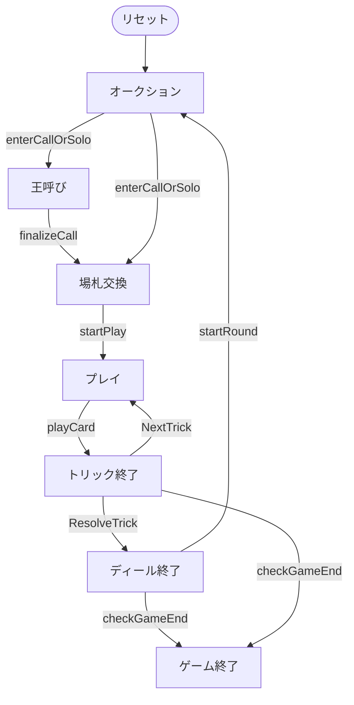

# ケーニッヒルーフェン（Web版）遊び方

## ゲーム概要

Königrufen（ケーニッヒルーフェン）はオーストリアの4人用**タロックゲーム（トリックテイキング）**です。54枚のタロックデッキ（4スート × 8枚、切り札21枚、スキュース）を使い、あなたは**席0**としてプレイします。オークションで**デクレアラー（declarer）**が決まると、**王呼び（King-calling）**で呼んだ王を持つプレイヤーが**秘密のパートナー**になり、デクレアラー側 2人 vs 防御側 2人で対戦します。

## 起動方法

```sh
go run ./cmd/trumpcards web         # CLI経由でWebサーバーを起動
go run ./cmd/trumpcards web --open  # サーバー起動 + ブラウザを開く
go run ./cmd/server                 # 直接Webサーバーを起動
```

ブラウザで `http://localhost:8080` にアクセスし、ナビゲーションバーから「ケーニッヒルーフェン」を選択します。
ナビバーのJA/ENボタンで日本語・英語を切り替えられます。

## ルール

### デッキと配布

- **デッキ**: 54枚。
  - **スート札**: ♠♥♦♣ の4スート × 各8枚（1〜4、J=ヴァレ／C=カヴァリエ／Q=ダーム／K=ロワ）。
  - **切り札（タロック）**: 番号1〜21の21枚（紫の ✦ 表示）。数字が大きいほど強い。
  - **スキュース（Sküs）**: ★ 表示の特殊札1枚（金色）。
- **プレイヤー**: 4人（あなた = 席0、CPU1〜3）。各12枚。
- **場札（タロン）**: 場に伏せた6枚の札。

### トゥルル（Trull）

**切り札の1（パガット）**・**切り札の21（XXI）**・**スキュース**の3枚を**トゥルル**と呼び、特に価値の高い名誉札です。これらと**王（K）**は場札交換で捨てられません。

### オークション（入札）

各プレイヤーは順番に、パスするか、**ルーファー（Rufer, 王呼び）**を宣言します。最高入札者がデクレアラーです。全員がパスした場合は再配札となります。

### 王呼び（King-calling）

デクレアラーは、**自分が持たない王のスート**を1つ選んで呼びます。その王を持つプレイヤーが**秘密のパートナー**となり、デクレアラーと同じ側で戦います。

- パートナーの正体は、呼ばれた王が最初にトリックへ出るまで**秘匿**されます。
- Web版では、自分がすでに持つ王のスートは選べません（ボタンが無効化されます）。

### 場札交換

デクレアラーは公開された場札6枚を手札に加え（18枚）、そこから**6枚を伏せて捨てます**。

- **王とトゥルル（切り札1・21・スキュース）は捨てられません。**
- 捨てた札の得点はデクレアラー側の獲得点に含まれます。

Web版では、捨てられない札は選択できないよう淡色表示になります。6枚を選ぶと「捨てる」ボタンが有効になります。

### プレイ

リードされたスートに**マストフォロー**。フォローできない場合は**切り札を出さなければなりません**。切り札も持っていない場合は任意の札を出せます。

- トリックは、切り札が出ていれば最も高い切り札、なければリードスートの最も高い札を出したプレイヤーが取ります。
- **スキュース**はほぼどのトリックでも出せますが、トリックを取ることはできません。

### 得点

デクレアラー側（デクレアラー＋パートナー）が獲得点で必要点に達すれば**契約成功**、届かなければ**失敗**です。得点はデクレアラー側と防御側でやり取りされます。規定ディール数を戦い、累計得点が最も高いプレイヤーが勝者です（同点は引き分け）。

## ゲームの流れ

ゲームの進行は `internal/domain/Koenigrufen.go` のフェーズ機械そのものです。各ノードは同ファイルの `KoenigrufenPhase` 定数、矢印ラベルはその遷移を行うメソッド名です。



## 画面の操作方法

- **入札**: 「ルーファー」または「パス」ボタン。
- **王呼び**: ♠♣♥♦ の4つのスートボタンから呼ぶ王を選びます（自分が持つ王は選べません）。
- **場札交換**: 手札から6枚を選び「捨てる」ボタン。
- **プレイ**: 出せるカードをクリックして「出す」ボタン。
- **次のトリック／次のディール**: フェーズ終了後にボタンで進みます。
- **ヒント**: 設定でヒントを有効にすると、推奨アクションが表示されます。
- **CLIモード**: 画面右上のトグルでコマンド入力モードに切り替えられます。

## 画面構成

上から順に、ページのコンポーネント構成そのままの並びです。

```
┌──────────────────────────────────────────────────┐
│  ケーニヒルーフェン                                         │
│  ディール: 1  トリック: 0  コントラクト: -
├──────────────────────────────────────────────────┤
│  設定パネル（CPU難易度・目標点など）             │
├──────────────────────────────────────────────────┤
│  場（現在のトリック）                            │
│    CPU1 [♠A]   CPU2 [♠9]   CPU3 [♠8]             │
│  直前のトリック（勝者つき）                      │
├──────────────────────────────────────────────────┤
│  メッセージ / ヒント                             │
├──────────────────────────────────────────────────┤
│  棋譜（アクションログ）                          │
├──────────────────────────────────────────────────┤
│  あなたの手札                                    │
│  [♠K][♠Q][♣Q][♣10][♥J][♥10][♥9][♥7][♦J]        │
│  [入札] [パス] [王を呼ぶ] [カードを出す] [次へ]
│  [リセット]                                      │
└──────────────────────────────────────────────────┘
```

- **ヘッダー**: ディール数・トリック数・確定したコントラクト
- **設定パネル**: CPU 難易度
- **場**: 現在のトリックと直前のトリック
- **王を呼ぶ**: 宣言者が呼んだ王の持ち主が、名乗らないままパートナーになります
- **手札**: `T1`〜`T22` がタロック（切り札）- **メッセージ / ヒント**: 直前の操作の結果と、ヒントボタンを押したときの推奨手
- **棋譜（アクションログ）**: これまでの手の履歴。折りたたみ式
- **あなたの手札**: 出せるカードだけが押せます。出せない札は淡く表示されます
- **リセット**: 新しいゲームを開始します
- **CLIモード切替**: 画面右上のトグルで、CUI 版と同じテキスト表示に切り替えられます（`CliToggle` / `CliTerminal`）
