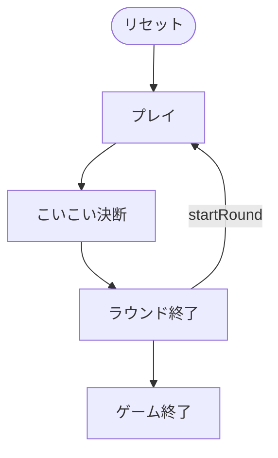

# こいこい（Web版）遊び方

## ゲーム概要

こいこい（Koi-Koi）は、日本の**花札（48枚）**を使う 2 人用の**合わせ（キャプチャ）ゲーム**です。手札の札と山札からめくった札で、場に出ている**同じ月（花）の札**を捕獲し、集めた札で「**役（やく）**」を作ります。役が成立するたびに、続けて役を伸ばす「**こいこい**」か、その場で得点を確定する「**勝負（しょうぶ）**」かを選びます。こいこいすると得点倍率は上がりますが、相手に先に役を作られると失点する危険もあります。目標点に先に到達したプレイヤーが勝ちです。

## 起動方法

```sh
go run ./cmd/trumpcards web         # CLI経由でWebサーバーを起動
go run ./cmd/trumpcards web --open  # サーバー起動 + ブラウザを開く
go run ./cmd/server                 # 直接Webサーバーを起動
```

ブラウザで `http://localhost:8080` にアクセスし、ナビゲーションバーから「こいこい」を選択します。
ナビバーのJA/ENボタンで日本語・英語を切り替えられます。

## ルール

### デッキと配布

- **デッキ**: 花札48枚（12か月 × 各4枚：光・タネ・短冊・カス）。
- **プレイヤー**: 2人（あなた = 席0、CPU = 席1）。
- **配布**: 各プレイヤーに **8枚**、場に **8枚**を表向きに置きます。

### 手番と捕獲（capture）

1. 手札から1枚を出し、場にある**同じ月**の札を捕獲します。同じ月の札が場に**2枚**あるときは、どちらを取るか選びます（Web では捕獲候補がハイライトされるのでタップして選択）。
2. 続けて山札から1枚めくり、同じ月の札があれば同様に捕獲します。
3. 一致する札がなければ、出した札・めくった札は場に残ります。

### 主な役（やく）

| 役 | 内容 | 点 |
|----|------|----|
| 五光（goko） | 光札5枚すべて | 10 |
| 四光（shiko） | 雨以外の光札4枚 | 8 |
| 雨四光（ameshiko） | 雨を含む光札4枚 | 7 |
| 三光（sanko） | 雨以外の光札3枚 | 5 |
| 猪鹿蝶（inoshikacho） | 猪・鹿・蝶の3枚 | 5 |
| 赤短（akatan） | 赤い短冊3枚 | 5 |
| 青短（aotan） | 青い短冊3枚 | 5 |
| 短冊（tanzaku） | 短冊5枚以上 | 1（超過1枚ごと+1） |
| タネ（tane） | タネ5枚以上 | 1（超過1枚ごと+1） |
| カス（kasu） | カス10枚以上 | 1（超過1枚ごと+1） |
| 花見酒（hanami） | 幕＋盃 | 5 |
| 月見酒（tsukimi） | 月＋盃 | 5 |

### こいこい / 勝負

- 役が成立すると **こいこい決断フェーズ**になります。
  - **こいこい**: 続行して役を伸ばします。以降に自分が勝負を宣言できたとき、得点が**2倍**になります（こいこい回数に応じて倍率上昇）。ただし相手が先に役を作って勝負すると失点します。
  - **勝負**: その時点の役の得点を確定してラウンドを終えます。
- どちらのプレイヤーも役を作れずに手札を使い切ると、そのラウンドは引き分け（0点）です。

### 勝敗

- ラウンドの得点は累計され、**目標点**（設定で 30 / 50 / 100 から選択）に先に到達したプレイヤーが勝ちです。

## ゲームの流れ

ゲームの進行は `internal/domain/KoiKoi.go` のフェーズ機械そのものです。各ノードは同ファイルの `KoiKoiPhase` 定数、矢印ラベルはその遷移を行うメソッド名です。



## 画面の操作方法

- **手札をタップ**: 同じ月の場札が1枚以下なら即座に捕獲します。2枚一致する場合は、続けて捕獲する場札をタップして選びます。
- **こいこい / 勝負ボタン**: こいこい決断フェーズで表示されます。
- **次のラウンド**: ラウンド終了後に次の配札を行います。
- **設定**: CPU難易度、目標点、フロントエンドヒントの有無を変更できます。
- **リセット**: 現在の設定で新しいゲームを開始します。

## CLI モード

画面右上のトグルで CLI モードに切り替えると、テキストコマンドでプレイできます。詳細は [CUI版マニュアル](../cui/koikoi.md) を参照してください。
