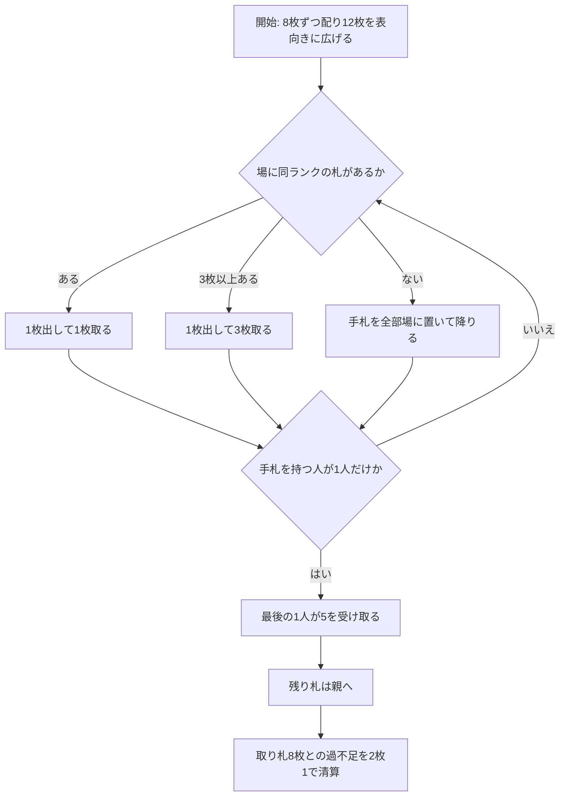

# ラフ・アンド・ライダウン（Web版）遊び方

## ゲーム概要

16〜17 世紀イングランドの 5 人用フィッシングゲーム。現存する記録としては最古級で、実装は [David Parlett の再構成](https://www.parlettgames.uk/histocs/laughand.html)（[pagat](https://www.pagat.com/fishing/laugh.html) が参照している版）に従います。

同ランクの場札を取っていくだけの単純な手続きですが、**取れなくなった人は手札を全部場に置いて降りる**ため、降りた人の札がそのまま他家の獲物になります。

## 起動方法

1. `go run ./cmd/trumpcards web` でサーバーを起動します
2. ブラウザで `http://localhost:8080` を開きます
3. ゲーム一覧から **ラフ・アンド・ライダウン** を選ぶか、`/laughandliedown` へ直接アクセスします

## ルール

- **デッキ**: 52 枚 / **5 人**
- **掛け金**: 親が **3**、他の 4 人が **2** ずつ。ポットは **11**
- **配札**: 各自 **8 枚**、残り **12 枚を表向きに広げます**（伏せた山札はありません）
- **捕獲**: 手番では手札から 1 枚出し、場にある**同ランク**の札を **1 枚または 3 枚**取ります
  - 2 枚取りや 4 枚取りはありません
  - 場のどの札とでも、ランクが合えば取れます（「一番上」という概念はありません）
- **降りる（lie down）**: 取れる札が 1 枚もなくなったら、**手札を全部場に置いて**その回は終わりです。置かれた札は**他家が取れるようになります**
- **終了**: **手札を持っている人が 1 人だけ**になった時点で終わります
- **精算**:
  1. 最後まで手札が残っていた人がポットから **5** を受け取ります
  2. 最後の 1 人の手札と場の残りは**親の取り札**に入ります（親だけ 1 多く出していることの埋め合わせ）
  3. 各自、取り札の枚数を数え、**8 枚との差**を 2 枚につき 1 で清算します（8 枚未満なら払い、8 枚超なら受け取り）

### ポットの算術が精算表を裏付けます

52 枚すべてが誰かの取り札になるので、8 枚との過不足の合計は必ず **(52 − 8×5) ÷ 2 = 6**。「最後の 1 人に 5」と足すとちょうど **11**＝ポットの総額に一致します。

## ゲームの流れ

## 画面の操作方法

| 操作 | 説明 |
|------|------|
| 手札のカードをクリック | その札で場札を **1 枚**取ります（取れる札だけが選択可能になります） |
| **3枚取る** ボタン | 同ランクが場に 3 枚以上あるときだけ現れ、まとめて取ります |
| **ヒント** トグル | 推奨する手をハイライトします |
| **設定** パネル | CPU 難易度を変更してリセットします |
| **CLI** トグル | ターミナル風の操作に切り替えます |

## 画面構成

- **ヘッダー**: ポットの総額と親の席
- **ルール表示**: 常時表示します。「1 枚か 3 枚」と「取れなければ手札を場に置いて降りる」が、このゲームで最も間違えやすい 2 点です
- **場**: 表向きの 12 枚（＋降りた人が置いていった札）。伏せた山札はありません
- **プレイヤー**: 手札の枚数と**取り札の枚数**。8 枚との差がそのまま収支になります。降りた人には印が付きます
- **手札**: 自分の手札。取れる札だけが選択可能です。CPU の手札は裏向きで枚数のみ表示されます
- **アクションログ**: 進行を後から追えます

## 遊び方のコツ

- **3 枚取れるなら取る。**取り札の枚数がそのまま収支なので、1 枚で済ませる理由はありません
- **降りた人は場に獲物を撒きます。**誰かが降りた直後は場が厚くなるので、そこで取れるランクを手札に残しておくと得です
- 逆に、**自分が降りると手札 8 枚が丸ごと相手の取り札になります**。取れるランクが場から消えそうなときは、先に使ってしまうより残す判断もあります
- **親は残り札を全部もらえます。**親のときは終盤に無理をせず、場に札が残る展開でも損をしません
- 8 枚が損益分岐です。**9 枚では 0 のまま**（2 枚で 1）なので、あと 1 枚を取りに行く価値があります
