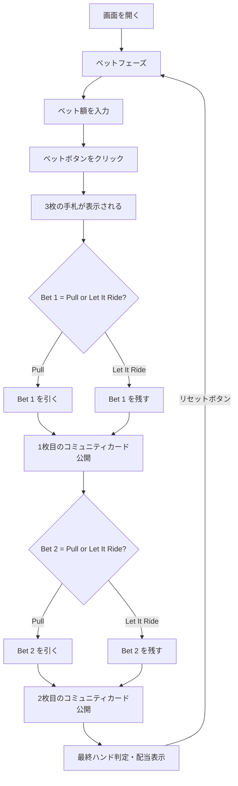

# レットイットライド（Web版）遊び方

## ゲーム概要

3つの同額ベットを置き、3枚の手札と2枚のコミュニティカードで最終的な5枚のポーカーハンドを作るカジノポーカーです。コミュニティカードが公開される前に、ベットを引く（Pull）か残す（Let It Ride）かを選択します。10のペア以上で配当が発生します。

## 起動方法

```sh
go run ./cmd/trumpcards web   # CLI経由でWebサーバーを起動
go run ./cmd/server           # 直接Webサーバーを起動
```

ブラウザで `http://localhost:8080` にアクセスし、ナビゲーションバーから「レットイットライド」を選択します。

## ルール

### 基本ルール

- 52枚のトランプ（ジョーカーなし）を使用
- プレイヤーは3つの同額ベット（Bet 1, Bet 2, Bet 3）を置く
- 3枚の手札と2枚の伏せコミュニティカードが配られる
- 1枚目のコミュニティカード公開前に、Bet 1をPull（引く）またはLet It Ride（残す）を選択
- 2枚目のコミュニティカード公開前に、Bet 2をPull（引く）またはLet It Ride（残す）を選択
- Bet 3は常に残る（引けない）
- 最終的な5枚のハンド（手札3枚+コミュニティ2枚）で配当を判定

### 手札ランキング（強い順）

| ランク | 説明 |
|--------|------|
| ロイヤルフラッシュ | 同じスートのA-K-Q-J-10 |
| ストレートフラッシュ | 同じスートの連続5枚 |
| フォーカード | 同じランク4枚 |
| フルハウス | スリーカード+ペア |
| フラッシュ | 同じスートの5枚 |
| ストレート | 連続する5枚 |
| スリーカード | 同じランク3枚 |
| ツーペア | ペア2組 |
| 10のペア以上 | 10, J, Q, K, A のペア |

### 配当表

| 役 | 配当 |
|----|------|
| ロイヤルフラッシュ | 1000:1 |
| ストレートフラッシュ | 200:1 |
| フォーカード | 50:1 |
| フルハウス | 11:1 |
| フラッシュ | 8:1 |
| ストレート | 5:1 |
| スリーカード | 3:1 |
| ツーペア | 2:1 |
| 10のペア以上 | 1:1 |

配当は残っている各ベットに対して個別に支払われます。例えば3つ全てのベットが残っている場合、配当は3倍になります。

## ゲームの流れ



## 画面の操作方法

### ベットフェーズ

1. **ベット額**: 数値入力欄で1スポットあたりのベット額を設定（10刻み、最低10）
2. **「ベット」ボタン**: クリックでベットを確定し、3枚の手札が配られる

### 判定フェーズ1（Decision1）

1. プレイヤーの3枚の手札が表示されます
2. **「Pull」ボタン**: Bet 1 を引く（チップを取り戻す）
3. **「Let It Ride」ボタン**: Bet 1 を残す
4. 選択後、1枚目のコミュニティカードが公開されます

### 判定フェーズ2（Decision2）

1. 手札3枚とコミュニティカード1枚が表示されます
2. **「Pull」ボタン**: Bet 2 を引く（チップを取り戻す）
3. **「Let It Ride」ボタン**: Bet 2 を残す
4. 選択後、2枚目のコミュニティカードが公開されます

### 結果フェーズ

1. 最終的な5枚のハンドと役名が表示されます
2. 各ベットの配当と合計配当が表示されます
3. **「リセット」ボタン**: 新しいラウンドを開始
4. **「棋譜を見る」ボタン**: アクションログを表示

### キーボードショートカット

| キー | アクション | 有効条件 |
|------|-----------|---------|
| `b` | ベット | ベットフェーズのみ |
| `p` | Pull | 判定フェーズのみ |
| `l` | Let It Ride | 判定フェーズのみ |
| `r` | リセット | 結果フェーズのみ |

## 画面構成

```
┌────────────────────────────────────────────┐
│  チップ残高                フェーズ表示       │
│                                            │
│  コミュニティ: [??] [??]                     │
│                                            │
│  プレイヤー: [♠A] [♥K] [♦Q]                  │
│              役名: (結果フェーズで表示)        │
│                                            │
│  ベット: [100] x 3スポット                   │
│  Bet 1: Active  Bet 2: Active  Bet 3: Active│
│  [ベット] [Pull] [Let It Ride] [リセット]     │
└────────────────────────────────────────────┘
```

- **ヘッダー**: チップ残高と現在のフェーズ（BET / DECISION1 / DECISION2 / RESULT）
- **コミュニティエリア**: 画面上部。フェーズに応じて伏せ/公開
- **プレイヤーエリア**: 画面中央。自分の手札3枚を表示
- **ベット情報**: 各ベットの状態（Active/Pulled）を表示
- **操作ボタン**: フェーズに応じてベット/Pull/Let It Ride/リセットが有効

## 遊び方のコツ

- 手札に10以上のペアがあれば、基本的にLet It Rideが有利
- スリーカード以上の手札は迷わずLet It Ride
- ストレートやフラッシュの4枚揃いは、1枚目の判断でLet It Rideを検討
- 弱い手札は早めにPullしてリスクを抑える
