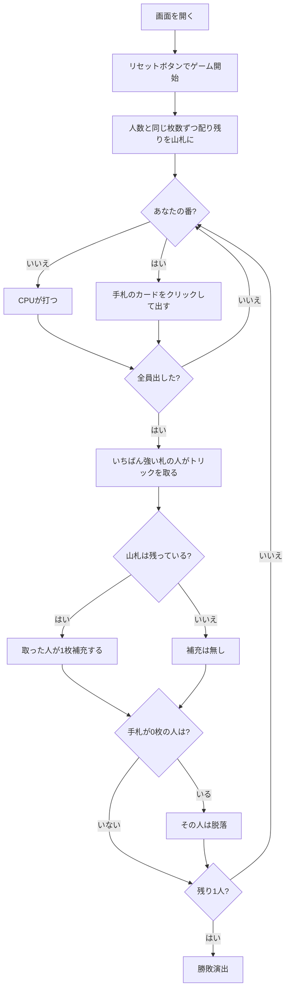

# リンガーロンガー（Web版）遊び方

## ゲーム概要

アメリカ発祥の**脱落制トリックゲーム**。**トリックを取っても得点にはなりません。** 取れるのは「**山札から1枚補充する権利**」だけです。裏を返せば、勝ち続けているかぎり手札は減りません。手札が尽きた人から脱落し、**最後まで手札を持ち続けた1人**が勝ちです。4〜6人で遊べます。

## 起動方法

```sh
go run ./cmd/trumpcards web  # CLI経由でWebサーバーを起動
go run ./cmd/server          # 直接Webサーバーを起動
```

ブラウザで `http://localhost:8080` にアクセスし、ナビゲーションバーから「リンガーロンガー」を選択します。
ナビバーのJA/ENボタンで日本語・英語を切り替えられます。

## ルール

- 標準52枚を使い、**配る枚数は人数と同じ**。残りが山札になります: 4人 4枚ずつ・山札36枚 / 5人 5枚ずつ・山札27枚 / 6人 6枚ずつ・山札16枚
- リードの人が1枚出し、以降は**フォロースート**。切り札はありません
- 全員が出したら、リードのスートでいちばん強い札の人がトリックを取ります
- **取った人だけが山札から1枚補充できます。** 1枚出して1枚引くので、**取り続けているかぎり手札は減りません**
- **山札が尽きたら補充はありません。** そこから先は全員の手札が減る一方です
- **手札が0枚になった人は脱落。** ただし脱落が決まるのは、そのトリックが解決して補充まで済んだあとです
- **最後まで手札を持ち続けた1人の勝ち**
- **全員が同時に尽きたときは、最後のトリックを取った人の勝ち**（持ちこたえた1人がいないため）

## ゲームの流れ



## 画面の操作方法

| 操作 | 説明 |
|------|------|
| 手札のカードをクリック | そのカードを出す（出せる札には緑の枠が付きます） |
| 人数（設定） | 4〜6人。リセットすると反映され、配る枚数と山札の厚さも変わります |
| ヒントボタン | 出すべき札を提示する |
| ギブアップボタン | 投了する |
| リセットボタン | 確認ダイアログのうえで最初からやり直す |
| CLI トグル | 同じゲームをコマンド入力で操作するモードに切り替える |

**補充するボタンはありません。** トリックを取れば自動的に1枚引きます。

## 画面構成

```
┌────────────────────────────────────────────┐
│ トリック 3            山札 残り32枚         │
├────────────────────────────────────────────┤
│ トリックを取っても得点にならない。          │
│ 取れるのは山札から1枚補充する権利だけ       │
├────────────────────────────────────────────┤
│  あなた [直前に補充]: 手札4枚 / 獲得2回     │
│  CPU1: 手札2枚 / 獲得0回                    │
│  CPU2 [2番目に脱落]: 手札0枚 / 獲得1回      │
│  CPU3: 手札3枚 / 獲得1回                    │
├────────────────────────────────────────────┤
│              現在のトリック                 │
├────────────────────────────────────────────┤
│  あなたの手札（出せる札に緑の枠）           │
└────────────────────────────────────────────┘
```

- **上部**: トリック数と山札の残り。**0になった瞬間から局は終わりに向かいます**（そのときは警告が出ます）
- **規則帯**: このゲームの勝利条件そのもの。**取っても得点にならない**ことを常に出します
- **席の行**: 手札の枚数と獲得回数。**枚数がそのまま生死**なので、得点表示はありません
- **`[直前に補充]` / `[N番目に脱落]`**: どちらも盤面に痕跡が残らないので明示します
- **中央**: 現在のトリック
- **下部**: 自分の手札。**フォロー義務を満たす札だけ**に緑の枠が付きます

**あなたが脱落しても盤面は続きます。** 手番が二度と回ってこないので、そのときは「脱落しました」と画面に出したうえで、残りのCPUが決着するまで進みます。

## 遊び方のコツ

- **強い札は素直に強い。** 取っても損をしないゲームなので、A や K は迷わず使えます
- **山札の残りを数える。** 補充が続くうちは取りにいく価値が高く、尽きたあとは「持たされない」ほうが大事になります
- **リードを取れるうちは取り続ける。** 1枚出して1枚引くので、手札が減らないまま相手だけが痩せていきます
- **6人戦は短期決戦。** 山札16枚では補充が全員に行き渡らないので、序盤の1トリックが重く効きます
- **獲得回数の多い席に注意。** 補充を重ねている席ほど手札が厚く、最後まで残りやすい相手です
