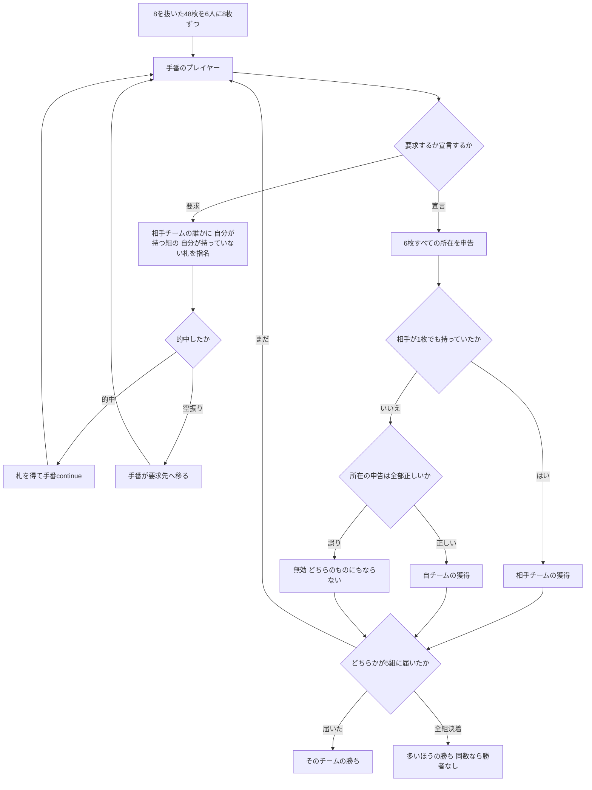

# リテラチャー（Web版）遊び方

## ゲーム概要

インド亜大陸とカナダの学生コミュニティで根強く遊ばれる**推理型フィッシング**。**8 を抜いた 48 枚**を **6 人 3 対 3** で 8 枚ずつ持ち、**8 組のハーフスート**を奪い合います。**味方の手札も見えません。**どこに何があるかを推理することがゲームそのものです。

出典: [pagat.com: Literature](https://www.pagat.com/quartet/literature.html)

## 起動方法

```sh
go run ./cmd/trumpcards web  # CLI経由でWebサーバーを起動
go run ./cmd/server          # 直接Webサーバーを起動
```

ブラウザで `http://localhost:8080` にアクセスし、ナビゲーションバーから「リテラチャー」を選択します。
ナビバーのJA/ENボタンで日本語・英語を切り替えられます。

## ルール

### デッキとハーフスート

52 枚から **8 を 4 枚抜いた 48 枚**です。各スートが 2 組に分かれます。

| 組 | 構成 |
|---|---|
| 低位 | 2 3 4 5 6 7 |
| 高位 | 9 10 J Q K A |

**8 が抜けているので、低位と高位の境目に札がありません。**4 スート × 2 = **8 組**、各 6 枚で 48 枚ちょうどです。

### 席とチーム

**6 人 3 対 3。席は交互**で、各自の両隣は必ず相手チームです。味方に要求できない規則があるので、席順は飾りではありません。

### 要求（ask）

手番のプレイヤーは札を 1 枚指名して要求します。**条件は 4 つ。**

1. 要求先は**必ず相手チームの誰か**。**味方には要求できません**
2. **自分がそのハーフスートの別の札を 1 枚以上持っている**こと
3. **自分が持っていない札**であること
4. 要求先に**手札が残っている**こと

**的中すれば札を得て手番が続きます。外れれば手番は要求先に移ります。**

**誰が誰に何を訊いて、通ったかどうかは全員が見ています。**これが推理の材料です。

### 宣言（claim）— 結末は 3 通り

自チームで 1 組そろったと思ったら、**6 枚すべての所在を申告**して宣言します。

| 状況 | 結果 |
|---|---|
| 自チームが 6 枚とも持ち、所在も全部正しい | **自チームの獲得** |
| 自チームが 6 枚とも持つが、**所在の申告を間違えた** | **無効。どちらのチームも取りません** |
| **相手チームが 1 枚でも持っていた** | **相手チームの獲得** |

**「揃っているのは分かるが、誰が持っているか自信がない」ときに宣言を我慢する動機**がここにあります。自チーム内で言い間違えただけなら相手には渡りませんが、その組は失われます。

### 勝利条件

**8 組の過半数、つまり 5 組**を取ったチームの勝ちです。

**4 組では決着しません。**相手も 4 組取り得るからです。また無効になった組はどちらのものにもならないので、**両チームの獲得数の合計が 8 になるとは限りません。**全組が決着して 5 組に届く側がいなければ、多いほうの勝ちです。同数なら勝者なしです。

### 手札が尽きたとき

自分の手番中に手札が無くなったら、**まだ手札のある味方に手番を渡します。**手札の尽きたプレイヤーには要求できません。



## 画面の操作方法

| 操作 | 説明 |
|------|------|
| **相手** の選択 | 要求先を選びます。**相手チームで手札の残っている席だけ**が並びます |
| **札** の選択 | 要求する札を選びます。**未決の組の札だけ**が並びます |
| **要求する** ボタン | 選んだ相手に選んだ札を要求します |
| **組** の選択 | 宣言するハーフスートを選びます（未決のものだけ） |
| 各札の **席** 選択 | 6 枚それぞれの所在を申告します。**自チームの席だけ**が並びます |
| **宣言する** ボタン | 申告した内容で宣言します |
| **CLI** トグル | ターミナル風の操作に切り替えます |

## 画面構成

- **スコア**: 両チームの獲得組数、**無効**、未決。勝利条件もここに出ます
- **ハーフスート**: 8 組の帰属。**無効は色を変えて区別**します
- **プレイヤー**: 各席のチームと手札枚数。**中身は誰のものも見えません**
- **直近の要求**: 全員に公開されている情報。的中と空振りを区別して出します
- **アクションログ**: 進行を後から追えます

## 遊び方のコツ

- **空振りにも情報があります。**「席 1 は ♥ 高位を持っていない」と分かります
- **相手が訊いた札は、その相手が持っていないことが確定します。**訊けるのは自分が持っていない札だけだからです
- **味方が要求して通った札は、その味方が持っています。**宣言の所在はここから組み立てます
- **宣言を急がないでください。**所在を 1 つ言い間違えるだけで、揃っていても組が消えます
- **4 組では勝てません。**5 組目までの道筋を考えて宣言する組を選んでください
