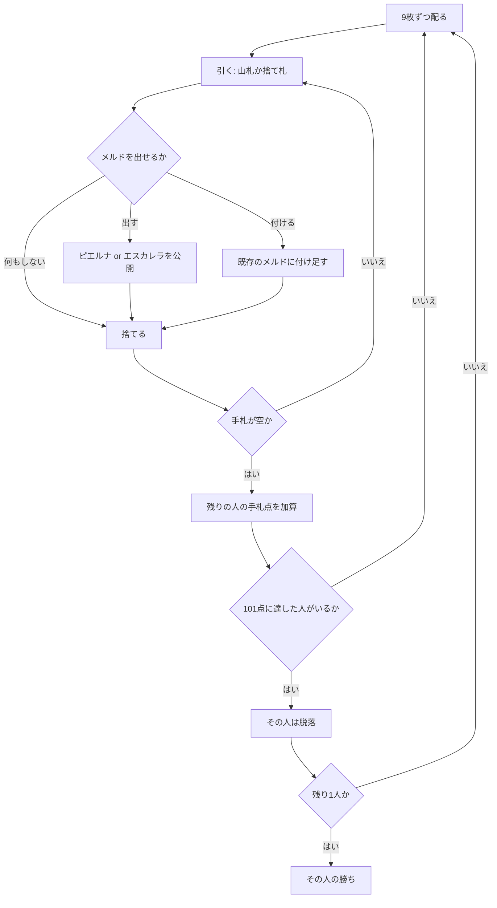

# ロバ (Loba de Menos) — Web マニュアル

## ゲーム概要

アルゼンチンのラミー。**2 組 + ジョーカー 4 枚の 108 枚**を使い、手札を出し切って相手に失点を残します。**101 点に達した人から脱落**し、最後まで残った人が勝ちです。

実装は [pagat.com の Loba](https://www.pagat.com/rummy/loba.html) の **de Menos**（マイナス式）に従います。

## 起動方法

1. `go run ./cmd/trumpcards web` でサーバーを起動します
2. ブラウザで `http://localhost:8080` を開きます
3. ゲーム一覧から **ロバ** を選ぶか、`/loba` へ直接アクセスします

## ルール

- **デッキ**: **108 枚**（52 枚 × 2 組 + ジョーカー 4 枚）。同じ札が 2 枚ずつあります
- **人数**: 4 人（原典は 2〜5 人）
- **配札**: 各自 **9 枚**。1 枚を表にして捨て札の起点にし、残りが山札

### 手番

1. **引く** — 山札から 1 枚、または捨て札の一番上を取る
2. **出す・付ける**（任意）— メルドを出す、既存のメルドに付ける
3. **捨てる** — 1 枚捨てて手番終了

### メルドは 2 種類

| 種類 | 条件 |
|---|---|
| **ピエルナ** | 同じランク 3 枚以上。ただし**異なる 3 スート**でなければなりません。2 組デッキなので同じスートが 2 枚揃いますが、それではメルドになりません |
| **エスカレラ** | 同じスートの 3 枚以上の並び。**ジョーカーは 1 枚まで**。A は上（Q-K-A）か下（A-2-3）の一方だけで、K-A-2 のように跨げません |

### ジョーカー

- **ワイルドではありません。**エスカレラにしか置けず、ピエルナには入れられません
- 1 つのエスカレラに **1 枚まで**
- **通常は捨てられません**（手札がジョーカー 1 枚だけのときだけ例外）
- 手札に残すと **10 点**の失点です

### 付け札（レイオフ）

- **自分が一度メルドを出したあと**に限り、付けられます
- **他家のメルドにも付けられます**（de Menos の規則）
- ピエルナに付けられるのは**元の 3 スート**の札だけです。4 つ目のスートは「異なる 3 スート」の枠を壊します

### 精算

- 手札を出し切った人がそのラウンドの勝者。残りの人は**手札の点**を失点として加算します
- **数札は額面、ジョーカー・K・Q・J・A は 10 点**
- **一度も場に出さずに一気に上がると −10**（失点が減ります）
- **101 点以上**になった人はその場で**脱落**します
- 最後に残った 1 人が勝ちです

## ゲームの流れ

## 画面の操作方法

| 操作 | 説明 |
|------|------|
| **山札から引く** / **捨て札を取る** ボタン | 手番の最初に押します |
| 手札のカードをクリック | 選択します（複数選べます） |
| **メルド** ボタン | 選択中の札をメルドとして出します |
| **付ける** ボタン | 選択中の 1 枚を、選んだメルドに付けます |
| **捨てる** ボタン | 選択中の 1 枚を捨てて手番を終えます |
| **次のラウンド** ボタン | 精算を読んだあと、次のラウンドへ進みます |
| **ヒント** トグル | 推奨する手をハイライトします |
| **CLI** トグル | ターミナル風の操作に切り替えます |

## 画面構成

- **ヘッダー**: ラウンド数、山札の残り、脱落点（101）
- **ルール表示**: 常時表示します。「異なる 3 スート」と「ジョーカーはエスカレラだけ」が最も間違えやすい 2 点です
- **捨て札**: 一番上の 1 枚。取るかどうかの判断材料です
- **場のメルド**: 種類（ピエルナ／エスカレラ）と出した席、札の並び。付け札の対象として選べます
- **プレイヤー**: 失点と手札の枚数。脱落した人には印が付きます
- **手札**: 自分の手札。CPU の手札は裏向きで枚数のみ
- **アクションログ**: 進行を後から追えます

## 遊び方のコツ

- **ピエルナは 3 スートが要ります。**同じスートの 2 枚目は「4 枚目の札」としては使えても、組を作る 3 枚には数えられません
- **ジョーカーは重い荷物です。**エスカレラにしか置けず捨てられないので、抱えたまま相手に上がられると 10 点そのまま食らいます
- **一気に上がると −10。**メルドを小出しにせず、揃うまで待てるなら待つ価値があります
- 逆に、相手が **101 に近い**ときは早く上がって押し込むほうが効きます
- 捨てるときは、**どこにも繋がらない札**から。同ランク別スートや同スートの近いランクは残しておくと次のメルドに育ちます
