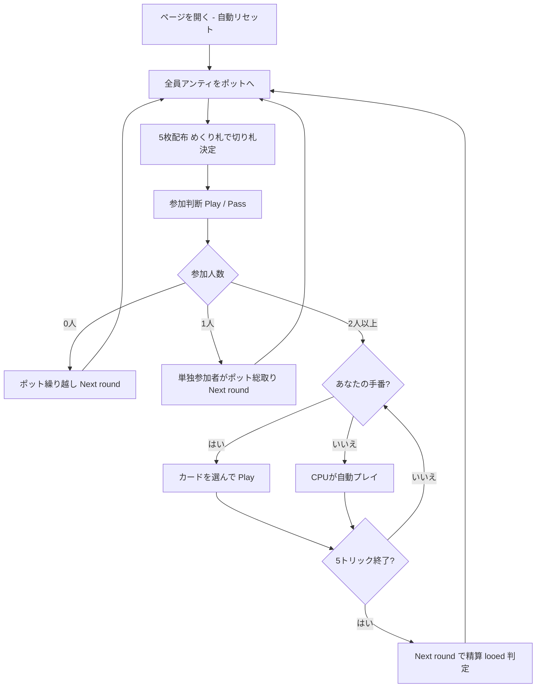

# ルー（Web版）遊び方

## ゲーム概要

Loo（ルー / Lanterloo）は、18〜19世紀のイングランドで流行した**ポット系ギャンブル・トリックテイキングゲーム**です。本実装は 5 枚手札の Five-card Loo を 4 人（あなた＝席0＋CPU3人）でプレイします。各ディールで全員が一定額（アンティ、既定 **3**）を**繰り越し式のポット**へ支払い、めくり札（turn-up）のスートが**切り札**になります。各プレイヤーは手札を見て**参加（play）か降り（pass）**かを決めます。参加者は **5 トリック**を**マストフォロー・マストヘッド**で戦い、1 トリックにつきポットの **1/5** を獲得します。参加したのに 1 トリックも取れなかったプレイヤーは **"looed"** となり、ペナルティを次ディールのポットへ支払います。目標点レースはなく、チップを積み上げていくディール反復方式です。

## 起動方法

```sh
go run ./cmd/trumpcards web         # CLI経由でWebサーバーを起動
go run ./cmd/trumpcards web --open  # サーバー起動 + ブラウザを開く
go run ./cmd/server                 # 直接Webサーバーを起動
```

ブラウザで `http://localhost:8080` にアクセスし、ナビゲーションバーから「ルー」を選択します。
ナビバーのJA/ENボタンで日本語・英語を切り替えられます。

## ルール

### デッキと配布

- **デッキ**: 標準52枚（A〜2 × 4スート）。
- **プレイヤー**: 4人（あなた = 席0、CPU1〜3）。各自がチップを持ちます。
- **配布**: 各プレイヤー5枚。配り終えた後、山札の1枚をめくって切り札を決めます。

### アンティとポット

- 各ディール開始時、全員が **アンティ（既定 3）** をポットへ支払います。
- ポットは**繰り越し式**で、looed のペナルティや無人ディールのポットは次ディールへ持ち越されます。

### 参加判断（play / pass）

各プレイヤーは順番に**参加（play）**か**降り（pass）**かを決めます。Web では「Play」「Pass」ボタンで操作します。参加者だけが 5 トリックを戦い、参加者が 1 人だけならその人がポットを総取り、誰も参加しなければポットは繰り越されます。

### フォロー義務・マストヘッド

- リードスートを持っていれば**必ず従い**、現在勝っている札を**上回れるなら上回る義務**があります（マストヘッド）。
- リードスートを持たないときは、**切り札を持っていれば切り札を出さなければなりません**（ヘッドできるならヘッド）。
- 切り札も持たない場合のみ任意の札を捨てられます。切り札が出たトリックは最強の切り札が取り、切り札が出なければリードスートの最高札が取ります。1ディールは **5トリック**。

### 精算と looed

- 参加者は獲得トリック数に応じてポットを分配されます（1 トリック = ディール開始時ポット ÷ 5）。
- 参加したのに **0 トリック**のプレイヤーは **looed** となり、ペナルティを次ディールのポットへ支払います。
- 目標点はありません。「Next round」で精算し、チップを積み上げます。

## ゲームの流れ



## 画面の操作方法

- **参加判断**: 「Play」または「Pass」ボタンで参加/降りを選びます。
- **プレイ**: プレイ可能な札がハイライトされるので、選んで「Play」します（フォロー・ヘッド義務でフィルタ済み）。
- **ディール進行**: 「Next round」で精算し、次のディールへ進みます。
- **その他**: 「Reset」で新規ゲーム、設定でヒントをONにすると推奨アクション（参加判断・出す札）が表示されます。

### キーボードショートカット

| キー | アクション | 有効条件 |
|------|-----------|---------|
| `Enter` | 次へ進む（Next round） | ディール結果表示中 |
| `R` | リセット | 常時 |

## 画面構成

```
┌────────────────────────────────────────────┐
│ Loo (ルー)   Phase = Play   Trump = ♥       │ ← ヘッダー
├──────────────┬─────────────────────────────┤
│ P1 (CPU)     │                             │
│ Pass  Chips-3│      現在のトリック          │
│ P2 (CPU)     │   P0 ♥A   P2 ♥K   ...       │
│ Play  Chips-3│                             │
│ P3 (CPU)     │   Pot = 12                  │
│ Pass  Chips-3│                             │
├──────────────┴─────────────────────────────┤
│ あなたの手札（プレイ可能札をハイライト）      │ ← フッター
│ [♥A][♥3][♠K][♣7][♦2]  [Play][Next round]   │
└────────────────────────────────────────────┘
```

- **ヘッダー**: ゲーム名・フェーズ表示（Decide / Play / TrickEnd / RoundEnd）・切り札・CLI 切り替え。
- **情報サイドバー**: 各プレイヤーの参加状態（Play / Pass）・獲得トリック・累積チップ・ポット。
- **中央**: 現在のトリック（場札とリードプレイヤー）。
- **フッター**: あなたの手札（プレイ可能札がハイライト）・アクションボタン（Play / Pass / Play card / Next round / Reset）。

## 遊び方のコツ

- 切り札（めくり札のスート）を複数枚、または A や高い切り札を持つときだけ参加しましょう。0 トリックだと looed でポット相当を失います。
- マストヘッド: フォローや切り札を出すとき、勝てる札があるなら勝ちに行かなければなりません。
- looed の繰り越しでポットが大きいディールは、参加して 1 トリックでも取れれば見返りが大きくなります。
- 弱い手なら潔く Pass。参加しなければ looed にはなりません（アンティは支払い済み）。
- ヒント（設定でON）は、参加判断・プレイの各フェーズで推奨アクションを提示します。
