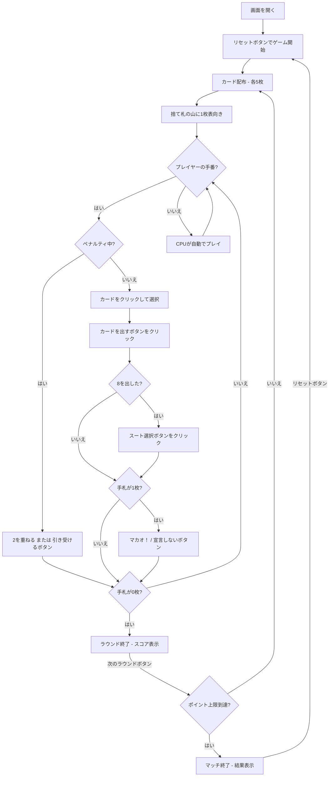

# マカオ（Web版）遊び方

## ゲーム概要

4人（プレイヤー1人 + CPU 3人）で遊ぶ、クレイジーエイトの欧州系バリエーションです。捨て札のトップとスートまたはランクが一致するカードを出していき、先に手札を出し切ったプレイヤーがラウンドの勝者です。「マジックカード」（2=ドローツー、7=スキップ、8=ワイルド、J=リバース）によるペナルティの応酬と、残り1枚での「マカオ！」宣言が最大の見どころです。ポイント上限（デフォルト200点）に達したプレイヤーが出たらマッチ終了です。

## 起動方法

```sh
go run ./cmd/trumpcards web  # CLI経由でWebサーバーを起動
go run ./cmd/server          # 直接Webサーバーを起動
```

ブラウザで `http://localhost:8080` にアクセスし、ナビゲーションバーから「マカオ」を選択します。
ナビバーのJA/ENボタンで日本語・英語を切り替えられます。

## ルール

### 基本ルール

- 52枚のトランプを使用、4人プレイ
- 各プレイヤーに5枚ずつ配り、1枚を表向きにして捨て札の山を開始、残りは山札
- 捨て札のトップとスートまたはランクが一致するカードを出す
- 出せるカードがなければ山札から1枚ドロー。出せればそのまま続行、出せなければパス
- 山札が空になったら捨て札（トップを除く）をリサイクルして山札にする

### マジックカード

- **2（ドローツー）**: 次のプレイヤーは2枚引く。2を重ねて出すとペナルティが累積し（+2枚）、次へ回せる。重ねられない（または出さない）プレイヤーが累積分をまとめて引き受ける
- **7（スキップ）**: 次のプレイヤーの手番を飛ばす
- **8（ワイルド）**: いつでも出せ、出した後に次のスートを指定できる
- **J（リバース）**: プレイの進行方向を反転する

### マカオ宣言

- 手札が残り1枚になったら「マカオ！」と宣言する必要がある
- 宣言せずにスキップすると、ペナルティとして2枚引く

### 得点

- ラウンド終了時、他プレイヤーの手札がスコアとして加算される
- 8=50点、J/Q/K=10点、A=1点、その他=額面

### ゲーム終了

- ポイント上限（デフォルト200点）に達したプレイヤーが出たらマッチ終了

### CPU難易度

- **Easy**: ランダムにカードを出す（宣言を忘れることがある）
- **Normal**: 基本的な戦略（デフォルト）
- **Hard**: 戦略的なプレイ（8の温存等）

## ゲームの流れ



## 画面の操作方法

### カードのプレイ（プレイフェーズ）

1. 手札のカードをクリックして選択します。**いま出せる札には緑の枠**が付き、出せない札は薄く表示されます（マジックカードやワイルドで宣言されたスートも織り込んだ、サーバー側の判定そのままです）
2. **「出す」** ボタンをクリックしてカードを場に出します
3. 出せるカードがなければ **「引く」** ボタンで山札から1枚引きます

### ペナルティの応酬（ドローツー）

1. 2が出されると **ドローペナルティ** のバナーが表示されます
2. 手札の2を出してペナルティを次のプレイヤーへ回すか、**「N枚引き受ける」** ボタンで累積分をまとめて引き取ります

### スート選択（8を出した後）

1. 8を出すとスート選択ボタン（♠ / ♣ / ♥ / ♦）が表示されます
2. 選択したスートが次のプレイで要求されます

### マカオ宣言（残り1枚）

1. 手札が残り1枚になると **「マカオ！」** と **「宣言しない」** のボタンが表示されます
2. 「マカオ！」で宣言、「宣言しない」を選ぶとペナルティ2枚を受けます

### ラウンドの進行

1. ラウンドが完了するとスコアが表示されます
2. **「次のラウンド」** ボタンで次のラウンドに進みます

## 画面構成

```
┌────────────────────────────────────────────┐
│  ▶ 設定 (クリックで展開)                   │
│    CPU難易度:    [Normal▼]                 │
│    ポイント上限: [200▼]                    │
├────────────────────────────────────────────┤
│           CPU プレイヤーエリア              │
│ ┌──────────┐ ┌──────────┐ ┌──────────┐    │
│ │ CPU 1    │ │ CPU 2    │ │ CPU 3    │    │
│ │ 0点(5枚) │ │ 0点(4枚) │ │ 0点(6枚) │    │
│ └──────────┘ └──────────┘ └──────────┘    │
├────────────────────────────────────────────┤
│              ゲーム情報                     │
│  ラウンド 1 | 山札: 27枚 | 方向: →         │
│  捨て札トップ: ♥7                          │
│  ドローペナルティ: 2枚                     │
├────────────────────────────────────────────┤
│         フッター: あなたの手札              │
│  [♠3][♣2][♥Q][♦5][♠J]                   │
│  [リセット] [出す] [引く]                   │
│  [♠][♣][♥][♦]  (スート選択 - 8を出した時) │
│  [マカオ！][宣言しない]  (残り1枚の時)      │
└────────────────────────────────────────────┘
```

- **設定パネル（▶ 設定）**:
  - 「CPU難易度」セレクト: Easy / Normal / Hard から選択
  - 「ポイント上限」: マッチ終了のポイント上限を設定
  - 次のリセット時に設定が適用される
- **CPU プレイヤーエリア**: 各 CPU の累計得点と手札枚数（手番の CPU は金色枠）
- **ゲーム情報**: 現在のラウンド、山札残り枚数、進行方向、捨て札トップ、ドローペナルティ累積
- **フッター（あなたの手札）**: クリックで選択（緑枠 + 上に浮き上がる）
- **スコアテーブル**: 各プレイヤーのラウンドスコアと累積スコア

## 遊び方のコツ

- 2は手元に温存し、ペナルティを受けそうなときに重ねて相手へ回しましょう
- 7（スキップ）や J（リバース）は、出し切りそうな相手の手番を飛ばす妨害に有効です
- 8（ワイルド）は切り札として温存し、出せるカードがない時に使いましょう
- 残り1枚になったら「マカオ！」宣言を忘れずに。忘れるとペナルティで2枚増えます
- 高得点カード（8=50点、J/Q/K=10点）は早めに処理してリスクを減らしましょう
