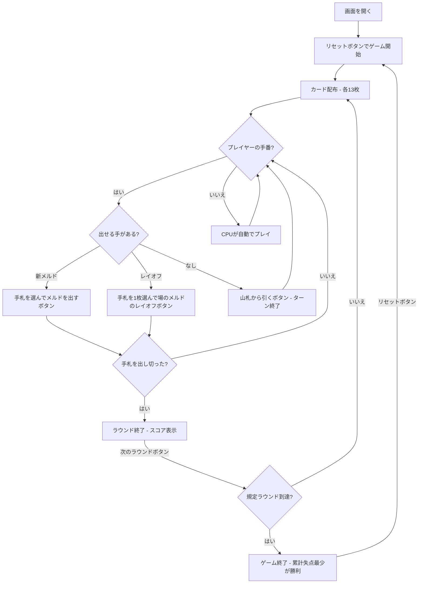

# マキャヴェッリ（Web版）遊び方

## ゲーム概要

2〜5人（プレイヤー1人 + CPU 1〜4人）で遊ぶイタリア発祥のラミーです。ジョーカーを除く2デッキ（計104枚）を使い、各プレイヤーに13枚ずつ配ります。特徴は、全員で共有する**1つの「場」**にすべてのメルド（セット／シーケンス）を並べ、既存のメルドを自由に組み替えながらプレイできる点です（ボードゲーム「ルミカブ」のトランプ版）。手札を先にすべて出し切ったプレイヤーがそのラウンドの勝者となり、残ったプレイヤーは手札のピップ点を失点として加算します。規定ラウンド消化時点で累計失点が最も少ないプレイヤーが勝利します。

## 起動方法

```sh
go run ./cmd/trumpcards web  # CLI経由でWebサーバーを起動
go run ./cmd/server          # 直接Webサーバーを起動
```

ブラウザで `http://localhost:8080` にアクセスし、ナビゲーションバーから「マキャヴェッリ」を選択します。
ナビバーのJA/ENボタンで日本語・英語を切り替えられます。

## ルール

### 基本ルール

- ジョーカーを除く2デッキ（104枚）を使用、2〜5人プレイ
- 各プレイヤーに13枚ずつ配り、残りは山札（ストック）
- 手番では、手札からメルドを出す／既存メルドにレイオフする／山札から引く（ターン終了）のいずれかを行う

### メルド（セットとシーケンス）

- **セット**: 同ランク3〜4枚（異なるスート）
- **シーケンス（連番）**: 同スート3枚以上の連続したカード

### 場の組み替え

- 場はすべてのプレイヤーで共有される
- 自分の手番であれば、既存のメルドを組み替えて手札のカードを組み込める
- 手番終了時に場のすべてのメルドが有効でなければならない

### デッドウッドと得点

- ラウンド勝者（手札を出し切ったプレイヤー）の失点は0
- 他のプレイヤーは手札に残ったカードのピップ点（A=1点、10/J/Q/K=10点、その他は額面）を失点として加算

### ゲーム終了

- 規定ラウンド数（デフォルト3）を消化した時点で、累計失点が最も少ないプレイヤーが勝利

### CPU難易度

- **Easy**: ランダムに近いプレイ
- **Normal**: 基本的なメルド戦略（デフォルト）
- **Hard**: 戦略的なプレイ

## ゲームの流れ



## 画面の操作方法

### 手番フェーズ

1. **メルドを出す**: 手札のカードを3枚以上クリックして選択し、**「メルドを出す」** ボタンを押す
2. **レイオフ**: 手札のカードを1枚選択し、場のメルドの **「レイオフ」** ボタンを押す
3. **山札から引く**: 出せる手がなければ **「山札から引く」** ボタンを押す（ターン終了）

### ラウンド終了

1. **「次のラウンド」** ボタンで次のラウンドに進む

## 画面構成

```
┌────────────────────────────────────────────┐
│  ▶ 設定 (クリックで展開)                   │
│    プレイヤー数:  [4▼]                      │
│    CPU難易度:     [Normal▼]                │
│    ラウンド数:    [3▼]                      │
├────────────────────────────────────────────┤
│  ラウンド 2/3 | 山札: 40枚                  │
├──────────────────────┬─────────────────────┤
│   場のメルド          │   CPU エリア        │
│  [♠3 ♠4 ♠5] [レイオフ]│  CPU 1: 13枚 | 累計:10│
│  [♥9 ♠9 ♣9] [レイオフ]│   スコアテーブル     │
├──────────────────────┴─────────────────────┤
│         フッター: あなたの手札              │
│  [♠3][♠4][♠5][♥9]...                       │
│  [リセット] [山札から引く] [メルドを出す]   │
└────────────────────────────────────────────┘
```

- **設定パネル（▶ 設定）**:
  - 「プレイヤー数」セレクト: 2〜5人
  - 「CPU難易度」セレクト: Easy / Normal / Hard
  - 「ラウンド数」: 規定ラウンド数を設定
  - 次のリセット時に設定が適用される
- **場のメルド**: 全員共有の場に並んだメルド。自分の手番では各メルドに「レイオフ」ボタンが表示される
- **CPUエリア**: 各CPUの手札枚数とスコア（ラウンド／ゲーム終了時に手札を公開）
- **フッター（あなたの手札）**: クリックで選択（緑枠 + 上に浮き上がる）
- **スコアテーブル**: 各プレイヤーのラウンドスコアと累積スコア

## 遊び方のコツ

- まず手札で作れるメルドを場に出し、手札を減らしましょう
- 既存の場のメルドにレイオフできないか常に確認しましょう
- 場を組み替えれば、一見出せないカードも組み込めることがあります
- 高いカード（10/J/Q/K=10点）は失点が大きいので早めに処理しましょう
