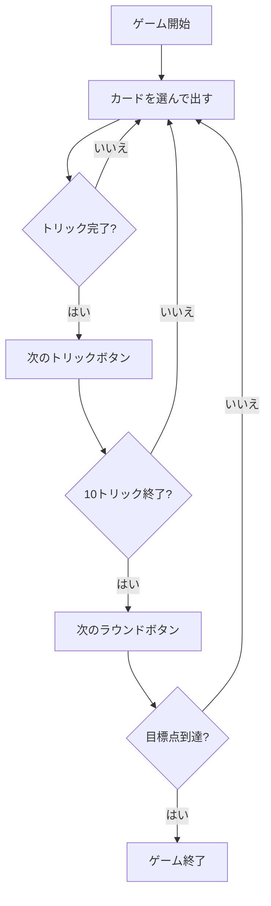

# マドラッソ（Web版）遊び方

## ゲーム概要

Madrasso（マドラッソ）はイタリア・ヴェネト州でもっとも人気のあるトリックテイキングゲームです。伊式40枚デッキ（8・9・10を除く）を4人（2対2のチーム戦）に10枚ずつ配り切ります。**切り札は配りで決まります** —— 最後に配られた1枚のスートがその手の切り札になり、切り札はどの平札にも勝ちます。カードの強さは **A > 3 > K > Q > J > 7 > 6 > 5 > 4 > 2** で、**点の高い札ほど強い**という並びです（同じ伊式のトレセッテは 3 と 2 が A より強く、逆になります）。カード点は**整数**で数え、過半（61点以上）を取った側がそのディールを取ります。先に目標ディール数（既定4）に到達したチームの勝利です。

## 起動方法

```sh
go run ./cmd/trumpcards web         # CLI経由でWebサーバーを起動
go run ./cmd/trumpcards web --open  # サーバー起動 + ブラウザを開く
go run ./cmd/server                 # 直接Webサーバーを起動
```

ブラウザで `http://localhost:8080` にアクセスし、ナビゲーションバーから「マドラッソ」を選択します。
ナビバーのJA/ENボタンで日本語・英語を切り替えられます。

## ルール

### チーム

- プレイヤー0（あなた）とプレイヤー2がチームA、プレイヤー1とプレイヤー3がチームB。
- 向かい合うプレイヤー同士が味方です。

### カードの強さ（トリックの勝敗）

**切り札は配りで決まります。** 最後に配られた1枚のスートが切り札です（誰も選びません）。リードスートに従う義務（マストフォロー）があり、追従できないときだけ切り札を切れます。

- 切り札はどの平札にも勝ちます。
- 切り札が出ていなければ、リードスートの最強札が勝ちます。

強い順: **A > 3 > K > Q > J > 7 > 6 > 5 > 4 > 2**

**点の高い札がそのまま強い**並びです。トレセッテは 3 と 2 が A より強いので、同じ伊式でも感覚が逆になります。

### 得点（整数点）

| カード | 得点 |
|--------|------|
| A | 11点 |
| 3 | 10点 |
| K | 4点 |
| Q | 3点 |
| J | 2点 |
| 7・6・5・4・2 | 0点 |
| 最終トリックの勝者 | +1点（ウルティマ・ボーナス） |

1ディールで奪い合うカード点の合計は **120点**（1スートあたり30点 × 4）に、ウルティマの1点を加えた **121点**。**過半（61点以上）を取った側がそのディールを取り、1ディール分を獲得します。** ちょうど半分ずつ（60対60）なら誰も取りません。

### ゲーム終了

いずれかのチームの獲得ディール数が目標（既定4）以上に達し、かつ相手チームを上回ったらゲーム終了。上回ったチームが勝者です。

## ゲームの流れ



## 画面の操作方法

- **設定パネル**: CPU難易度と目標点を選択できます。「ヒント」チェックでフロントエンドのヒント表示を切り替えられます。
- **カードを選ぶ**: あなたの手番のとき、手札のカードをクリックして選択します。リードスートに従えないカードはサーバ側で弾かれます。
- **「出す」ボタン**: 選んだカードをプレイします。
- **「次のトリック」ボタン**: トリックが解決したら次のトリックへ進みます。
- **「次のラウンド」ボタン**: ラウンド終了時に集計して次のラウンドへ進みます。
- **「ヒント」ボタン**: 現在の手番での推奨プレイを表示します。
- **リセットボタン**: 新しいゲームを開始します。

## 画面構成

- **ヘッダー**: ゲーム名・フェーズ表示・CLI切り替えトグル。
- **ラウンド／トリック表示**: 現在のラウンドとトリック番号。
- **トリック表示エリア**: 場に出ているカードと出したプレイヤー。
- **チームスコア表**: チームA／Bの獲得ディール数と、現ディールで取ったカード点（121点中）。
- **メッセージボックス**: 現在のフェーズや結果の案内。
- **フッター**: あなたの手札と操作ボタン。

## 遊び方のコツ

- A・2・3 は強い札であると同時に得点札です。取られないよう注意しましょう。
- 味方がトリックで勝っているときは、得点札を出して味方に点を渡すのが定石です。
- 相手が勝っていて得点札が出ているなら、勝てる札で取りに行きます。取れないときは低い札でダックして温存します。
- 最終トリックには +1点 のボーナス（ウルティマ）があります。
