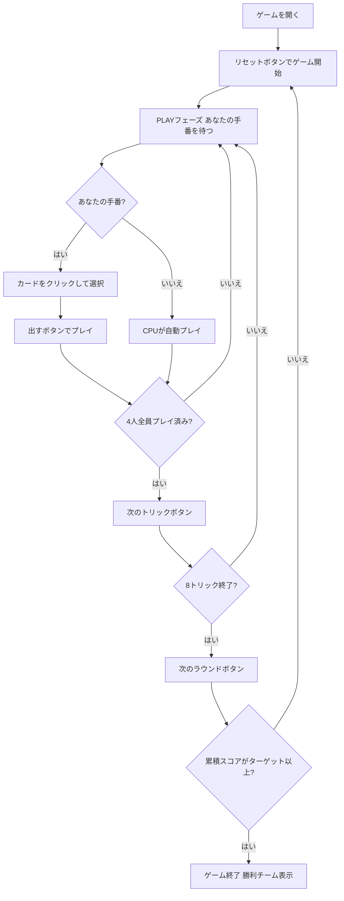

# マニーユ（Web版）遊び方

## ゲーム概要

Manille（マニーユ）はベルギー・フランスを中心にヨーロッパで広く親しまれているトリックテイキングゲームです。32枚のデッキを4人（2チーム制、席0&2 対 席1&3）でプレイします。切り札スートは配布時に決まり、マスト・フォロー＋切り札温存免除ルールの下で8トリックを争います。最大の特徴は**逆順ランク**で、10（マニーユ）が最強、次いでA（マニヨン）が強いカードとなっています。カード点数を複数ラウンドにわたって累積し、先にターゲット（デフォルト101点）に達したチームが勝ちます。あなたは席0（チームA）としてプレイします。

## 起動方法

```sh
go run ./cmd/trumpcards web         # CLI経由でWebサーバーを起動
go run ./cmd/trumpcards web --open  # サーバー起動 + ブラウザを開く
go run ./cmd/server                 # 直接Webサーバーを起動
```

ブラウザで `http://localhost:8080` にアクセスし、ナビゲーションバーから「マニーユ」を選択します。
ナビバーのJA/ENボタンで日本語・英語を切り替えられます。

## ルール

### デッキと配布

- **デッキ**: 32枚（7,8,9,10,J,Q,K,A × 4スート）
- **プレイヤー**: 4人（あなた = 席0、CPU1〜3）
- **チーム**: 席0&2（あなたのチーム）対 席1&3
- **配布**: 各プレイヤー8枚
- **切り札**: 最後に配られたカードのスートが切り札スートとなる

### カードの強さと点数（マニーユ逆順ランキング）

**全スート共通**（強い順）: **10(マニーユ) > A(マニヨン) > K > Q > J > 9 > 8 > 7**

切り札スートはすべての非切り札スートのカードに勝ちます。切り札内・非切り札内ではともに上記の順序が適用されます。

**カード点数**: **10=5点、A=4点、K=3点、Q=2点、J=1点、9/8/7=0点**（4スート合計60点）

### マスト・フォロー＋切り札温存免除

1. リードされたスートを持っている場合は必ずそのスートを出す
2. リードスートがない場合（ボイド）かつパートナーがそのトリックを勝っていないなら、切り札を持っていれば必ず切り札を出す
3. リードスートがない場合（ボイド）かつパートナーがすでにそのトリックを勝っているなら、切り札を温存して任意のカードを捨て札として出せる
4. オーバートランプ義務はない

### 勝利条件

各ラウンドで獲得したカード点数がチームスコアに累積され、先にターゲット（デフォルト **101点**）に達したチームがマッチ勝利となります。（メルドなし、最終トリックボーナスなし）

## ゲームの流れ



## 画面の操作方法

### PLAYフェーズ

- あなたの手番のとき、手札のカードをクリックして選択します。
- **「出す」ボタン**: 選択したカードをプレイします。マスト・フォロー義務（またはボイド時のパートナー状況による切り札温存免除）に従う必要があります。
- **「次のトリック」ボタン**: トリックが解決したら次へ進みます。
- **「次のラウンド」ボタン**: 8トリック終了後にスコアを集計して次のラウンドへ進みます。

### キーボードショートカット

このゲームではキーボードショートカットはありません。すべての操作はボタンまたはカードのクリックで行います。

## 画面構成

```
┌─────────────────────────────────────────────┐
│  Manille (マニーユ) [JA/EN] [CLI]           │
├─────────────────────────────────────────────┤
│  ラウンド: 1  トリック: 1  フェーズ: PLAY   │
│  切り札: ♥  チームスコア: あなた=0 相手=0   │
├──────────┬──────────────────────────────────┤
│  CPU1    │                                   │
│  CPU2    │     現在のトリック表示エリア       │
│  CPU3    │     （各プレイヤーの出したカード）  │
│          │                                   │
├──────────┼──────────────────────────────────┤
│  チームA │  メッセージ / 結果表示            │
│  チームB │  ラウンド結果・スコア情報          │
├──────────┴──────────────────────────────────┤
│  あなたの手札（クリックで選択）               │
│  [A♠][10♠][K♥][J♠][Q♣]...                 │
│  [出す] [次のトリック] [次のラウンド]         │
└─────────────────────────────────────────────┘
```

- **ヘッダー**: ゲーム名・フェーズ表示・言語切り替えトグル・CLI切り替えトグル。
- **ラウンド／トリック表示**: 現在のラウンド番号・トリック番号・切り札スート。
- **チームスコア**: 各チームの累積スコア（カード点数の合算）をリアルタイムで表示。
- **プレイヤー表示エリア（左）**: CPU各プレイヤーの手札枚数・取得トリック数・チームを表示。
- **トリック表示エリア（中央）**: 場に出ているカードと出したプレイヤー名。
- **メッセージボックス**: フェーズ・ラウンド結果（カード点数・スコア）・勝敗の案内。
- **フッター（手札エリア）**: あなたの手札と操作ボタン（出す／次のトリック／次のラウンド）。

## 遊び方のコツ

- **10（マニーユ）が最強**: 10はすべてのカードに勝ちます（切り札の10はさらに強力）。手持ちのマニーユをいつ使うかが勝敗の鍵です。
- **パートナーが勝っているトリックでは切り札を温存**: パートナーがリードしているトリックでは切り札を出す義務がありません。切り札を後のトリックに取っておきましょう。
- **カード点数の高いカードを狙う**: 10（5点）、A（4点）、K（3点）を集めることが得点最大化の基本です。相手の10（マニーユ）を奪うには切り札か自分の10が必要です。
- **チームプレイ**: 席0&2が同じチームです。パートナーが高得点トリックを取りそうな場合は低いカードでサポートしましょう。
- **ボイドスートを作る**: 特定のスートを早めに使い切ることで、そのスートがリードされた時に切り札を出せるようになります。
- **101点目標の長期戦**: Manilleは複数ラウンド続く長期戦です。序盤から累積スコアを意識し、ラウンドごとに獲得点数を最大化する戦略を立てましょう。
- **A（マニヨン）の価値**: Aは2番目に強く4点の価値があります。マニーユ（10）がない場合に頼れる最強カードであるため、序盤の温存が有効です。
