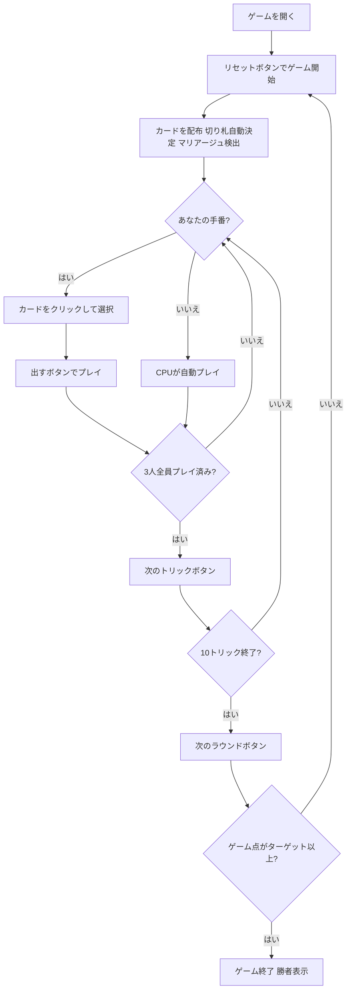

# マリアーシュ（Web版）遊び方

## ゲーム概要

Mariáš（マリアーシュ）はチェコ・スロバキアで広く親しまれているトリックテイキングゲームです。32枚のドイツ式スートデッキを3人でプレイします。各ラウンドごとに1人の**ソロイスト**（前手 = ディーラーの左隣、毎ラウンド交代）が2人の**ディフェンダー**と対戦します。ソロイストの合計点（カード点 + マリアージュ + 最終トリックボーナス）がディフェンダー合計を上回ればソロイスト勝利、先にターゲット（デフォルト10点）に達したプレイヤーがマッチ勝利です。あなたは席0としてプレイします。

## 起動方法

```sh
go run ./cmd/trumpcards web         # CLI経由でWebサーバーを起動
go run ./cmd/trumpcards web --open  # サーバー起動 + ブラウザを開く
go run ./cmd/server                 # 直接Webサーバーを起動
```

ブラウザで `http://localhost:8080` にアクセスし、ナビゲーションバーから「マリアーシュ」を選択します。
ナビバーのJA/ENボタンで日本語・英語を切り替えられます。

## ルール

### デッキと配布

- **デッキ**: 32枚（7,8,9,10,J,Q,K,A × 4スート）
- **プレイヤー**: 3人（あなた = 席0、CPU1〜2）
- **配布**: 各プレイヤー10枚（残り2枚はタロン——簡易実装のため使用しない）
- **切り札**: ソロイストの最長スートが自動的に切り札スートになる（入札フェーズなし）

### 役割

| 役割 | 内容 |
|------|------|
| **ソロイスト** | ディーラーの左隣の前手（毎ラウンド1席交代）。単独で2人のディフェンダーと対戦 |
| **ディフェンダー** | ソロイスト以外の2人。協力してソロイストの得点を阻止する |

### カードの強さと点数

**全スート共通**（強い順）: **A > 10 > K > Q > J > 9 > 8 > 7**

切り札スートはすべての非切り札スートのカードに勝ちます。

**カード点数**: **A=11点、10=10点、K=4点、Q=3点、J=2点、9/8/7=0点**（4スート合計120点）

### マリアージュ（婚礼）

配布時に同一スートのKとQを両方持っている場合、マリアージュが自動適用されます。

- **切り札スートのマリアージュ**: **40点**
- **非切り札スートのマリアージュ**: **20点**

### フォロー義務

1. リードされたスートを持っている場合は必ずそのスートを出す
2. リードスートがない場合（ボイド）、切り札を持っていれば必ず切り札を出す
3. 切り札もない場合、任意のカードを捨て札として出せる
4. オーバートランプ義務はない

### 勝利条件

**ラウンド結果**: ソロイストの合計（カード点 + マリアージュ + 最終トリック+10点）が ディフェンダー合計を上回ればソロイスト勝利で**+2ゲーム点**、それ以外は各ディフェンダーが**+2ゲーム点**。

**マッチ勝利**: 先にターゲット（デフォルト **10** ゲーム点）に達したプレイヤーが勝利。

## ゲームの流れ



## 画面の操作方法

### PLAYフェーズ

- あなたの手番のとき、手札のカードをクリックして選択します。
- **「出す」ボタン**: 選択したカードをプレイします。フォロー義務（ボイド時は切り札必須）に従う必要があります。
- **「次のトリック」ボタン**: トリックが解決したら次へ進みます。
- **「次のラウンド」ボタン**: 10トリック終了後にスコアを集計して次のラウンドへ進みます。

### キーボードショートカット

このゲームではキーボードショートカットはありません。すべての操作はボタンまたはカードのクリックで行います。

## 画面構成

```
┌─────────────────────────────────────────────┐
│  Marias (マリアーシュ) [JA/EN] [CLI]        │
├─────────────────────────────────────────────┤
│  ラウンド: 1  トリック: 1  フェーズ: PLAY   │
│  切り札: ♥  ソロイスト: あなた              │
│  ゲーム点: あなた=0  CPU1=0  CPU2=0         │
├──────────┬──────────────────────────────────┤
│  CPU1    │                                   │
│  (役割)  │     現在のトリック表示エリア       │
│  CPU2    │     （各プレイヤーの出したカード）  │
│  (役割)  │                                   │
├──────────┼──────────────────────────────────┤
│  マリア  │  メッセージ / 結果表示            │
│  ージュ  │  ラウンド結果・スコア情報          │
│  ボーナス│                                   │
├──────────┴──────────────────────────────────┤
│  あなたの手札（クリックで選択）               │
│  [A♠][10♠][K♥][Q♥][J♠]...                 │
│  [出す] [次のトリック] [次のラウンド]         │
└─────────────────────────────────────────────┘
```

- **ヘッダー**: ゲーム名・フェーズ表示・言語切り替えトグル・CLI切り替えトグル。
- **ラウンド／トリック表示**: 現在のラウンド番号・トリック番号・切り札スート・ソロイスト表示。
- **ゲーム点**: 各プレイヤーの累積ゲーム点をリアルタイムで表示。
- **プレイヤー表示エリア（左）**: CPU各プレイヤーの手札枚数・役割（ソロイスト or ディフェンダー）を表示。
- **マリアージュ情報（左）**: 配布時に自動検出されたマリアージュとボーナス点。
- **トリック表示エリア（中央）**: 場に出ているカードと出したプレイヤー名。
- **メッセージボックス**: フェーズ・ラウンド結果（カード点・マリアージュ・ゲーム点）・勝敗の案内。
- **フッター（手札エリア）**: あなたの手札と操作ボタン（出す／次のトリック／次のラウンド）。

## 遊び方のコツ

- **ソロイストは攻め、ディフェンダーは守れ**: ソロイストはカード点とマリアージュを積み上げてディフェンダーの合計より高くするのが目標。ディフェンダーは2人で協力してソロイストの合計を下回らせましょう。
- **切り札管理が鍵**: 切り札はどのスートにも勝ちます。ソロイストは切り札スートが最長スートになるため積極的に活用できます。ディフェンダーは切り札の消費を相手に強いることで有利になります。
- **A（11点）と10（10点）の争奪**: カード点の大部分はAと10が占めます（各スート21点、計84点/120点中）。これらを確実に取るかブロックするかがラウンド結果を左右します。
- **マリアージュは見逃せない**: 切り札マリアージュ（40点）は非常に大きく、それだけでラウンドを有利にします。ソロイストとして切り札マリアージュを持てたなら、守りを固めつつ安全にプレイできます。
- **最終トリックボーナスを意識する**: 10トリック目には+10点のボーナスがあります。接戦のラウンドでは最終トリックを取れるかどうかが勝負を分けることがあります。
- **フォロー義務を把握**: ボイド時は切り札が必須です。特定のスートのカードを早めに使い切ることで、そのスートがリードされた際に切り札を出すチャンスを作れます。
- **ディフェンダー同士で連携**: ディフェンダーの2人は点数の高いカードをお互いのトリックに乗せるなど、暗黙の連携が重要です。ソロイストが弱そうなスートをリードして互いの高得点カードを確保しましょう。
