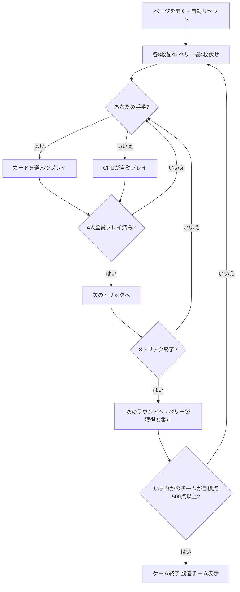

# マルヤプッシ（Web版）遊び方

## ゲーム概要

Marjapussi（マルヤプッシ）は、フィンランド発祥の伝統的な**4人・2対2チーム戦ポイント・トリックテイキングゲーム**です。36枚のデッキを使用し、席0（あなた）と席2のチーム0、席1と席3のチーム1がペアを組んで対戦します。競り（ビッド）やタロン交換はなく、配札後直ちにプレイフェーズが始まります。リード時に同スートのKとQを所持していれば「マリッジ（結婚）」を宣言でき、切り札の変更と追加点（20点または40点）を獲得できます。第8トリック（最終トリック）を取ったチームが伏せ札「ベリー袋（pussi）」の4枚を獲得します。先に目標得点（デフォルト500点）に到達したチームが勝利となります。あなたは席0としてプレイします。

## 起動方法

```sh
go run ./cmd/trumpcards web         # CLI経由でWebサーバーを起動
go run ./cmd/trumpcards web --open  # サーバー起動 + ブラウザを開く
go run ./cmd/server                 # 直接Webサーバーを起動
```

ブラウザで `http://localhost:8080` にアクセスし、ナビゲーションバーから「マルヤプッシ」を選択します。
ナビバーのJA/ENボタンで日本語・英語を切り替えられます。

## ルール

### プレイヤーとチーム

- **プレイヤー**: 4人（席0: あなた、席1: CPU 1、席2: CPU 2、席3: CPU 3）
- **チーム**: 席0 + 席2（チーム0）対 席1 + 席3（チーム1）のチーム戦。得点はチーム単位で累積されます。

### デッキと配布

- **デッキ**: 36枚（各スート 6, 7, 8, 9, 10, J, Q, K, A。2〜5は不使用）
- **配布**: 各プレイヤーに8枚ずつ配布されます（合計32枚）。
- **ベリー袋（pussi）**: 残り4枚は裏向きのまま「ベリー袋（pussi）」として中央に伏せられます。

### カードの強さと点数

- **トリックの強さ（強い順）**: A > 10 > K > Q > J > 9 > 8 > 7 > 6
  - 切り札が出ている場合、切り札の中で最強のカードを出したプレイヤーがトリックを獲得します。
  - 切り札が出ていない場合、リードスートの中で最強のカードを出したプレイヤーがトリックを獲得します。
- **カード点数**:
  - A: 11点
  - 10: 10点
  - K: 4点
  - Q: 3点
  - J: 2点
  - 9, 8, 7, 6: 0点
  - デッキ全体（pussi 4枚を含む）の合計カード点数は **120点** です。

### マリッジ（婚礼）＝ 動的切り札

- ラウンド開始時は**切り札なし（未決定）**です。
- リード（トリックの先手）の手番で、同一スートの **K と Q を両方**手札に持っている場合、そのKまたはQをリードすることでマリッジを宣言できます。
- マリッジ点:
  - 宣言したスートが**現在の切り札と同じ**場合: **40点**
  - 宣言したスートが**現在の切り札と異なる（または未決定の）**場合: **20点**（そのスートが新たな切り札になります）
- 手札にマリッジ可能な組がある場合、マリッジ候補として案内が表示されます。

### フォロー義務（裁定）

1. **マストフォロー**: リードされたスートのカードを手札に持っている場合、必ずそのスートを出さなければなりません。
2. **切り札強制**: リードスートを持たない（ボイド）場合、切り札を持っていれば**必ず切り札を出さなければなりません**。
3. 切り札も持っていない場合、または切り札が未決定の間にリードスートを持たない場合は、任意の手札を捨てることができます。
4. オーバートランプ義務（場に出ている切り札より強い切り札を出す義務）はありません。

### ベリー袋（pussi）

- ラウンドの最後のトリック（第8トリック）を獲得したプレイヤーのチームが、中央に伏せられていたベリー袋（pussi）4枚を獲得します。
- pussi に含まれるカードの点数は、そのチームのラウンド獲得カード点に加算されます。

### 得点計算と勝利条件

- 毎ラウンド終了時、各チームは獲得したトリックのカード点＋マリッジ点（および第8トリック勝者チームは pussi のカード点）を加算します。
- 先に累積 **500点**（設定変更可能）に到達したチームがマッチの勝者となります。

### CPU 難易度

| 難易度 | 説明 |
|--------|------|
| Easy | 初心者向け。基本的なルールに従ってプレイします。 |
| Normal | 標準難易度。マストフォローやマリッジの基本戦略を実行します。 |
| Hard | 上級者向け。パートナーとの連携や切り札管理、カウンティングを考慮してプレイします。 |

## ゲームの流れ



## 画面の操作方法

### プレイフェーズ

1. あなたの手番になると、手札の中でルール上出すことができるカードがクリック可能になります（ルール上出せないカードは無効化されます）。
2. カードをクリックして場に出します。
3. 同スートの K と Q を揃えた状態でリードすると、自動的にマリッジが宣言されて切り札が更新され、マリッジ点がチームに記録されます。

### トリック終了フェーズ

全員がカードを出し終えると、そのトリックの勝者が判定されます。「次のトリックへ」ボタンを押して次のトリックに進みます。

### ラウンド終了フェーズ

8トリックがすべて終了すると、第8トリックを獲得したチームがベリー袋（pussi）を獲得し、ラウンドのカード点・マリッジ点・pussi 点が集計されます。「次のラウンドへ」ボタンを押して新しいラウンドを開始します。

### ゲーム終了

いずれかのチームが累積で目標得点（500点）に到達するとゲーム終了です。「リセット」ボタンを押すことで、新しいゲームを開始できます。

## 画面構成

```
┌─────────────────────────────────────────────────────────┐
│ ヘッダー: マルヤプッシ / ラウンド・トリック進行 / 切り札スート │
├──────────────────────────┬──────────────────────────────┤
│ 中央: トリック表示エリア   │ 情報パネル:                   │
│ 各プレイヤーが出したカード │ 各チーム累積得点・目標得点   │
│                          │ 各プレイヤーの手札枚数・獲得数 │
├──────────────────────────┴──────────────────────────────┤
│ フッター: あなたの手札（プレイ可能な札をハイライト）       │
│ マリッジ候補バナー / 操作ボタン（次のトリックへ / リセットなど）│
└─────────────────────────────────────────────────────────┘
```

- **ヘッダー**: ゲームタイトル、現在のラウンド・トリック番号、現在の切り札スートを表示します。
- **トリック表示エリア**: 4人のプレイヤーが場に出したカードと、トリックの勝者を表示します。
- **情報パネル**: チーム0（あなたとCPU 2）およびチーム1（CPU 1とCPU 3）の累積得点・獲得点数、CPU難易度や目標点数を表示します。
- **手札エリア**: あなたの手札を表示します。フォロー義務に従って出せるカードがハイライトされます。
- **アクションボタン**: 「次のトリックへ」「次のラウンドへ」「リセット」などのボタンが表示されます。

## 遊び方のコツ

- **マリッジで有利な切り札を作る**: KとQを両方持っているなら、リード番で出して積極的にマリッジを宣言しましょう。現在の切り札と同じスートなら40点、異なるスートなら20点とともに切り札を塗り替えられます。
- **パートナー（席2）との連携**: パートナーがトリックを取れそうなときは、無理に勝たずに低いカードでフォローし、逆に相手チームが勝ちそうなときは切り札等で阻止しましょう。
- **第8トリックのベリー袋（pussi）獲得を狙う**: 最終トリックの勝者チームは、伏せられていた pussi 4枚の得点を獲得できます。重要なカードを最終トリックまで温存して勝負を制しましょう。
