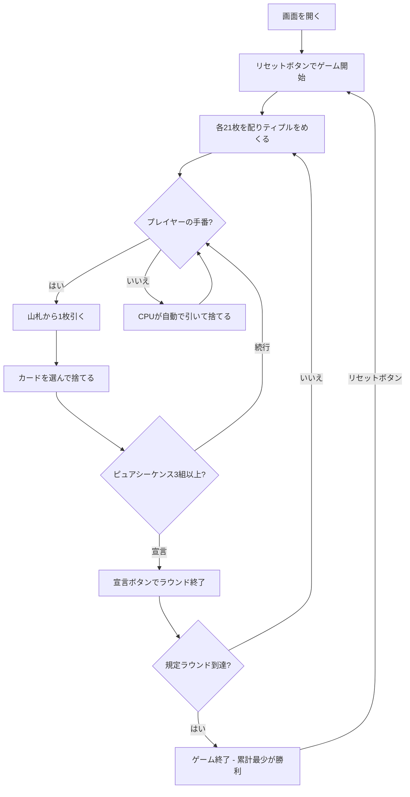

# マリッジ（Web版）遊び方

## ゲーム概要

2〜5人（プレイヤー1人 + CPU 1〜4人）で遊ぶネパール／北インドの21枚制ラミーです。標準52枚×3組と印刷ジョーカー6枚（162枚）を使い、21枚すべてをメルドにしてピュアシーケンス3組以上をそろえたプレイヤーが宣言できます。デフォルト3ラウンドで、累計点が最も少ないプレイヤーが勝利します。

## 起動方法

```sh
go run ./cmd/trumpcards web  # CLI経由でWebサーバーを起動
go run ./cmd/server          # 直接Webサーバーを起動
```

ブラウザで `http://localhost:8080` にアクセスし、ナビゲーションバーから「マリッジ」を選択します。
ナビバーのJA/ENボタンで日本語・英語を切り替えられます。

## ルール

### 基本ルール

- 標準52枚×3組 + 印刷ジョーカー6枚（162枚）、2〜5人で遊びます
- 各プレイヤーに21枚を配り、配り終えた後に1枚を表向きにめくります。これがティプルです
- 手番は1枚引いて1枚捨てます。山札が尽きたラウンドは宣言なしで終了します

### ワイルドとメルド

- ティプルと同ランク、上下1ランク（K↔Aで巡回）のカードはスートを問わずワイルドです。印刷ジョーカーもワイルドです
- セットは同ランク3〜4枚（異なるスート）で、ワイルドは1枚までです
- シーケンスは同スートの連続3枚以上で、ワイルドなしがピュア、1枚使用がインピュアです
- 21枚すべてが有効なメルドで、ピュアシーケンスが3組以上あるときだけ宣言できます

### マールと得点

ティプル（同ランク同スート）は3点、ポプル／ジプル（同スートで上下1ランク）は各2点、アルター（同ランク別スート）は1点、印刷ジョーカーは1点です。ピュアシーケンスが3組以上あるプレイヤーだけマール合計をラウンド点から差し引き、負の点も許されます。成功宣言は0点、失敗宣言は80点、それ以外はデッドウッド（A・10/J/Q/K=10、2〜9は額面、ワイルド=0、上限80）です。このマール表とピュアシーケンス3組以上は、このリポジトリのハウスルールであり、史実上の唯一の遊び方ではありません。

## ゲームの流れ



## 画面の操作方法

### ドローフェーズ

1. **「山札から引く」** または **「捨て札から引く」** ボタンで1枚引きます

### ディスカード／宣言フェーズ

1. 手札のカードをクリックして選択します
2. **「捨てる」** ボタンで選択したカードを捨てます
3. 条件を満たしたら **「宣言」** ボタンを押します

### ラウンド終了

1. **「次のラウンド」** ボタンで次のラウンドに進みます

## 画面構成

```
┌────────────────────────────────────────────┐
│  ▶ 設定  プレイヤー数 [5▼]  ラウンド数 [3▼] │
├────────────────────────────────────────────┤
│  ティプル: ♥7   山札: 45枚                  │
│  CPU 1: 21枚 | 累計: 12                     │
├────────────────────────────────────────────┤
│  ラウンド 1/3 | あなたの手札: 21枚           │
│  [♥5][♥6][♥8][♣7]...                       │
│  [リセット] [山札から引く] [捨てる] [宣言]   │
└────────────────────────────────────────────┘
```

- **ティプル**: そのラウンドのワイルド基準とマールを示します
- **手札**: クリックしたカードを捨てる対象として選択します
- **スコアテーブル**: ラウンド点と累計点を表示します
