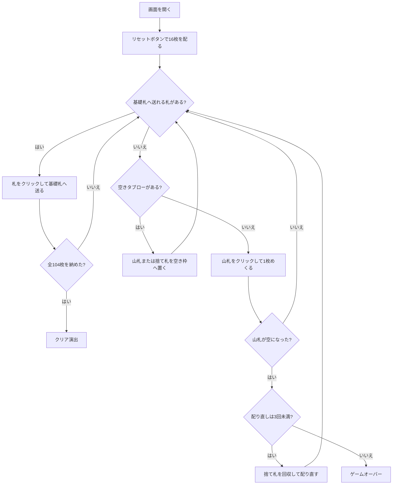

# マトリモニー（Web版）遊び方

## ゲーム概要

2 組 104 枚を使う 1 人用ペイシェンスです。16 枚のタブローから、スートごとに決められた基礎札へ送り、全札を納めればクリアです。

## 起動方法

```sh
go run ./cmd/trumpcards web
go run ./cmd/server
```

ブラウザで `http://localhost:8080` にアクセスし、ナビゲーションバーから「マトリモニー」を選択します。ナビバーの JA/EN ボタンで日本語・英語を切り替えられます。

## ルール

- 52 枚 2 組（104 枚）を使い、16 枚をタブローへ配り、残りを山札にします。
- 基礎札は 4 本です。♠Q の 2 枚は降順、♦J の 2 枚は昇順に、スートに従って積みます。同名のもう 1 枚も基礎札になります。
- 降順は Q→J→10→…→2→A→K、昇順は J→Q→K→A→2→…→10 のようにランクを一周します。
- 次に必要なランクとスートが一致する札を基礎札へ送り、空いたタブローは山札または捨て札で補充します。
- 山札を使い切ったら捨て札を回収して配り直します。配り直しは最大 3 回です。
- 全 104 枚を基礎札へ納めればクリアです。

ラップのおかげで明確な行き止まりはありませんが、K の次に A、A の次に 2 が続くため、**次に送れる札が読みにくい**ゲームです。

## ゲームの流れ



## 画面の操作方法

| 操作 | 説明 |
|------|------|
| リセットボタン | 16 枚を配って新しいゲームを開始する |
| タブローの札をクリック | 選択中の札を基礎札へ送る |
| 捨て札をクリック | 基礎札へ送るか、空きタブローへ移す |
| 山札をクリック | 1 枚めくる。山札が空なら最大 3 回まで配り直す |
| 空きタブローをクリック | 選択中の山札・捨て札を置く |
| ヒントボタン | 送れる手を 1 つ提示する |
| オートコンプリートボタン | 送れる札を自動で基礎札へ送る |
| 元に戻すボタン | 直前の手を取り消す |
| ギブアップボタン | ゲームを終了する |
| CLI トグル | 同じゲームをコマンド入力で操作するモードに切り替える |

### キーボードショートカット

| キー | アクション | 有効条件 |
|------|-----------|---------|
| `H` | ヒントを表示 | プレイ中 |
| `U` | 直前の手を取り消す | 取り消せる手があるとき |
| `R` | リセット | 確認後いつでも |

## 画面構成

- **上部**: ゲーム名、フェーズ、手数、配り直し回数
- **中央上**: ♠Q 降順 2 本と ♦J 昇順 2 本の基礎札
- **中央**: 16 枠のタブロー（4×4）
- **下部**: 山札、捨て札、ヒント・オートコンプリート・元に戻す・リセットの操作ボタン
- **補助領域**: アクションログと設定。CLI トグルで CUI 操作に切り替えられます

## 遊び方のコツ

- スートと方向を確認して、基礎札ごとの次のランクを覚えます。
- ラップは行き止まりをなくしますが、次の札の予測を難しくします。現在の札だけでなく、次に続くランクも見ておきましょう。
- タブローを空ける手は補充の余地を増やします。山札をめくる前に、基礎札へ送れる札を探します。
