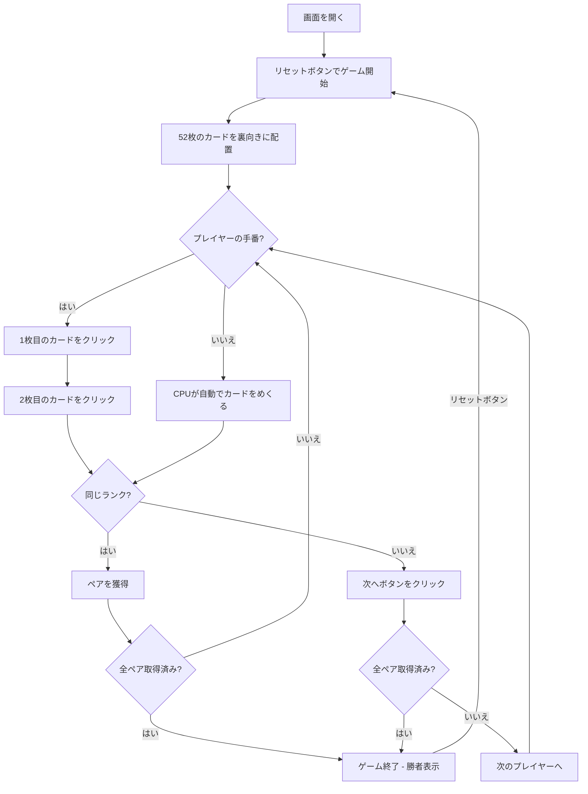

# 神経衰弱（Web版）遊び方

## ゲーム概要

4人（プレイヤー1人 + CPU 3人）で遊ぶカードゲームです。52枚のカードを裏向きに並べ、2枚ずつめくって同じランクのペアを揃えます。全26ペアが取られた時点で最もペア数の多いプレイヤーが勝者です。

## 起動方法

```sh
go run ./cmd/trumpcards web  # CLI経由でWebサーバーを起動
go run ./cmd/server          # 直接Webサーバーを起動
```

ブラウザで `http://localhost:8080` にアクセスし、ナビゲーションバーから「神経衰弱」を選択します。
ナビバーのJA/ENボタンで日本語・英語を切り替えられます。

## ルール

### 基本ルール

- 52枚のトランプ（ジョーカーなし）を裏向きにボード上に並べる
- プレイヤーは順番に2枚のカードをめくる
- めくった2枚が同じランクならペアとして獲得し、もう1ターン続行
- 異なるランクなら2枚を裏に戻し、次のプレイヤーに交代

### ゲーム終了

- 全26ペアが取られた時点でゲーム終了
- 最もペア数の多いプレイヤーが勝者

### CPU難易度

- **Easy**: ランダムにカードをめくる
- **Normal**: 部分的にカードの位置を記憶する（デフォルト）
- **Hard**: 完全にカードの位置を記憶する

## ゲームの流れ



## 画面の操作方法

### カードをめくる（Flip1・Flip2フェーズ）

1. ボード上の裏向きのカードをクリックして1枚目をめくります
2. 続けて2枚目の裏向きのカードをクリックしてめくります
3. 同じランクならペアとして獲得し、続けてもう1ターンプレイできます

### 結果確認後の進行（Resultフェーズ）

1. めくった2枚が異なるランクの場合、結果が表示されます
2. **「次へ」** ボタンをクリックしてカードを裏に戻し、次のプレイヤーに交代します

### キーボードショートカット

ゲーム中、以下のキーボードショートカットが使用できます。

| キー | アクション | 有効条件 |
|------|-----------|---------|
| `n` | 次へ | 結果フェーズ（Resultフェーズ） |

※ テキスト入力欄にフォーカスがある場合、ショートカットは無効になります。

## 画面構成

```
┌────────────────────────────────────────────┐
│  ▶ 設定 (クリックで展開)                   │
│    CPU難易度:    [Normal▼]                 │
├────────────────────────────────────────────┤
│           CPU プレイヤーエリア              │
│ ┌──────────┐ ┌──────────┐ ┌──────────┐    │
│ │ CPU 1    │ │ CPU 2    │ │ CPU 3    │    │
│ │ 2ペア    │ │ 1ペア    │ │ 0ペア    │    │
│ └──────────┘ └──────────┘ └──────────┘    │
├────────────────────────────────────────────┤
│              ゲーム情報                     │
│  残りペア: 20 / 26                         │
│  手番: あなた                              │
├────────────────────────────────────────────┤
│              ボード                        │
│  [??][??][??][♠2][??][??][--]             │
│  [??][??][??][??][??][??][--]             │
│  ...                                      │
├────────────────────────────────────────────┤
│         フッター: あなた (3ペア)            │
│  [リセット] [次へ]                         │
└────────────────────────────────────────────┘
```

- **CPU プレイヤーエリア**: 各 CPU の獲得ペア数を表示
  - 手番の CPU は金色枠
- **ゲーム情報**: 残りペア数、現在の手番プレイヤー
- **ボード**:
  - 裏向きカード: クリックでめくる
  - 表向きカード: めくられたカードが表示される
  - 取得済みカード: 空白または非表示
- **設定パネル（▶ 設定）**:
  - 「CPU難易度」セレクト: Easy / Normal / Hard から選択
  - 次のリセット時に設定が適用される

## 遊び方のコツ

- めくられたカードの位置とランクを覚えておきましょう
- CPUがめくったカードも注意深く観察すると、ペアの位置を特定しやすくなります
- 序盤は情報収集を重視し、まだ見ていない位置のカードを優先的にめくると効率的です
- 確実にペアだとわかるカードがあれば、優先的にめくりましょう
