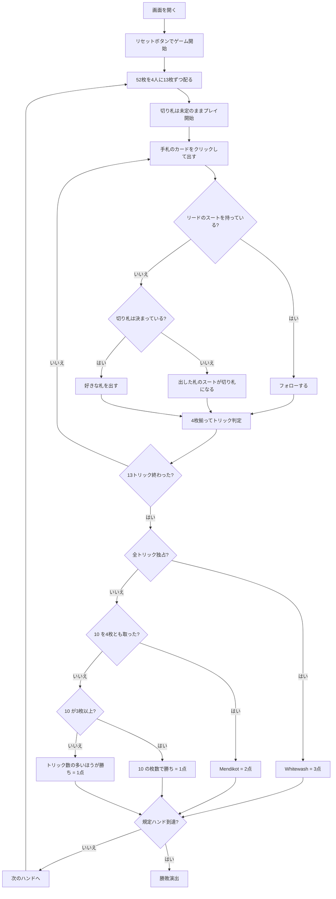

# メンディコット（Web版）遊び方

## ゲーム概要

インドの家庭で広く遊ばれている切り札トリックテイキング。52枚を4人に13枚ずつ配る**2対2のパートナー戦**で、向かい合う席が味方。**勝敗を決めるのは点数でもトリック数でもなく、4枚の「10」を何枚取ったか**です。**切り札を選ぶ場面はありません**——最初にフォローできなかった人が出した札のスートが、そのまま切り札になります。

## 起動方法

```sh
go run ./cmd/trumpcards web  # CLI経由でWebサーバーを起動
go run ./cmd/server          # 直接Webサーバーを起動
```

ブラウザで `http://localhost:8080` にアクセスし、ナビゲーションバーから「メンディコット」を選択します。
ナビバーのJA/ENボタンで日本語・英語を切り替えられます。

## ルール

- **52枚**、**4人2対2**（向かい合う席が味方）、13枚ずつ。山札は残りません
- **切り札は未定のまま始まります。** 誰かがリードのスートを持たず**フォローできなくなった瞬間**、その人が出した札のスートが切り札になります
- **自分の手番で切り札が決まってしまうとき**は、盤面の上に専用の警告バナーが出ます（フォローできる手番や、切り札が決まったあとは出ません）
- **10 を3枚以上取ったチームがハンドの勝ち**（1点）。2枚ずつならトリック数の多いほうが勝ち（1点）
- **4枚とも取れば Mendikot で2点**、**全13トリック取れば Whitewash で3点**
- 10 は2枚ずつになるか3枚以上どちらかに寄るかのどちらかなので、**引き分けのハンドはありません**
- フォロー義務あり。切り札 > リードのスート > その他。同じスートなら A > K > Q > J > **10** > … > 2
- 先に規定ハンド勝ち点（既定3）を取ったチームの勝ち

## ゲームの流れ



## 画面の操作方法

| 操作 | 説明 |
|------|------|
| 手札のカードをクリック | そのカードを出す（出せる札には緑の枠が付きます） |
| 次のハンドへボタン | ハンド終了後、次のハンドを配る |
| ヒントボタン | 打つべき札を提示する |
| ギブアップボタン | 投了する |
| リセットボタン | 確認ダイアログのうえで最初からやり直す |
| CLI トグル | 同じゲームをコマンド入力で操作するモードに切り替える |

**切り札を選ぶボタンはありません。** フォローできないときに出した札で決まります。

### キーボードショートカット

| キー | アクション | 有効条件 |
|------|-----------|---------|

（このゲーム固有のキーボードショートカットはありません）

## 画面構成

```
┌────────────────────────────────────────────┐
│  ハンド: 2   3ハンド先取   切り札: ♥        │
├────────────────────────────────────────────┤
│  10 の獲得: あなたのチーム 2 － 相手 1（全4枚）│
│  トリック: あなたのチーム 3 － 相手 1        │
│  ハンド勝ち点: あなたのチーム 1 － 相手 0    │
├────────────────────────────────────────────┤
│  あなた T0 : 10を2枚 / 獲得3                │
│  CPU1  T1 : 10を0枚 / 獲得1                 │
│  CPU2  T0 [切り札決定] : 10を0枚 / 獲得0     │
│  CPU3  T1 : 10を1枚 / 獲得0                 │
├────────────────────────────────────────────┤
│           現在のトリック                    │
├────────────────────────────────────────────┤
│  あなたの手札（出せる札に緑の枠）            │
└────────────────────────────────────────────┘
```

- **上部**: ハンド数、目標ハンド勝ち点、切り札（未定のあいだは決まり方を説明します）
- **10 の獲得帯**: 勝敗そのもの。**3枚取った時点で勝ちが決まります**
- **トリック行**: 10 が2枚ずつのときだけ効きます
- **中央上**: 各プレイヤーのチーム番号（**T0があなたの味方**）、**切り札を決めた人**の印、10 の枚数と獲得トリック数
- **中央**: 現在のトリック
- **ハンド終了時**: 10 の枚数・トリック数・**Mendikot（2点）**・**Whitewash（3点）** のどれで決まったかを明示します
- **下部**: 自分の手札。**フォロー義務を満たす札だけ**に緑の枠が付きます

## 遊び方のコツ

- **10 を数える。** 場に出た10がどちらのチームに入ったかだけは必ず追ってください。3枚目が入った瞬間にハンドが決まります
- **10 は J より弱い。** 素直にリードすると取られます。**味方が勝っているトリックに乗せる**のが基本形
- **切り札は「出してしまう」もの。** 短いスートを早めに使い切ると、自分の都合のいいタイミングで切り札を決められます
- **逆に、決めさせない手もある。** 全員がフォローできるかぎり切り札は無いままで、A が確実に勝ちます
- **相手が10を持つスートは早めに引き抜く。** A・K でリードして10を落とさせれば、そのまま自陣に入ります
- **2枚ずつで終わりそうならトリックを数える。** 1つ差がそのまま勝敗になります
