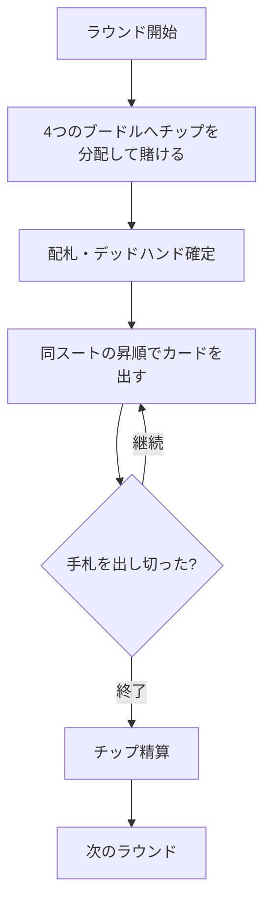

# ミシガン（Web版）遊び方

## ゲーム概要

ミシガン（Michigan / Newmarket）は、中央に置かれた4枚の「ブードル（boodle）」札（A♥・K♣・Q♦・J♠）にチップを賭けてから、同じスートの昇順シーケンスでカードを出していく「ストップ系」のチップ賭けゲームです。ブードルと一致する札を出すとそのチップを獲得でき、最初に手札を出し切ったプレイヤーがラウンドを終わらせます。規定ラウンドを消化したあと、最もチップの多いプレイヤーが勝者です。

## 起動方法

```sh
go run ./cmd/trumpcards web  # CLI経由でWebサーバーを起動
go run ./cmd/server          # 直接Webサーバーを起動
```

ブラウザで `http://localhost:8080` にアクセスし、ナビゲーションバーから「ミシガン」を選択します。
ナビバーの JA/EN ボタンで日本語・英語を切り替えられます。

## ルール

### 基本ルール

1. 各ラウンドの開始時、全員がアンティに相当するチップを4つのブードル（A♥・K♣・Q♦・J♠）に分配して賭けます。
2. 残りのカードは各プレイヤーに配られ、余った札は伏せて「デッドハンド」となります。
3. ディーラーの左隣から、最も小さい札で新しいシーケンスをリードします。以降は同じスートの1つ上の札を出していきます（例: ♥3 → ♥4 → ♥5 …）。
4. 次の札が誰の手札にもない（デッドハンドにある、またはキングを超える）と「ストップ」になり、最後に札を出したプレイヤーが新しいシーケンスをリードします。
5. 出した札がブードルと一致した場合、そのブードルに積まれたチップを総取りします（同じブードルは1ラウンドに1回のみ）。
6. 最初に手札をすべて出し切ったプレイヤーがそのラウンドを終わらせます。獲得されなかったブードルのチップは次のラウンドに繰り越されます。

### 停止条件

規定ラウンド数を消化するとゲーム終了。最終的にチップが最も多いプレイヤーが勝者です。

## ゲームの流れ



## 画面の操作方法

- **ブードルへ賭ける**: ベットフェーズでは、各ブードルの「＋」「−」ボタンでチップを分配します。残額が0になったら「賭ける」ボタンで確定します（均等割りがあらかじめセットされています）。
- **カードを出す**: プレイフェーズであなたの番になると、出せる手札がハイライトされます。出したいカードをクリックすると、同じスートの昇順で場に出ます。
- **次のラウンド**: ラウンド結果の表示後に「次のラウンド」をクリックして続行します（チップは引き継がれます）。
- **ヒント**: あなたの番で、出すべきカードの助言を表示します（オプション）。
- **アクションログ**: これまでの配札・プレイ・精算の履歴を確認できます。

## 画面構成

- **フェーズ表示**: 現在のフェーズ・ラウンド番号・アンティ・デッドハンドの枚数・チップ残高
- **ブードル**: 中央の4枚の賭け札と、そこに積まれたチップ・獲得状況
- **シーケンス表示**: 現在の連番のスートと最高札（新しいシーケンスが必要なときは案内を表示）
- **プレイヤー一覧**: 各プレイヤーのチップ・手札枚数・状態（待機／手番／上がり）
- **結果表示**: ラウンドの勝者（手札を出し切ったプレイヤー）と最終チップ

## 遊び方のコツ

- ブードル札（A♥・K♣・Q♦・J♠）を手札に持っているなら、それを出せるタイミングでチップを回収しましょう。
- 「ストップ」を自分で起こすと次のシーケンスをリードできます。手札を早く減らす好機になります。
- チップの分配は、獲得できそうなブードルに厚く賭けるのが基本です。
- ヒントを有効にすると、状況に応じた推奨カードが表示されます。
