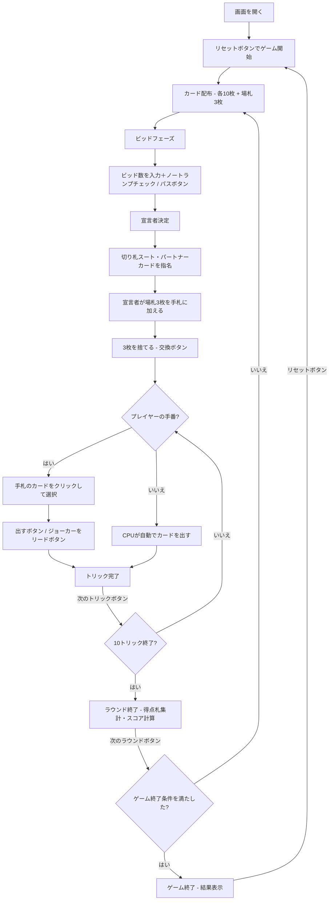

# マイティ（Web版）遊び方

## ゲーム概要

5人（プレイヤー1人 + CPU 4人）で遊ぶ韓国発祥のトリックテイキング型カードゲームです。52枚+ジョーカー1枚の計53枚を使用し、得点札（A/10/J/Q/K = 計20枚）の獲得数を競います。最高ビッドのプレイヤーが宣言者（Declarer）となり、切り札スートとパートナー指名カードを宣言します。宣言者+秘密パートナー（与党）と残り3人（野党）の隠しチーム戦です。

## 起動方法

```sh
go run ./cmd/trumpcards web  # CLI経由でWebサーバーを起動
go run ./cmd/server          # 直接Webサーバーを起動
```

ブラウザで `http://localhost:8080` にアクセスし、ナビゲーションバーから「マイティ」を選択します。
ナビバーのJA/ENボタンで日本語・英語を切り替えられます。

## ルール

### 基本ルール

- 53枚のカード（52枚+ジョーカー1枚）を5人に配布（1人10枚、余り3枚は場札／キティ）
- 各ラウンド開始時に得点札の獲得予想数をビッド（最低入札数〜20）
- 最高ビッドのプレイヤーが **宣言者（Declarer）** になる
- 宣言者は **切り札スート**（またはノートランプ）を宣言し、 **パートナーカード** を指名する
- 指名されたカードを持つプレイヤーが秘密のパートナー（他のプレイヤーには非公開）
- 宣言者は場札3枚を手札に加え、手札（13枚）から3枚を捨てる
- リードスートに従う（フォロースート）
- トリックの勝者: 切り札があればトリック中の最高切り札、なければリードスートの最高値

### 特殊カード

- **マイティ**: 通常は ♠A、♠が切り札のときは ♦A。あらゆる切り札に勝つ最強カード
- **ジョーカー**: 出されたトリックを基本的に勝つ強力カード。ただし「ジョーカーコール」によって無力化される
- **ジョーカーコール（♣3、♣が切り札のときは ♠3）**: トリックでリードに出すと、ジョーカーを持つプレイヤーは強制的にジョーカーを場に出さなければならない

### 得点札（ポイントカード）

以下のカードが得点札としてカウントされます（合計20枚）：
- A × 4枚
- 10 × 4枚
- J × 4枚
- Q × 4枚
- K × 4枚

ジョーカーは得点札ではありません。

### 得点

- **与党（宣言者+パートナー）の勝利**: 与党が獲得した得点札数 >= ビッド数
- **野党の勝利**: 与党が獲得した得点札数 < ビッド数
- ノートランプ宣言時はビッドが追加点で評価されます

### ゲーム終了

- 目標スコアに到達したプレイヤーが出た場合にゲーム終了

### CPU難易度

- **Easy**: ランダムにカードを出す
- **Normal**: 基本的なトリック戦略（デフォルト）
- **Hard**: 戦略的なプレイ（マイティ・ジョーカー管理等）

## ゲームの流れ



## 画面の操作方法

### ビッドフェーズ

1. 数値入力欄にビッド数（最低入札数〜20）を入力します
2. ノートランプを宣言する場合は **「ノートランプ」** チェックボックスをオンにします
3. **「ビッド」** ボタンで確定します
4. ビッドしない場合は **「パス」** ボタンをクリックします

### 切り札・パートナー宣言（宣言者のみ）

1. 切り札スートを選択します（ノートランプ / スペード / クラブ / ハート / ダイヤ）
2. パートナーカードのスートを選択します（ジョーカー / スペード / クラブ / ハート / ダイヤ）
3. ジョーカー以外を選んだ場合は、パートナーカードの数字（A〜K）を選択します
4. **「宣言」** ボタンで確定します

### 場札交換（宣言者のみ）

1. 場札3枚が手札に加わります（合計13枚）
2. 手札から捨てる3枚をクリックして選択します
3. **「交換」** ボタンで確定します（3枚選択するまで無効です）

### カードのプレイ（プレイフェーズ）

1. 手札のカードをクリックして選択します
2. フォロー必須のルールに従い、出せないカードは選択できません
3. **「出す」** ボタンをクリックしてカードを場に出します
4. ジョーカーをリードに出すときは、 **「ジョーカーをリード」** ボタンをクリックして要求スートを指定します

### ヒント

- **「ヒント」** ボタンをクリックすると、推奨アクションが表示されます

### トリック・ラウンドの進行

1. トリックが完了すると結果が表示されます
2. **「次のトリック」** ボタンで次のトリックに進みます
3. ラウンドが完了すると与党・野党の得点集計が表示されます
4. **「次のラウンド」** ボタンで次のラウンドに進みます

### キーボードショートカット

| キー | アクション | 有効条件 |
|------|-----------|---------|
| `1`〜`9`, `0` | カード選択/解除（1=1枚目, ..., 9=9枚目, 0=10枚目） | プレイヤーの手番 |
| `Enter` | カードを出す | プレイフェーズ・人間のターン |
| `Escape` | 選択クリア | プレイヤーの手番 |

※ テキスト入力欄にフォーカスがある場合、ショートカットは無効になります。

## 画面構成

```
┌────────────────────────────────────────────┐
│  ▶ 設定 (クリックで展開)                   │
│    CPU難易度:    [Normal▼]                 │
│    目標スコア:   [100▼]                    │
│    最低ビッド:   [13▼]                     │
├────────────────────────────────────────────┤
│           CPU プレイヤーエリア              │
│ ┌────────┐ ┌────────┐ ┌────────┐ ┌────────┐│
│ │ CPU 1  │ │ CPU 2  │ │ CPU 3  │ │ CPU 4  ││
│ │ 30点   │ │ 20点   │ │ 25点   │ │ 18点   ││
│ │ パートナー│未ビッド│ ビッド0 │ ビッド0 ││
│ └────────┘ └────────┘ └────────┘ └────────┘│
├────────────────────────────────────────────┤
│              ゲーム情報                     │
│  ラウンド 2 / トリック 5                    │
│  切り札: スペード（またはノートランプ）     │
│  最高ビッド: 14                             │
│  パートナーカード: ♥A (非公開／公開済み)    │
├────────────────────────────────────────────┤
│           現在のトリック                    │
│  CPU 1: ♣10   CPU 2: ♣K                  │
├────────────────────────────────────────────┤
│  あなた (宣言者): ビッド14 得点札:5         │
│  [♠A=マイティ][♣8][♥K][♦3][JOKER]...       │
│  [リセット] [ヒント] [出す] [ジョーカーをリード] │
└────────────────────────────────────────────┘
```

- **設定パネル（▶ 設定）**:
  - 「CPU難易度」セレクト: Easy / Normal / Hard から選択
  - 「目標スコア」: 累計スコアの上限を設定
  - 「最低ビッド」: 最低入札数を設定
  - 次のリセット時に設定が適用される
- **CPU プレイヤーエリア**: 各 CPU の累計得点、獲得得点札数、宣言者/パートナーの表示
  - パートナーバッジは「公開済み」状態でのみ表示される
- **ゲーム情報**: 現在のラウンド、トリック番号、切り札、最高ビッド、パートナー指名カード
- **現在のトリック**: トリックに出されたカード
- **フッター（あなたの手札）**:
  - クリックで選択（緑枠 + 上に浮き上がる）
  - フォロー必須のカードのみ選択可能

## 遊び方のコツ

- マイティ（♠A / ♠切り札時は ♦A）は最強のカードです。温存して最後の決定打に使いましょう
- ジョーカーは強力ですが、ジョーカーコール（♣3 / ♣切り札時は ♠3）に注意。先に持ち主から引き出させる戦略も有効です
- 宣言者になった場合、切り札スートは自分が多く持つスートを選びましょう
- ノートランプ宣言はマイティとジョーカーの両方を持っているときの強気な選択です（追加点付与）
- パートナーカードは、自分が持っていない強いカード（例: ♥A）を指名すると効果的です
- 与党と野党が分からない序盤は、各プレイヤーの出札からチームを推測しましょう
- 迷った時はヒントボタンで推奨アクションを確認できます
