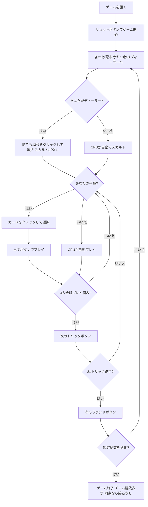

# ミンキアーテ（Web版）遊び方

## ゲーム概要

Minchiate（ミンキアーテ）は16世紀フィレンツェで生まれた97枚タロー系トリックテイキングゲームです。**対面同士が固定パートナー**となる4人2対2のチーム戦で、あなたは席0でプレイします。入札はありません。

最大の特徴は **切札が40枚あること**です。本作の他のタロー系（frenchtarot / scarto / tarocchini はいずれも21枚）の倍近くあり、しかも単なる番号の列ではありません。上位には**黄道十二宮・四大元素・美徳**が並びます。

## 起動方法

```sh
go run ./cmd/trumpcards web         # CLI経由でWebサーバーを起動
go run ./cmd/trumpcards web --open  # サーバー起動 + ブラウザを開く
go run ./cmd/server                 # 直接Webサーバーを起動
```

ブラウザで `http://localhost:8080` にアクセスし、ナビゲーションバーから「ミンキアーテ」を選択します。
ナビバーのJA/ENボタンで日本語・英語を切り替えられます。

## ルール

### デッキ（97枚）

| 種別 | 枚数 | 内訳 |
|------|------|------|
| スート札 | 56 | 4スート × 14枚（1〜10, F, C, R, Re） |
| 切札（タロッキ） | 40 | 1〜40。上位は星座12・四大元素・美徳を含む |
| マット（Matto / 愚者） | 1 | — |

97枚のタロー札には専用の絵札画像が無いため、記号と番号で手続き的に描画されます。**切札は番号ではなく呼び名がラベルに出ます** —— 40枚もあると番号だけでは何の札か分からないためです。

### 配札とスカルト

- 各プレイヤーに **21枚**ずつ配ります。
- **97は4で割り切りません。**余った **13枚**はディーラーが受け取り、同じ13枚を伏せて捨てます（**スカルト**）。
- 伏せた13枚は**ディーラー側チームの得点になります**。そのため **切札とマットは捨てられません**。

### トリック・テイキング

- **マストフォロー**: リードされたスートを持っていれば必ず従います。
- **持っていなければ切札を出す義務**があります。
- **マットは例外**でいつでも出せますが、トリックは取れません。
- **マットがリードされてもスートは決まりません。**次に出た札がリードスートを決めます。
- 出せないカードは選択できないよう抑止されます。
- **勝敗**: 切札が出ていれば最強の切札、なければリードスートの最強札が勝ちます。切札40枚はすべて序列が異なり、同格札はありません。

### 勝利条件

| 項目 | 得点 |
|------|------|
| トリック | 1トリックにつき1点（席の属するチームへ） |
| 最終トリックボーナス | 最後のトリックを取ったチームへ3点 |
| スカルト | 伏せた13枚がディーラー側チームへ13点 |

規定局数（設定で **4 / 8 / 12** から選択、デフォルト4局）を終えた時点で合計点の多いチームが勝ちです。**同点なら勝者なし**となります。

## ゲームの流れ



## 画面の操作方法

### 設定パネル

- **CPU難易度**: Easy / Normal / Hard。変更するとゲームがリセットされます。
- **ラウンド数**: 4 / 8 / 12。ディーラーが一巡するようプレイヤー数の倍数に限られます。
- **ヒント表示**: フロントエンドのヒントツールチップの有効・無効。

### スカルトフェーズ

あなたがディーラーのとき、手札から**13枚**を選んで捨てます。切札とマットは選択できません。

### プレイフェーズ

- 手札のカードをクリックして選択し、**「出す」ボタン**でプレイします。
- **「ヒント」ボタン**: スカルト／プレイのフェーズで押すと、サーバーが今の局面での推奨手を返します。押したときだけ表示されます。
- **「次のトリック」ボタン**: トリックが解決したら次へ進みます。
- **「次のラウンド」ボタン**: 21トリック終了後にスコアを集計して次のラウンドへ進みます。

入札フェーズは存在しないため、入札ボタンは表示されません。

## 画面構成

```
┌─────────────────────────────────────────────────────┐
│  Minchiate (ミンキアーテ) [JA/EN] [CLI]              │
├─────────────────────────────────────────────────────┤
│  ラウンド: 1  トリック: 1  全4ラウンド                │
│  切札は40枚 —— 上に何枚残っているかが読みどころ       │
├──────────┬──────────────────────────────────────────┤
│          │  得点  チーム0: 0   チーム1: 0            │
│  現在の  │                                           │
│  トリック│  あなた(T0)[親] / CPU1(T1) /              │
│  表示    │  CPU2(T0) / CPU3(T1)                      │
│  エリア  │  手札枚数・獲得トリック数                  │
├──────────┴──────────────────────────────────────────┤
│  メッセージ / 結果表示                                │
├─────────────────────────────────────────────────────┤
│  あなたの手札（クリックで選択）                       │
│  [♠1][♠7][✦Eremita][✦Angelo][★Matto] ...   21枚     │
│  [出す] [次のトリック] [次のラウンド] [リセット]       │
└─────────────────────────────────────────────────────┘
```

- **切札の行**: 40枚あることを常時表示します。**「まだ上に何枚残っているか」が最大の読みどころ**です。
- **得点**: チーム単位の累計点。個人戦ではありません。
- **プレイヤー情報**: 所属チーム、手札枚数、このラウンドで取ったトリック数、ディーラー表示。
- **手札**: 切札は番号ではなく**呼び名**（Eremita, Angelo など）で表示されます。出せないカードは選択できません。

## 遊び方のコツ

- **切札の残り枚数を数える**: 40枚もあるので、21枚のタロー系の感覚だと「もう上は無いはず」と誤算します。自分より上の切札が何枚出たかを追うのが本作最大の技術です。
- **味方のトリックは奪わない**: 対面が既に勝っているトリックに強い札を重ねるのは無駄です。
- **ディーラーのスカルトは13点**: 1トリック1点なので、**スカルトだけで13トリック分**に相当します。切札とマット以外で最も使いにくい札を選びましょう。
- **マットは逃げ札**: トリックは取れませんが、フォロー義務と切札義務の両方を免れます。リードにも使え、その場合はスートを定めないので次の人に自由な手を渡します。
- **最終トリックは3点**: 通常の3倍です。終盤に高位の切札を1枚残しておくと確実に取れます。
