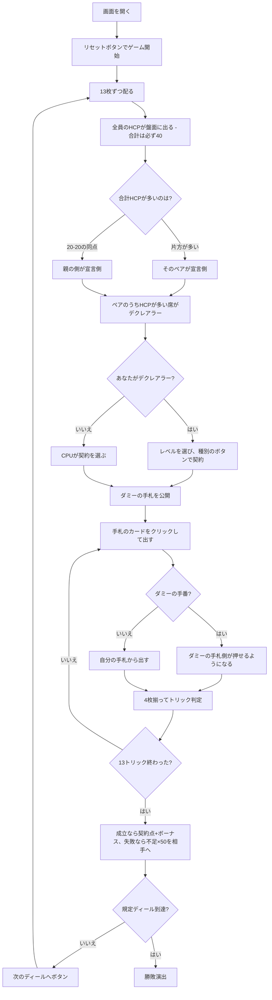

# ミニブリッジ（Web版）遊び方

## ゲーム概要

コントラクトブリッジの難関である**競りを省いた入門用**の4人ゲーム（2対2）。競りのかわりに**全員が自分のHCP（ハイカードポイント）を公開申告**し、合計の多いペアが宣言側になります。デクレアラーの正面がダミーとなって手札を公開し、デクレアラーが**両方の手札を操作**します。規定ディールを終えた時点で累計得点の高いペアの勝ちです。

## 起動方法

```sh
go run ./cmd/trumpcards web  # CLI経由でWebサーバーを起動
go run ./cmd/server          # 直接Webサーバーを起動
```

ブラウザで `http://localhost:8080` にアクセスし、ナビゲーションバーから「ミニブリッジ」を選択します。
ナビバーのJA/ENボタンで日本語・英語を切り替えられます。

## ルール

- **52枚**、**4人（2対2）**、13枚ずつ。4 × 13 = 52 でちょうど配り切ります
- **競りはありません。** 全員が自分のHCP（**A=4 K=3 Q=2 J=1**）を公開申告します。**合計は必ず40**です
- **合計HCPの多いペアが宣言側**。そのペアのうち**多く持つ席がデクレアラー**、その**正面がダミー**
- **20-20の同点は起こります**（実測で12回に1回程度）。そのときは**親の側**が宣言側。席が同点なら**親から先の席**
- デクレアラーが**レベル（1〜7）と種別（♠ ♣ ♥ ♦ NT）**を選びます。**上回る必要はありません**——競りではないので
- 契約が決まると**ダミーの手札が公開**され、**デクレアラーが両方の手札を操作**します
- 契約は「**6 + レベル**」トリック。契約点は ♣♦ が20/トリック、♠♥ が30/トリック、NTは40+30×（レベル−1）
- **成立**: 契約点 ＋（100以上なら300、未満なら50）＋ レベル6で500・7で1000。**失敗**: 相手に不足×50点
- フォロー義務あり。切り札（契約の種別）> リードのスート > その他。NT契約では切り札がありません
- 規定ディール（既定4、**4の倍数**）を終えた時点で、**累計得点の高いペアの勝ち**

## ゲームの流れ



## 画面の操作方法

| 操作 | 説明 |
|------|------|
| レベル選択（プルダウン） | 契約のレベル1〜7を選ぶ（**あなたがデクレアラーのときだけ表示**） |
| 種別のボタン（♠ ♣ ♥ ♦ NT の5つ） | 選んだレベルでその種別の契約にする（**競りではないので全部押せます**） |
| 手札のカードをクリック | そのカードを出す（出せる札には緑の枠が付きます） |
| ダミーの手札をクリック | **ダミーの手番のときだけ**押せます。デクレアラーが両方の手札を操作します |
| 次のディールへボタン | ディール終了後、次のディールを配る |
| ヒントボタン | 選ぶべき契約、打つべき札を提示する |
| ギブアップボタン | 投了する |
| リセットボタン | 確認ダイアログのうえで最初からやり直す |
| CLI トグル | 同じゲームをコマンド入力で操作するモードに切り替える |

**HCPを申告するボタンはありません。** 配った時点で自動的に公開されます。

**押せる手札は手番ごとに入れ替わります。** ダミーの番になるとダミー側に緑の枠が付き、自分の手札は押せなくなります。CPUがデクレアラーのときは、そのダミーは押せません。

### キーボードショートカット

| キー | アクション | 有効条件 |
|------|-----------|---------|

（このゲーム固有のキーボードショートカットはありません）

## 画面構成

```
┌────────────────────────────────────────────┐
│  ディール 1/4     累計: 自分 0 / 相手 0     │
├────────────────────────────────────────────┤
│ 競りはありません。HCPを公開申告します       │
│ 契約: 3NT（あなた）／必要 9トリック         │
├────────────────────────────────────────────┤
│  あなた[デクレアラー]: HCP15 / 獲得0        │
│  CPU1: HCP8 / 獲得0                         │
│  CPU2[ダミー]: HCP10 / 獲得0                │
│  CPU3: HCP7 / 獲得0                         │
├────────────────────────────────────────────┤
│              現在のトリック                 │
├────────────────────────────────────────────┤
│  ダミーの手札（ダミーの番のとき押せます）   │
├────────────────────────────────────────────┤
│  あなたの手札（出せる札に緑の枠）           │
├────────────────────────────────────────────┤
│  レベル[3▾] [3♠][3♣][3♥][3♦][3NT]          │
└────────────────────────────────────────────┘
```

- **上部**: ディール数と、ペアごとの累計得点
- **規則帯**: このゲームの仕組みそのもの。**競りが無い**ことを常に出します
- **契約行**: `3NT（あなた）／必要 9トリック`。**必要トリック数を併記**します
- **HCP帯**: 各席の申告値。**4席を足すと必ず40**。デクレアラーとダミーの印が付きます
- **中央**: 現在のトリック
- **ダミーの手札**: 契約が決まると公開されます。**ダミーの手番のときだけ押せます**
- **下部**: 自分の手札。**フォロー義務を満たす札だけ**に緑の枠が付きます

## 遊び方のコツ

- **HCPは全部見えている。** 相手ペアの合計も分かるので、契約の大きさを決める材料が揃っています
- **ペア合計25点前後がゲーム契約の目安。** 3NTや4♥/♠が狙えます。20点台前半なら小さく止めるほうが得です
- **失敗の失点は不足 × 50点。** 3トリック足りないと150点で、partscoreの成立ぶんを軽く超えます
- **NTは1トリック目が40点。** 3NTでちょうど100点＝ゲーム成立です
- **マイナーは遠い。** ♣♦ はゲームにするのに5レベル（11トリック）要ります
- **ダミーは自分の手札の延長。** 公開されたら2つの手札を1つの計画として見ます
