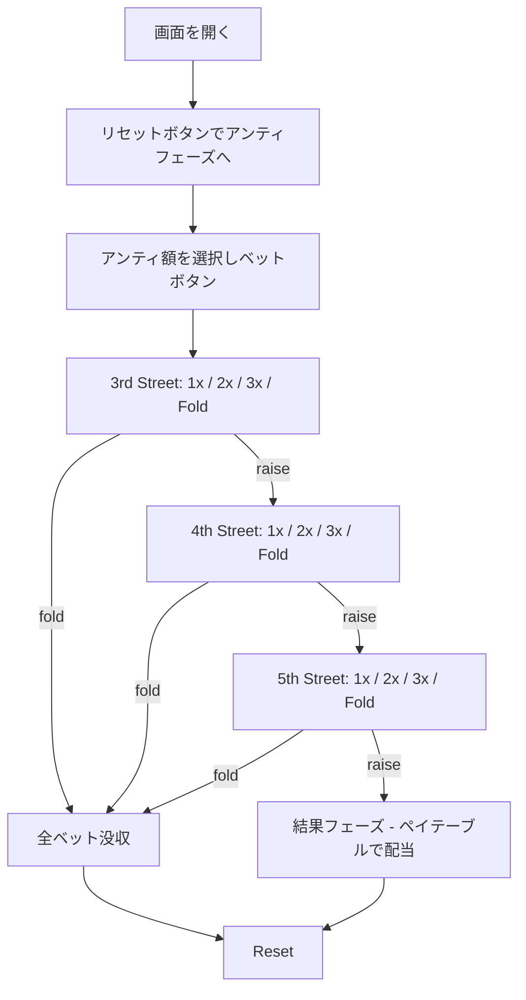

# ミシシッピ・スタッド（Web版）遊び方

## ゲーム概要

ミシシッピ・スタッドは、プレイヤー対ペイテーブルのカジノポーカーです。2枚のホールカードと3枚のコミュニティカードで作る5枚ハンドの強さに応じて配当が決まります。各ストリートで「1x / 2x / 3x」または「フォールド」を選択しながらベットを積み上げます。

## 起動方法

```sh
go run ./cmd/trumpcards web  # CLI経由でWebサーバーを起動
go run ./cmd/server          # 直接Webサーバーを起動
```

ブラウザで `http://localhost:8080` にアクセスし、ナビゲーションバーから「ミシシッピ・スタッド」を選択します。
ナビバーのJA/ENボタンで日本語・英語を切り替えられます。

## ルール

### 基本ルール

- アンティを置いてラウンドを開始する。
- ホールカード2枚が配られた後、3rd Street / 4th Street / 5th Street の3段階に分けてコミュニティカードが1枚ずつ公開される。
- 各ストリートで「1x / 2x / 3x ベット」または「フォールド」を選択する。フォールドはこれまでのベットをすべて没収する。
- 5th Street 公開後に5枚役判定を行い、ペイテーブルに沿って配当を支払う。

### ペイテーブル

| 役 | 配当倍率 |
|----|---------|
| ロイヤルフラッシュ | 500:1 |
| ストレートフラッシュ | 100:1 |
| フォーカード | 40:1 |
| フルハウス | 10:1 |
| フラッシュ | 6:1 |
| ストレート | 4:1 |
| スリーカード | 3:1 |
| ツーペア | 2:1 |
| J以上のペア | 1:1 |
| 6〜10のペア | プッシュ（ベット返却） |
| それ以下 | 全ベット没収 |

## ゲームの流れ



## 画面の操作方法

### ベット（Ante）フェーズ

1. フッターのチップ入力でアンティ額を選ぶ。最大値は所持チップの1/4まで。
2. 「アンティ」ボタンを押してラウンドを開始する。

### ストリート（3rd / 4th / 5th）フェーズ

1. 公開されたカードを見て「1倍 / 2倍 / 3倍」ボタンから1つ選ぶ。
2. 自信がない場合は「フォールド」を押す。降りた瞬間に場のベットがすべて没収される。

### 結果フェーズ

1. 役名・合計ベット・合計配当が表示される。
2. 「リセット」ボタンで次のラウンドへ進む。

### キーボードショートカット

| キー | アクション | 有効条件 |
|------|-----------|---------|
| B | アンティを置く | アンティフェーズ |
| 1 / 2 / 3 | 1x / 2x / 3x ベット | ストリートフェーズ |
| F | フォールド | ストリートフェーズ |
| R | リセット | 結果フェーズ |

## 画面構成

```
┌────────────────────────────────────────────┐
│ Mississippi Stud  [phase] chips:1000 [CLI] │
├────────────────────────────────────────────┤
│ Message / Hint Toggle                      │
│                                            │
│   [Player] J♠ J♥                           │
│                                            │
│   [Community] 🂠 🂠 🂠                       │
│                                            │
│   3rd:0x  4th:0x  5th:0x   Total Bet:100   │
├────────────────────────────────────────────┤
│ [Footer]                                   │
│   Ante: [ 100 ] [アンティ]                 │
│   1x  2x  3x  Fold                         │
└────────────────────────────────────────────┘
```

## 遊び方のコツ

- ホールカードがハイ・カード（J/Q/K/A）2枚や6+ペアなら3rd Streetで3xを検討。
- 強いドロー（フラッシュ / ストレート）が成立しそうなら1xで残しておく。
- 5th Streetでまだペアにすらなっていない手は早めにフォールドして損失を最小化する。
- 配当はベット倍率にかかっているため、強い手では3xでベットして配当を最大化する。
