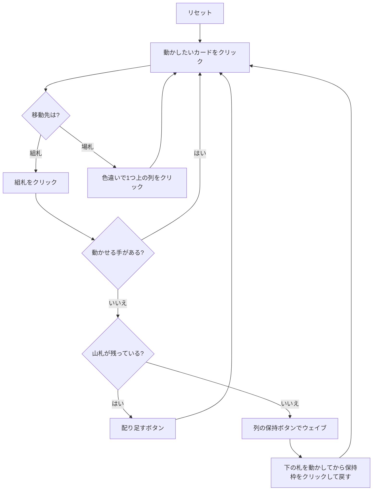

# ミス・ミリガン（Web版）遊び方

## ゲーム概要

2 デッキ 104 枚を使うイギリス発祥のソリティア。最も難しい部類とされる。8 列のタブローに 1 枚ずつ配って始め、手が尽きたら山札から **8 枚を一度に**（各列へ 1 枚ずつ）配り足す。

最大の特徴は救済ルール「**ウェイブ**」。山札を使い切ったあとに限り、連番を 1 組だけ脇に持ち上げて保持でき、下に埋まっていた札を動かしてから戻せる。

## 起動方法

1. `go run ./cmd/trumpcards web` でサーバーを起動する
2. ブラウザで `http://localhost:8080` を開く
3. ゲーム一覧または左サイドバーから「ミス・ミリガン」を選ぶ

## ルール

- 52 枚 2 組（104 枚）。最初は 8 列に 1 枚ずつ、残り 96 枚が山札
- 基礎札は 8 つ（スートごとに 2 つ）。エースで開き、同じスートで A→K
- タブローは**色違いの降順**。連番はまとめて動かせる
- **空いた列にはキングしか置けない**（画面上も「K のみ」と表示される）
- 山札は**8 枚単位**で配り足す。捨て札は無い
- 山札を使い切ると**ウェイブ**が使える。保持中は配り足しも 2 度目のウェイブも不可
- 8 つの基礎札すべてを K まで積めばクリア

## ゲームの流れ

## 画面の操作方法

| 操作 | 説明 |
|------|------|
| 場札のカードをクリック | そのカードを移動元として選択する。**連番の途中を選べば、そこから末尾までがまとめて動く** |
| 組札をクリック | 選択中のカードをその組札に置く |
| 別の列をクリック | 選択中のカード（または連番）をその列に置く |
| 山札 / 配り足すボタン | 各列に 1 枚ずつ配り足す。保持中は押せない |
| 列の下の「保持」ボタン | その列の連番を脇へ持ち上げる（山札を使い切った後のみ表示） |
| 保持枠をクリック | 保持中の札を移動元として選択し、列や組札に戻す |
| ドラッグ＆ドロップ | クリック 2 回と同じ移動をドラッグでも行える |
| ヒントボタン | 組札 → 場札 → 配り足しの順に手を 1 つ提示する |
| 自動完成ボタン | 組札へ送れる札がなくなるまで自動で送る |
| 元に戻す / 手詰まり脱出ボタン | 1 手戻す / 脱出に必要な手数だけまとめて戻す |
| ギブアップ / リセットボタン | 確認ダイアログのうえで投了 / やり直す |
| CLI トグル | 同じゲームをコマンド入力で操作するモードに切り替える |

キーボードショートカット: `d` 配り足す / `h` ヒント / `a` 自動完成 / `z` 元に戻す / `g` ギブアップ（確認あり）。

## 画面構成

- **上部**: フェーズ表示と手数
- **中央上段**: 8 つの組札と、山札・保持枠。ウェイブ可能なときは保持枠に「可」と出る
- **中央下段**: 8 列の場札。列番号 `#0`〜`#7` はヒント表示の列番号と一致する。空き列は「K のみ」と表示
- **下部**: ヒント表示、アクションログ、設定、キーボードショートカット一覧

## 遊び方のコツ

- **空き列はキング専用。** キングが手元に無いうちに列を空けても使えない
- 配り足しは全列に等しく降ってくる。複数の列で受けられる形にしておく
- **保持中は配り足しが止まる。** 戻す先を確保してから持ち上げる
- エースは早く上げる。組札が 8 つあるので序盤の 1 枚が後半を大きく変える
- 詰まったら元に戻すで分岐をやり直す
