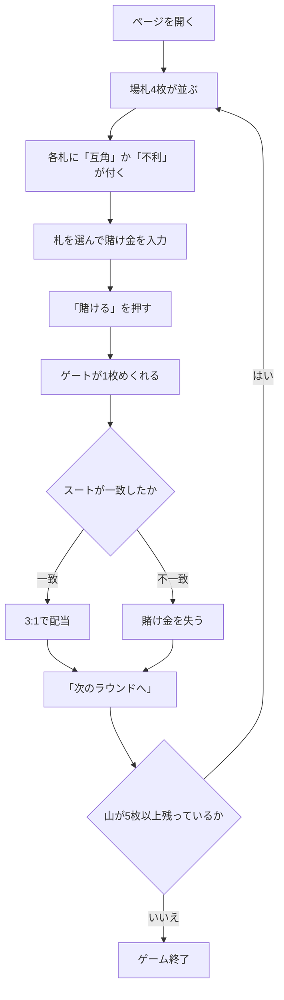

# モンテバンク（Web版）遊び方

## ゲーム概要

モンテバンク（スパニッシュ・モンテ）は、19 世紀のスペインとメキシコで広く遊ばれたバンキングゲームです。西部開拓時代のモンテ卓の元になったゲームでもあります。

**見るのはスートだけで、数字は一切使いません。** 場札 4 枚が表向きに並び、そのうち 1 枚に賭けます。次にめくる 1 枚（ゲート）が賭けた札とスートで一致すれば **3:1**。

**そして、このゲームの勝ち負けは「どれに賭けるか」だけで決まります。**

| 賭けたスートが場札に | 勝率 | 3:1 での期待値 |
|---|---|---|
| **1 枚だけ** | 9/36 = 25.0% | **ちょうど互角** |
| 2 枚 | 8/36 = 22.2% | 11.1% の損 |
| 3 枚 | 7/36 = 19.4% | 22.2% の損 |
| 4 枚 | 6/36 = 16.7% | 33.3% の損 |

**胴元の取り分は、すべてここから出ています。** 画面は各場札に「互角」「不利」を表示するので、それを見て選んでください。

## 起動方法

```sh
go run ./cmd/trumpcards web  # CLI経由でWebサーバーを起動
go run ./cmd/server          # 直接Webサーバーを起動
```

サーバ起動後、ブラウザで `http://localhost:8080/montebank` を開きます。

## ルール

- **ラテン 40 枚デッキ**（8・9・10 を抜いた 40 枚）を使います。1 スート 10 枚です。
- 各ラウンド、場札 4 枚が表向きに並びます。
- そのうち 1 枚を選び、賭け金（10〜500、10 刻み）を置きます。
- ゲートを 1 枚めくります。**賭けた札とスートが一致すれば 3:1**（賭け金も戻るので手元には 4 倍）。一致しなければ賭け金を失います。
- 数字は見ません。同じ数字でもスートが違えば外れです。
- 山が 1 ラウンドぶん（5 枚）に足りなくなるか、賭けられるチップが無くなったら終了です。40 枚なので **8 ラウンド**遊べます。

## ゲームの流れ



## 画面の操作方法

| 操作 | 説明 |
|------|------|
| 場札をクリック | 賭ける札を選びます。選んだ札が強調されます |
| 賭け金入力 | 10〜500 で指定します |
| 「賭ける」 | 賭けを確定してゲートをめくります |
| 「次のラウンドへ」 | 決着後、次のラウンドを始めます |
| ヒントボタン | いまの場札でいちばん良い選択を表示します |
| 棋譜ボタン | これまでの行動ログを表示します |
| リセットボタン | ゲームを最初からやり直します |

**「互角」「不利」の判定はサーバが行っています。** 画面はその値を表示するだけなので、数え間違いは起きません。

## 画面構成

- **フェーズ表示**: `BET`（賭け）/ `RESULT`（決着）/ `GAME END`（終了）
- **場札**: 4 枚。それぞれに、そのスートが場札に何枚出ているかと「互角 / 不利」が付きます
- **ゲート**: 決着後にめくれた 1 枚
- **決着**: 的中か外れかと、そのラウンドの収支
- **チップ**: 現在の持ちチップ
- **山の残り**: 5 枚を切ると次のラウンドはありません

## 遊び方のコツ

- **「互角」と表示された札から選んでください。** それが唯一、胴元に削られない賭けです。
- **4 枚とも「不利」なラウンドがあります。** そのときはどれを選んでも損なので、賭け金を最小にするのが被害を抑える唯一の手です。
- **数字に意味はありません。** A だから強い、ということは一切ありません。
- ヒントは常に「いちばん重複の少ないスート」を指します。互角の札が無いときは、そう明示します。
