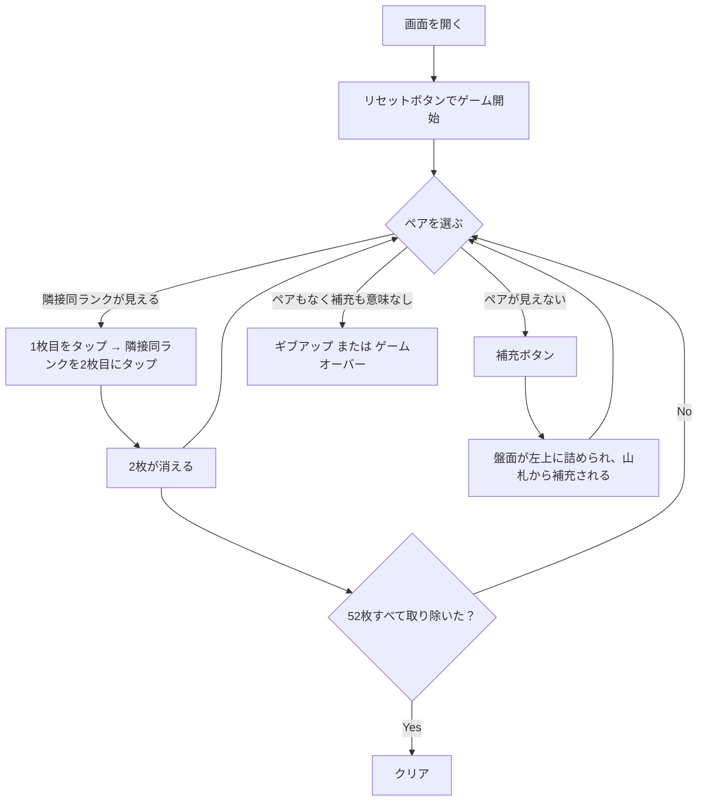

# モンテカルロ・ソリティア（Web版）遊び方

## ゲーム概要

1人用のグリッド型ソリティアです。52枚のシャッフル済みデッキの先頭25枚を5x5のグリッドに配り、隣接（縦・横・斜め）する同じランクのペアをタップして取り除いていきます。盤面のペアが見つからなくなったら「補充」を押すと盤面が左上に詰め直され、空いたマスに山札からカードが補充されます。山札と盤面の合計52枚すべてを取り除けばクリアです。

## 起動方法

```sh
go run ./cmd/trumpcards web     # CLI経由でWebサーバーを起動
go run ./cmd/server              # 直接Webサーバーを起動
```

ブラウザで `http://localhost:8080` にアクセスし、ナビゲーションバーから「モンテカルロ・ソリティア」を選択します。
ナビバーのJA/ENボタンで日本語・英語を切り替えられます。

## ルール

### 基本ルール

- 52枚のトランプ（ジョーカーなし）を使用
- リセット時、先頭25枚が5x5グリッドに行優先で配られ、残り27枚が山札となる
- ペアになる条件：
  - 両方のセルにカードがある
  - 同じランク（数字）である
  - 8方向（縦・横・斜め）に隣接している（同じセルは選べない）
- ペアが取り除かれると、両セルが空になる
- 「補充」ボタンを押すと、残ったカードが行優先で前詰めされ、空いたマスに山札からカードが補充される（山札がなくなるか盤面が満杯になるまで）

### ゲーム終了

- **クリア**: 全52枚を取り除いた状態
- **ゲームオーバー**: 山札が空 + 残りのカードに隣接ペアが無く、補充しても変化が無い状態（手詰まり）

## ゲームの流れ



## 画面の操作方法

| 要素 | 説明 |
|------|------|
| 5x5 グリッド | カードをタップして選択。1枚目を選んだ後、隣接する同ランクのカードをタップすると両方が消えます |
| 補充ボタン | 盤面を左上に詰め直し、山札から空きマスを補充します |
| 元に戻す | 直前の取り除きまたは補充を1手だけ取り消します |
| ヒント | サーバーが推奨手（ペア除去 or 補充）を返します |
| ギブアップ | プレイ中なら明示的にゲームオーバーにします |
| リセット | 新しいデッキでゲームを最初から始めます |

## 推奨環境・操作

- スマートフォン（タップ）/ デスクトップ（クリック）両対応
- すべてのタップ対象は 44x44 px 以上（WCAG 2.5.5 AAA 準拠）
- ja / en 切り替えに対応

## 画面構成

上から順に、ページのコンポーネント構成そのままの並びです。

```
┌──────────────────────────────────────────────────┐
│  モンテカルロ・ソリティア                                         │
│  残り山札: 27  取り除いた枚数: 0/52  補充回数: 0
├──────────────────────────────────────────────────┤
│  5×5 の盤面                                      │
│  (0,0)♥10 (0,1)♥4  (0,2)♣3  (0,3)♦3  (0,4)♥5    │
│  (1,0)♣A  (1,1)♦K  (1,2)♠2  (1,3)♥A  (1,4)♣6    │
│  (2,0)♦4  (2,1)♦2  (2,2)♣4  (2,3)♥K  (2,4)♥2    │
│  (3,0)♣J  (3,1)♥3  (3,2)♠K  (3,3)♣K  (3,4)♥6    │
│  (4,0)♠5  (4,1)♥9  (4,2)♣2  (4,3)♠Q  (4,4)♠9    │
├──────────────────────────────────────────────────┤
│  メッセージ / ヒント                             │
├──────────────────────────────────────────────────┤
│  設定パネル / 棋譜（アクションログ）             │
├──────────────────────────────────────────────────┤
│  [詰め直す] [元に戻す] [ヒント] [ギブアップ]
│  [リセット]                                      │
└──────────────────────────────────────────────────┘
```

- **5×5 の盤面**: `(行,列)` の座標つき。取り除けるのは**同ランクで隣接（縦・横・斜め）する2枚**だけです
- **残り山札 / 取り除いた枚数 / 補充回数**: 進行状況。52枚すべてを取り除けばクリア
- **補充**: 空きができたら詰め直しボタンで後続を前へ詰め、山札から補充します
- **メッセージ / ヒント**: 直前の操作の結果と、ヒントボタンを押したときの推奨手
- **設定 / 棋譜**: 難易度などの設定と、これまでの手の履歴（折りたたみ式）
- **リセット**: 新しいゲームを開始します
