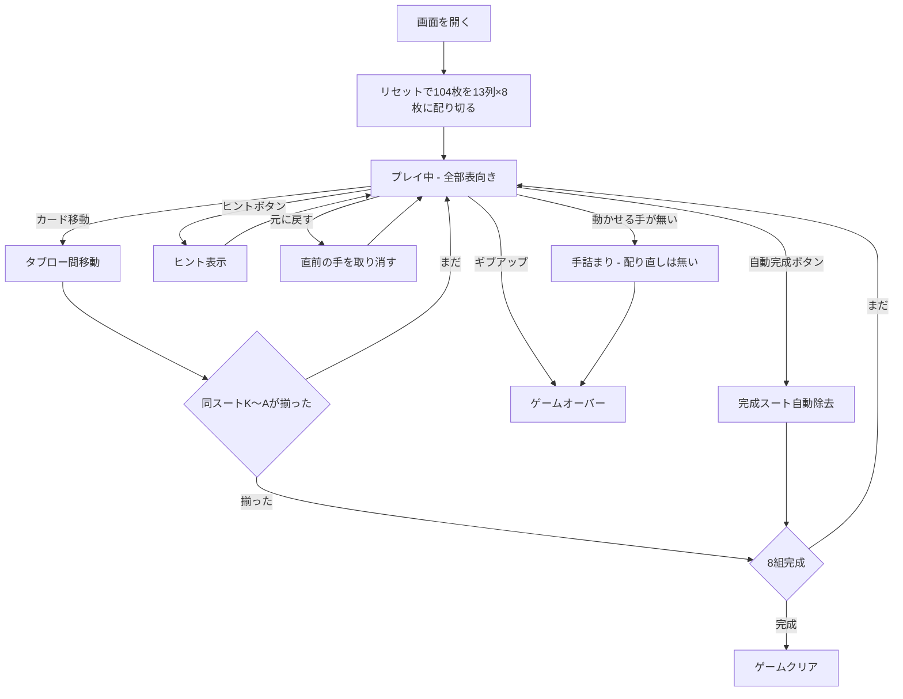

# ミセス・モップ（Web版）遊び方

## ゲーム概要

1人用のソリティアです。2デッキ（104枚）を **13列×8枚に配り切り、全部表向き**にします。同スート降順のK〜A13枚を作ると自動的に除去され、8組すべて除去すれば勝利です。

**山札はありません。**配り足しも配り直しもできないので、**伏せ札も未知の情報も一切ありません**。解けるかどうかは配られた瞬間に決まっていて、あとは読み切れるかどうかだけです。「開いたスパイダー」と呼べる形で、Charles Jewell の考案。

## 起動方法

```sh
go run ./cmd/trumpcards web        # CLI経由でWebサーバーを起動
go run ./cmd/server                # 直接Webサーバーを起動
```

ブラウザで `http://localhost:8080` にアクセスし、ナビゲーションバーから「ミセス・モップ」を選択します。
ナビバーのJA/ENボタンで日本語・英語を切り替えられます。

## ルール

### 基本ルール

- 2デッキ104枚を使用
- **13列に8枚ずつ配り切る。全カードが表向き**
- **ストックは無い**（配り足しの操作そのものが存在しない）
- タブロー間でカードを移動する。値が1つ大きいカードの上に置ける（**スート不問**）
- **同スート降順の連続シーケンスのみ**グループ移動可能
- **空列にはどのカード（または並び）でも置ける**
- K〜Aの同スート13枚が1列に揃うと自動的に除去される
- 8組すべて除去でゲームクリア

### 難易度

**4スートが本来の Mrs. Mop** です。1/2スートはクローン元のスパイダーから引き継いだ緩和版で、遊びやすさのために残しています。

- **4スート（既定・本来の形）**: 全4スートの104枚（2デッキ分）
- **2スート（中級）**: スペードとハートの104枚
- **1スート（初級）**: スペードのみの104枚

### 得点

- 開始時: 500点
- 移動: -1点
- スート完成: +100点

## ゲームの流れ



## 画面の操作方法

### マウス操作

1. 移動元のカードをクリックして選択（黄色の枠で強調）
2. 移動先の列をクリックして移動
3. 同スート降順の並びは、その先頭を掴めばまとめて動きます

### キーボードショートカット

| キー | アクション | 有効条件 |
|------|-----------|---------|
| `h` | ヒントを表示 | プレイ中 |
| `a` | 自動完成 | プレイ中 |
| `g` | ギブアップ | プレイ中 |
| `z` | 元に戻す | プレイ中 |

配るキー（`d`）はありません。104枚を最初に配り切るためです。

## 画面構成

```
┌────────────────────────────────────────────┐
│  フェーズ表示  手数  スコア  完成スート数      │
│                                            │
│  タブロー 列0 … 列12（13列・全部表向き）      │
│                                            │
│  [元に戻す] [ヒント] [自動完成] [ギブアップ]   │
│  [難易度: 4/2/1] [リセット]                  │
└────────────────────────────────────────────┘
```

- **ヘッダー**: フェーズ表示（プレイ中 / ゲームクリア / ゲームオーバー）、手数、スコア、完成スート数
- **タブロー（13列）**: カードをクリックで選択→移動先をクリック。**山札の置き場はありません**
- **フッター**: 元に戻す、ヒント、自動完成、ギブアップ、難易度セレクター、リセット

## 遊び方のコツ

- **運の要素はゼロです。**配られた盤が解けるかどうかは最初から決まっているので、迷ったら手を進める前に読み切りましょう。取り返しは「元に戻す」しかありません。
- 空列を作ると移動の自由度が大きく上がります。**どのカードでも置ける枠**なので、深い列を崩す足がかりになります。
- 同スートの降順シーケンスを意識して組み立てましょう。**スート不問で置けても、まとめて動かせるのは同スート降順だけ**です。
- ヒント機能を活用して有効な手を見つけましょう。
- 慣れるまでは1スート（初級）から始めるのも手ですが、それは Mrs. Mop 本来の形ではありません。
