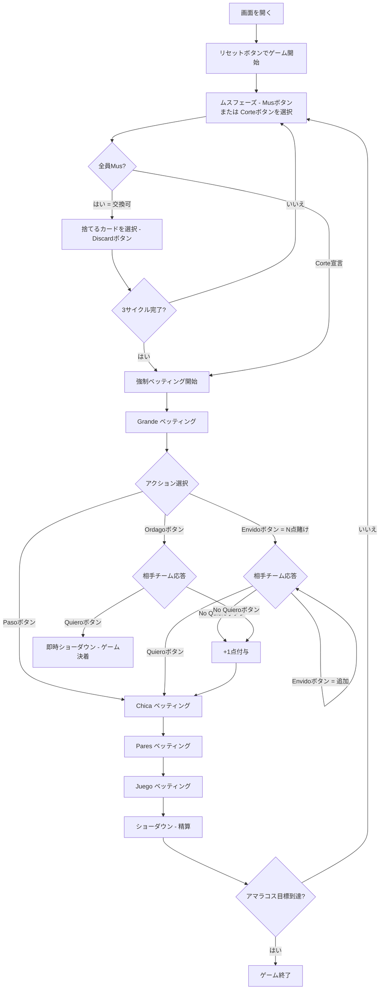

# ムス（Web版）遊び方

## ゲーム概要

Mus（ムス）はスペイン・バスク地方発祥の4人チーム制ビッディングゲームです。40枚のラテン系デッキ（A,2–7,Sota/Caballo/Rey × 4スート）を2チーム（シート0&2 vs シート1&3）で使用し、各プレイヤー4枚の手札で**Grande・Chica・Pares・Juego**の4つのベッティングラウンドを行います。先に目標アマラコス数（デフォルト40）を獲得したチームの勝利です。あなたはシート0（チーム0）の人間プレイヤーです。

## 起動方法

```sh
go run ./cmd/trumpcards web        # REST API + Web GUI サーバを起動
go run ./cmd/trumpcards web --open # 起動してブラウザを開く
```

ブラウザで `/mus` にアクセスします。

## ルール

### デッキと配布

- **デッキ**: 40枚（A,2,3,4,5,6,7,Sota,Caballo,Rey × ♠♣♥♦）
- **プレイヤー**: 4人（あなた = シート0/チーム0、CPU1〜3）
- **チーム**: チーム0 = シート0&2、チーム1 = シート1&3
- **配布**: 各プレイヤー4枚

### ムスフェーズ（カード交換）

各ラウンド開始時、各プレイヤーが順番に手札交換の意思を表明します：

- **Mus（ムス）**: カードを交換したい → 4人全員が同意すれば各自任意の枚数を捨てて引き直し（最大3回繰り返し可）
- **Corte（コルテ）**: 交換なしでベッティング開始 → 1人でも「コルテ」を宣言した時点でベッティング開始

### ベッティングラウンド（4ラウンド順番）

1. **Grande（グランデ）**: 最強の手を競う（Rey > Caballo > Sota > 7…A の順で高い方が勝ち）
2. **Chica（チカ）**: 最弱の手を競う（Aが最低で低い方が勝ち）
3. **Pares（パレス）**: 同ランクの組み合わせを競う（Duples > Medias > Par）
4. **Juego（フエゴ）**: 合計点数31以上の手を競う（31が最強；31以上がなければPunto = 30に近い方）

各ベッティングラウンドでのアクション：

| アクション | 説明 |
|-----------|------|
| Paso（パソ） | パス |
| Envido（エンビード）| N点を賭ける |
| Ordago（オルダゴ） | 全てを賭ける（受けたら即時ゲーム決着） |
| Quiero（キエロ） | ベットを受ける |
| No Quiero（ノキエロ） | ベットを断る（+1点を宣言チームに） |

### カード点数（Juego計算用）

| カード | 点数 |
|--------|------|
| Sota / Caballo / Rey | 10点 |
| A | 1点 |
| 2〜7 | 額面点 |

### 得点（アマラコス）

両チームがPasoのラウンドは勝利チームに自動+1点。No Quieroで宣言チームに+1点。Quieroで賭けポイント分獲得。先に目標アマラコスに達したチームが勝利します。

## ゲームの流れ



## 画面の操作方法

### ムスフェーズ

- **「Mus」ボタン**: カード交換を希望します。あなたの手番のみ有効。4人全員がMusを選択した場合は交換フェーズへ移行します。
- **「Corte」ボタン**: 交換なしでベッティング開始を宣言します。1人でも選択するとベッティングへ移行します。

### カード交換フェーズ（全員Musに同意した場合）

- 捨てたいカードをクリックして選択します（0〜4枚選択可能）。
- **「Discard」ボタン**: 選択したカードを捨てて同枚数を引き直します。

### ベッティングフェーズ（Grande / Chica / Pares / Juego）

- **「Paso」ボタン**: そのベッティングラウンドをパスします。
- **「Envido」ボタン + 点数入力**: N点を賭けます。相手チームはQuiero/No Quiero/追加Envidoで応答します。
- **「Ordago」ボタン**: 全てを賭けます。相手チームがQuieroを選ぶと即時ショーダウンでゲーム全体が決着します。
- **「Quiero」ボタン**: 相手チームのベットを受けます（ショーダウンで精算）。
- **「No Quiero」ボタン**: 相手チームのベットを断ります（宣言チームに+1点が入ります）。

### ショーダウンフェーズ

- 各ベッティングラウンドの手役が公開され得点が精算されます。
- **「Next」ボタン**: 次のラウンドへ進みます。

> Web 版ではキーボードショートカットは提供していません。すべての操作はボタンとカードのクリックで行います。

## 画面構成

```
┌────────────────────────────────────────────┐
│  Mus (ムス)  [JA/EN] [CLI]                 │
├────────────────────────────────────────────┤
│  ラウンド: 1  フェーズ: GRANDE              │
├──────────┬─────────────────────────────────┤
│  CPU1    │                                  │
│  (チーム1) │   ベッティング状況表示エリア    │
│  CPU2    │   (現在の賭け・ラウンド情報)     │
│  (チーム0) │                                │
│  CPU3    │                                  │
│  (チーム1) │                                │
├──────────┼─────────────────────────────────┤
│  アマラコス │  メッセージ / 結果表示          │
│  チーム0  │                                  │
│  チーム1  │                                  │
├──────────┴─────────────────────────────────┤
│  あなたの手札（クリックで選択）              │
│  [Rey♠] [A♣] [7♥] [Sota♦]                │
│  [Mus] [Corte] / [Paso] [Envido] [Ordago]  │
│  / [Quiero] [No Quiero]                    │
└────────────────────────────────────────────┘
```

- **ヘッダー**: ゲーム名・フェーズ表示・言語切り替えトグル・CLI切り替えトグル。
- **ラウンド／フェーズ表示**: 現在のラウンド番号とベッティングフェーズ（Grande/Chica/Pares/Juego）。
- **プレイヤー表示エリア（左）**: CPU各プレイヤーの手札枚数・チーム・アマラコス残高を表示。
- **ベッティング表示エリア（中央）**: 現在の賭け状況と各チームの入札情報。
- **アマラコス表（左下）**: 各チームの現在の得点と目標点。
- **メッセージボックス**: フェーズ・勝敗・精算結果の案内。
- **フッター（手札エリア）**: あなたの手札と操作ボタン（Mus/Corte/Discard/Paso/Envido/Ordago/Quiero/No Quiero/Next）。

## 遊び方のコツ

- **ムスの判断**: 手札を4ラウンド分（Grande/Chica/Pares/Juego）の視点で評価しましょう。1ラウンドが強くても他が弱ければ交換が有効です。
- **Paresの確認**: Pares（同ランク組み合わせ）を持っているか必ず確認しましょう。Paresがなければそのラウンドを自動棄権します。
- **Envidoの使い方**: 相手の反応を見るために少額から始めるのが有効です。No Quieroを引き出すだけで+1点になります。
- **Ordagoのタイミング**: アマラコスが拮抗している終盤や、圧倒的に有利な手役のときに有効です。相手に断られても+1点獲得できます。
- **Juegoを狙う**: 合計点が31になる手はJuegoラウンドで最強となります。31が出やすいよう手札を調整しましょう。
- **チームプレイ**: チームメート（シート2がパートナー）の動きを意識しましょう。相手チームの片方のEnvidoが弱そうなら追加Envidoで追い詰めましょう。
- **マノの優位**: そのラウンドの最初の手番（マノ）は先攻の利があります。強い手役では積極的にEnvidoを仕掛けましょう。
