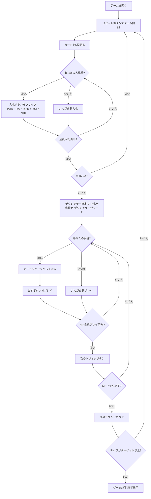

# ナップ (Napoleon)（Web版）遊び方

## ゲーム概要

Nap（ナップ、Napoleon）はイギリスで古くから親しまれているトリックテイキングゲームです。52枚の標準デッキを4人でプレイし、各プレイヤーに5枚ずつ配って5トリックを争います。各ラウンドの最初に**入札フェーズ**があり、最高入札者が**デクレアラー**（宣言者）として1人で3人の**ディフェンダー**と対戦します。宣言したトリック数以上を取ればチップを獲得し、失敗すれば相手3人がチップを獲得します。先にターゲット（デフォルト20チップ）に達したプレイヤーがマッチ勝利です。あなたは席0としてプレイします。

## 起動方法

```sh
go run ./cmd/trumpcards web         # CLI経由でWebサーバーを起動
go run ./cmd/trumpcards web --open  # サーバー起動 + ブラウザを開く
go run ./cmd/server                 # 直接Webサーバーを起動
```

ブラウザで `http://localhost:8080` にアクセスし、ナビゲーションバーから「ナップ (Napoleon)」を選択します。
ナビバーのJA/ENボタンで日本語・英語を切り替えられます。

## ルール

### デッキと配布

- **デッキ**: 52枚（A,2-10,J,Q,K × 4スート）
- **プレイヤー**: 4人（あなた = 席0、CPU1〜3）
- **配布**: 各プレイヤー5枚、計5トリック
- **カードの強さ（高い順）**: A > K > Q > J > 10 > 9 > 8 > 7 > 6 > 5 > 4 > 3 > 2

### 入札フェーズ

ディーラーの左隣から時計回りに、各プレイヤーが1回だけ入札します。

| コントラクト | 取るべきトリック数 | チップ（成功時） | チップ（失敗時 — 相手1人あたり） |
|--------------|------------------|-----------------|----------------------------------|
| **Pass（パス）** | — | — | — |
| **Two（ツー）** | 2以上 | 2 | 2 |
| **Three（スリー）** | 3以上 | 3 | 3 |
| **Four（フォー）** | 4以上 | 4 | 4 |
| **Nap（ナップ）** | 5（全部） | 10 | 5 |

- 先の入札より高いコントラクトのみ選択できます（Pass < Two < Three < Four < Nap）。
- 全員がパスした場合はそのラウンドは無効となり、再配布されます。
- 最高入札者が**デクレアラー**となり、他の3人が**ディフェンダー**として対戦します。

### 切り札

デクレアラーの手札で最も枚数の多いスートが自動的に切り札スートになります（簡易実装）。デクレアラーが最初のトリックをリードします。

### トリック・テイキング

- **スートフォロー義務**: リードされたスートのカードを持っている場合は必ず出さなければなりません。
- 持っていない場合は任意のカードを出せます（切り札でも他スートでも可）。
- **トリックの勝者**:
  - 切り札スートのカードが場にあれば、最も強い切り札カードが勝ちます。
  - 切り札がなければ、リードスートの最も強いカードが勝ちます。
- トリックの勝者が次のトリックをリードします。

### 勝利条件

**マッチ勝利**: 先にターゲット（デフォルト **20** チップ）に達したプレイヤーが勝利。

## ゲームの流れ



## 画面の操作方法

### BIDフェーズ（入札フェーズ）

あなたの入札番になると、手札の下に入札ボタンが表示されます。

各ボタンには賭け金が `+成功時/+失敗時` の形で併記されます（例: ナップは `+10/+5`）。失敗時の数字は**相手1人あたりが得るチップ数**で、宣言者から引かれるわけではありません。

- **「Pass」ボタン**: 入札をパスします。
- **「Two」ボタン**: Two（2トリック以上）を宣言します。先行入札がTwo以上の場合はグレーアウトして選択できません。
- **「Three」ボタン**: Three（3トリック以上）を宣言します。先行入札がThree以上の場合は選択できません。
- **「Four」ボタン**: Four（4トリック以上）を宣言します。先行入札がFour以上の場合は選択できません。
- **「Nap」ボタン**: Nap（全5トリック）を宣言します。先行入札がNapの場合は選択できません。

### PLAYフェーズ（トリックフェーズ）

- あなたの手番のとき、手札のカードをクリックして選択します。
- **「出す」ボタン**: 選択したカードをプレイします。スートフォロー義務に従う必要があります（義務に反するカードは選択できません）。
- **「次のトリック」ボタン**: トリックが解決したら次へ進みます。
- **「次のラウンド」ボタン**: 5トリック終了後にチップを集計して次のラウンドへ進みます。

## 画面構成

```
┌─────────────────────────────────────────────────────┐
│  Nap (ナップ) [JA/EN] [CLI]                          │
├─────────────────────────────────────────────────────┤
│  ラウンド: 1  トリック: 0  フェーズ: BID             │
│  切り札: -  デクレアラー: -  コントラクト: -         │
│  チップ: あなた=0  CPU1=0  CPU2=0  CPU3=0            │
├──────────┬──────────────────────────────────────────┤
│  CPU1    │                                           │
│  (役割)  │     現在のトリック表示エリア               │
│  CPU2    │     （各プレイヤーの出したカード）          │
│  (役割)  │                                           │
│  CPU3    │                                           │
│  (役割)  │                                           │
├──────────┼──────────────────────────────────────────┤
│  入札状況│  メッセージ / 結果表示                    │
│  CPU1=?  │  ラウンド結果・チップ情報                  │
│  CPU2=?  │                                           │
│  CPU3=?  │                                           │
├──────────┴──────────────────────────────────────────┤
│  あなたの手札（クリックで選択）                       │
│  [A♥][K♥][Q♠][J♦][10♣]                             │
│  [Pass] [Two] [Three] [Four] [Nap]  ← BIDフェーズ   │
│  [出す] [次のトリック] [次のラウンド] ← PLAYフェーズ │
└─────────────────────────────────────────────────────┘
```

- **ヘッダー**: ゲーム名・フェーズ表示・言語切り替えトグル・CLI切り替えトグル。
- **ラウンド／トリック表示**: 現在のラウンド番号・トリック番号・フェーズ・切り札スート・デクレアラーとコントラクト表示。
- **チップ**: 各プレイヤーの累積チップ数をリアルタイムで表示。
- **プレイヤー表示エリア（左）**: CPU各プレイヤーの手札枚数・役割（デクレアラー or ディフェンダー）を表示。
- **入札状況（左）**: 各プレイヤーの入札内容（入札フェーズ中）。
- **トリック表示エリア（中央）**: 場に出ているカードと出したプレイヤー名。
- **メッセージボックス**: フェーズ・ラウンド結果（トリック数・チップ増減）・勝敗の案内。
- **フッター（手札エリア）**: あなたの手札と操作ボタン（BIDフェーズは入札ボタン5種、PLAYフェーズは出す／次のトリック／次のラウンド）。
- **ラウンド結果のチップ増減**: そのラウンドで実際に動いたチップ数。達成なら宣言者が獲得、失敗なら相手それぞれが獲得と表示されます。

## 遊び方のコツ

- **入札の目安**: Two（2トリック）はA・Kが2枚以上あれば安定します。Three（3トリック）は強いカードが3枚以上必要です。Four（4トリック）はA・K・Qが揃い切り札スートが3枚以上ある場合に検討しましょう。
- **Napの高リスク・高リターン**: Nap（全5トリック）は成功で10チップ、失敗でも各相手に5チップしか払わないため、手札が非常に強い場合は積極的に狙う価値があります。
- **切り札スートを確認**: デクレアラーの切り札は手札の最長スートから自動選択されます。宣言前に自分の最長スートを確認し、そのスートでトリックを稼げるか計算しておきましょう。
- **デクレアラーは序盤に切り札を引き出せ**: 切り札リードで相手の切り札を消費させると、後半の強いカードで安全にトリックを取りやすくなります。
- **ディフェンダーは連携して阻止**: 3人で力を合わせてデクレアラーを阻みましょう。デクレアラーが弱そうなスートをリードして切り札を節約させると有効です。
- **グレーアウトボタンを確認**: 入札フェーズで既に高いコントラクトが出ている場合、それ以下のボタンはグレーアウトされます。残りの選択肢を確認してから入札しましょう。
- **得点管理**: Napの失敗は1回で最大5チップ×3人＝15チップを相手に渡すことになります。ターゲット残チップ差を常に意識し、安全なコントラクトに留めるか強気に行くかを判断しましょう。
