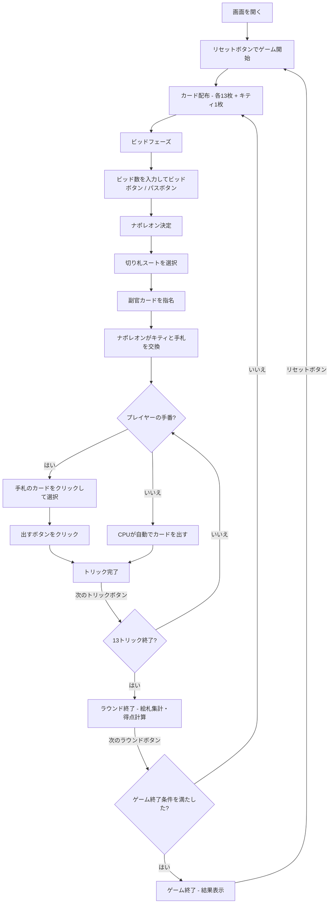

# ナポレオン（Web版）遊び方

## ゲーム概要

4人（プレイヤー1人 + CPU 3人）で遊ぶトリックテイキング型カードゲームです。52枚+ジョーカー1枚の計53枚を使用し、絵札（J/Q/K/A + ジョーカー = 最大17枚）の獲得数をビッドして競います。最高ビッドのプレイヤーがナポレオンとなり、切り札スートと副官カードを宣言します。ナポレオン軍（ナポレオン＋副官）と連合軍の隠しチーム戦です。

## 起動方法

```sh
go run ./cmd/trumpcards web  # CLI経由でWebサーバーを起動
go run ./cmd/server          # 直接Webサーバーを起動
```

ブラウザで `http://localhost:8080` にアクセスし、ナビゲーションバーから「ナポレオン」を選択します。
ナビバーのJA/ENボタンで日本語・英語を切り替えられます。

## ルール

### 基本ルール

- 53枚のカード（52枚+ジョーカー1枚）を4人に配布（1人13枚、余り1枚はキティ）
- 各ラウンド開始時に絵札の獲得予想数をビッド（最低入札数〜17）
- 最高ビッドのプレイヤーが **ナポレオン** になる
- ナポレオンは **切り札スート** を宣言し、 **副官カード** を指名する
- 副官カードを持つプレイヤーはナポレオンの味方（他のプレイヤーには非公開）
- ナポレオンはキティのカードと手札を交換できる
- リードスートに従う（フォロースート）
- トリックの勝者: 切り札が出ていれば最高の切り札、なければリードスートの最高値

### 特殊カード

- **ジョーカー（マイティ）**: 最も強いカード。どのトリックでも勝つ
- **スペードの3（ジョーカーキラー）**: ジョーカーに対してのみ勝てる特殊カード

### 絵札（ピクチャーカード）

以下のカードが絵札としてカウントされます（最大17枚）：
- ジャック (J) × 4枚
- クイーン (Q) × 4枚
- キング (K) × 4枚
- エース (A) × 4枚
- ジョーカー × 1枚

### 得点

- **ナポレオン軍の勝利**: ナポレオン軍が獲得した絵札数 >= ビッド数
- **連合軍の勝利**: ナポレオン軍が獲得した絵札数 < ビッド数

### ゲーム終了

- ポイント上限に到達したプレイヤーが出た場合にゲーム終了

### CPU難易度

- **Easy**: ランダムにカードを出す
- **Normal**: 基本的なトリック戦略（デフォルト）
- **Hard**: 戦略的なプレイ（切り札管理等）

## ゲームの流れ



## 画面の操作方法

### ビッドフェーズ

1. 数値入力欄にビッド数（最低入札数〜17）を入力します
2. **「ビッド」** ボタンで確定します
3. ビッドしない場合は **「パス」** ボタンをクリックします

### 切り札宣言（ナポレオンのみ）

1. スート選択ボタン（スペード/クローバー/ハート/ダイヤ）から切り札を選択します

### 副官カード指名（ナポレオンのみ）

1. 副官として指名するカードを選択します

### キティ交換（ナポレオンのみ）

1. キティのカードが表示されます
2. 手札から交換したいカードを選択します
3. **「交換」** ボタンで確定します

### カードのプレイ（プレイフェーズ）

1. 手札のカードをクリックして選択します
2. フォロー必須のルールに従い、出せないカードは選択できません
3. **「カードを出す」** ボタンをクリックしてカードを場に出します

### ヒント

- プレイフェーズで **「ヒント」** ボタンをクリックすると、推奨カードが表示されます

### トリック・ラウンドの進行

1. トリックが完了すると結果が表示されます
2. **「次のトリック」** ボタンで次のトリックに進みます
3. ラウンドが完了するとナポレオン軍・連合軍の絵札集計と得点が表示されます
4. **「次のラウンド」** ボタンで次のラウンドに進みます

### キーボードショートカット

| キー | アクション | 有効条件 |
|------|-----------|---------|
| `1`〜`9`, `0` | カード選択/解除（1=1枚目, ..., 9=9枚目, 0=10枚目） | プレイヤーの手番 |
| `Enter` | カードを出す / ビッド確定 | プレイヤーの手番 / ビッドフェーズ |
| `Escape` | 選択クリア | プレイヤーの手番 |

※ テキスト入力欄にフォーカスがある場合、ショートカットは無効になります。

## 画面構成

```
┌────────────────────────────────────────────┐
│  ▶ 設定 (クリックで展開)                   │
│    CPU難易度:    [Normal▼]                 │
│    目標スコア:   [300▼]                    │
│    最低入札数:   [12▼]                     │
├────────────────────────────────────────────┤
│           CPU プレイヤーエリア              │
│ ┌──────────┐ ┌──────────┐ ┌──────────┐    │
│ │ CPU 1    │ │ CPU 2    │ │ CPU 3    │    │
│ │ 80点     │ │ 30点     │ │ 40点     │    │
│ │ ナポレオン│ │ 絵札:2   │ │ 絵札:1   │    │
│ └──────────┘ └──────────┘ └──────────┘    │
├────────────────────────────────────────────┤
│              ゲーム情報                     │
│  ラウンド 2 / トリック 5                    │
│  切り札: スペード                           │
│  ナポレオン: CPU 1 (ビッド: 12)             │
│  副官カード: ♥A                            │
├────────────────────────────────────────────┤
│           現在のトリック                    │
│  CPU 1: ♣10   CPU 2: ♣K                  │
├────────────────────────────────────────────┤
│     フッター: あなた (50点, 絵札:3)         │
│  [♠5][♣8][♥K][♦3]...                     │
│  [リセット] [ヒント] [カードを出す] [次のトリック] │
└────────────────────────────────────────────┘
```

- **設定パネル（▶ 設定）**:
  - 「CPU難易度」セレクト: Easy / Normal / Hard から選択
  - 「目標スコア」: ポイント上限を設定
  - 「最低入札数」: 最低入札数を設定
  - 次のリセット時に設定が適用される
- **CPU プレイヤーエリア**: 各 CPU の累計得点、獲得絵札数、ナポレオン/副官の表示
  - 手番の CPU は金色枠
- **ゲーム情報**: 現在のラウンド、トリック番号、切り札スート、ナポレオン情報、副官カード
- **現在のトリック**: トリックに出されたカード
- **フッター（あなたの手札）**:
  - クリックで選択（緑枠 + 上に浮き上がる）
  - フォロー必須のカードのみ選択可能

## 遊び方のコツ

- ビッドは手札の強さに応じて慎重に行いましょう。絵札とトランプの枚数を確認してからビッドしましょう
- ナポレオンになった場合、切り札スートは自分が多く持つスートを選びましょう
- 副官カードは、自分が持っていない強いカード（例: エース）を指名すると効果的です
- ジョーカー（マイティ）は最強のカードですが、スペードの3（ジョーカーキラー）に注意しましょう
- 連合軍の場合、ナポレオンの切り札を早く消費させる戦略が有効です
- 迷った時はヒントボタンで推奨カードを確認できます
