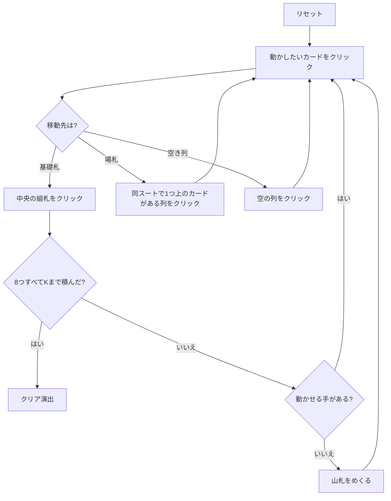

# ナポレオンズ・スクエア（Web版）遊び方

## ゲーム概要

2 デッキ 104 枚を使う大型ソリティア。中央に 8 つの基礎札（スートごとに 2 つ）、その周囲を 12 列×4 枚のタブローが正方形に囲む。残りは山札で、1 枚ずつめくって使う。

最大の特徴は**連番のまとめ移動**。同じスートで 1 つずつ下がって並んだカードは、その先頭をクリックすれば塊ごと別の列へ動かせる。長い連番をどう組んで運ぶかがそのまま勝率になる。

## 起動方法

```sh
go run ./cmd/trumpcards web  # CLI経由でWebサーバーを起動
go run ./cmd/server          # 直接Webサーバーを起動
```

ブラウザで `http://localhost:8080` にアクセスし、ナビゲーションバーから「ナポレオンズ・スクエア」を選択します。
ナビバーのJA/ENボタンで日本語・英語を切り替えられます。

## ルール

- 52 枚 2 組（104 枚）。8 枚のエースが基礎札に置かれ、48 枚が 12 列×4 枚に配られる。残り 48 枚が山札
- 基礎札は**同じスートで昇順** A→K。スートごとに 2 列あり、2 組目のエースが 2 列目を開く
- タブローは**同じスートで降順** K→A に重ねる
- 同スートで 1 つずつ下がる**連番はまとめて移動できる**
- **空いた列には任意のカード・任意の連番を置ける**
- 山札は 1 枚ずつめくる。**めくり直しはできない（1 巡のみ）**
- 8 つの基礎札すべてを K まで積み切ればクリア

## ゲームの流れ



## 画面の操作方法

| 操作 | 説明 |
|------|------|
| 山札をクリック | 1 枚めくって捨て札へ送る |
| 捨て札をクリック | 捨て札の一番上を移動元として選択する |
| 場札のカードをクリック | そのカードを移動元として選択する。**連番の途中のカードを選べば、そこから末尾までがまとめて動く** |
| 組札をクリック | 選択中のカードをその組札に置く |
| 別の列をクリック | 選択中のカード（または連番）をその列に置く |
| ドラッグ＆ドロップ | クリック 2 回と同じ移動をドラッグでも行える |
| ヒントボタン | 基礎札 → 場札 → 山札の順に手を 1 つ提示する |
| 自動完成ボタン | 基礎札へ送れる札がなくなるまで自動で送る |
| 元に戻すボタン | 直前の 1 手を取り消す |
| 手詰まり脱出ボタン | 手詰まりから抜けるのに必要な手数だけまとめて戻す |
| ギブアップ / リセットボタン | 確認ダイアログのうえで投了 / やり直す |
| CLI トグル | 同じゲームをコマンド入力で操作するモードに切り替える |

キーボードショートカット: `d` めくる / `h` ヒント / `a` 自動完成 / `z` 元に戻す / `g` ギブアップ（確認あり）。

## 画面構成

- **上部**: フェーズ表示（プレイ中 / 手詰まり / クリア）と手数
- **中央上段**: 8 つの基礎札（スート固定）と、山札・捨て札
- **中央下段**: 12 列の場札。列番号 `#0`〜`#11` はヒント表示の列番号と一致する
- **下部**: ヒント表示、アクションログ、設定、キーボードショートカット一覧

## 遊び方のコツ

- **連番を育ててから運ぶ。** 1 枚ずつ動かすと手数を無駄に消費する。同スートで繋げてから塊で移すのが基本
- 空き列は最強の資源。安易に埋めず、長い連番の一時置き場として温存する
- 山札は 1 巡しかない。めくる前に、盤面で動かせる手が本当に無いか確認する
- エースは 8 枚とも最初から場にあるので、序盤から 2 を探して基礎札を伸ばせる
- ヒントは手を 1 つ返すだけで最善手ではない。詰まったら元に戻すで分岐をやり直す
