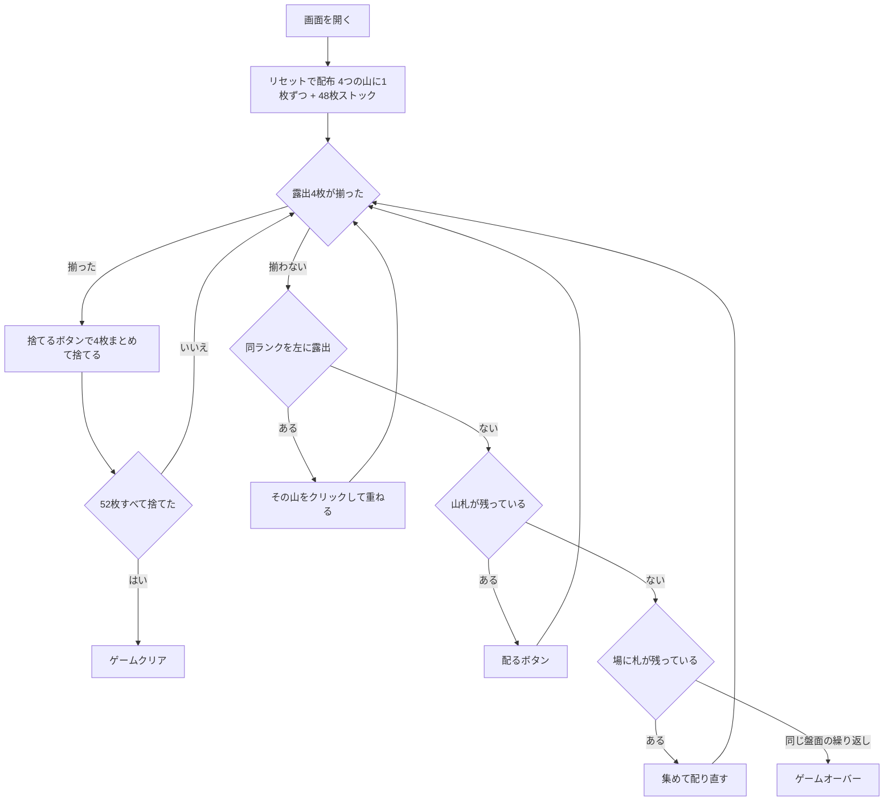

# ナルコティック（Web版）遊び方

## ゲーム概要

1人用のペア除去ソリティアです（別名 **Perpetual Motion / 永久機関**）。52枚のうち4枚を **4つの山** へ1枚ずつ配り、各山の**一番手前の札だけ**を使います。**露出している4枚のランクが揃ったら、その4枚をまとめて捨てます。**52枚すべてを捨てられればクリアです。

**山札が尽きても終わりません。**場の札を集めて何度でも配り直せます（回数無制限）。ただし集め方は決まっていて**シャッフルしない**ので、同じ盤面が戻ってきて打つ手が無ければ、そこから先は永遠に同じ繰り返しになります。そこが敗北です。

## 起動方法

```sh
go run ./cmd/trumpcards web  # CLI経由でWebサーバーを起動
go run ./cmd/server          # 直接Webサーバーを起動
```

ブラウザで `http://localhost:8080` にアクセスし、ナビゲーションバーから「ナルコティック」を選択します。
ナビバーのJA/ENボタンで日本語・英語を切り替えられます。

## ルール

### 基本ルール

- 52枚のトランプ（ジョーカーなし）を使用
- 開始時、4つの山へ1枚ずつ配る（残り48枚は山札）
- **使えるのは各山の一番手前の札だけ**。その下の札は、手前が無くなって初めて使える

### 捨てるルール

- **捨てられるのは「露出4枚のランクが全て揃ったとき」だけ**。そのときは4枚とも捨てる
- スートは見ません。4枚が同じランクでありさえすればよい
- 3枚だけ揃っても捨てられません。どれか1つの山が空でも捨てられません

### 重ねるルール

- 同じランクを露出している山があれば、**より左の山**へ重ねられます
- 行き先は「同じランクを露出している**最も左**の山」で自動的に決まります
- **左へしか動かせません。**右へも動けると同じ2枚を往復させられてしまいます
- 重ねると露出が1枚減り、下の札が出てくるので、4枚が揃う目が生まれます

### 配るルール

- 「配る」で4つの山へ1枚ずつ配ります（空の山にも配ります）

### 配り直しルール

- 山札が尽きたら「集めて配り直す」で、**一番右の山から順に左へ**重ねて集め、**シャッフルせずに**山札へ戻します
- **回数に上限はありません**

### ゲームクリア

- 52枚すべてを捨てるとクリア

### ゲームオーバー（ループ検出）

- **同じ盤面（と山札）が再び現れ、かつ打つ手が1つも無い**とき、そこで終わりです
- 配り直しがシャッフルしないので、同じ盤面からは必ず同じ展開になります。だから「繰り返しに入った」ことが確実に判定できます

## ゲームの流れ



## 画面の操作方法

| 操作 | 説明 | キーボード |
|------|------|-----------|
| 山の一番手前のカードをクリック | 左に同ランクがあれば重ねる | - |
| 捨てるボタン | 露出4枚が揃っているとき、4枚まとめて捨てる | - |
| 配るボタン | 4つの山へ1枚ずつ配る | `d` |
| 集めて配り直すボタン | 山札が尽きたとき、右から集めて配り直す | - |
| 元に戻すボタン | 直前の操作を取り消す | `z` |
| ヒントボタン | 次の一手と理由を表示 | `h` |
| ギブアップボタン | ゲームを終了する | `g` |
| リセットボタン | 新しいゲームを開始 | - |

## 画面構成

### メインエリア

- **場札（4つの山）**: 各山のカードが縦に重なって表示されます。**一番手前のカードだけ**が操作可能です
- **捨てるボタン**: 露出4枚のランクが揃ったときだけ押せます。列の指定は要りません
- **山札**: 裏向きのカードスタック。クリックで4つの山へ1枚ずつ配ります
- **捨て札 / 配り直し回数**: ヘッダーに表示されます

### フッターエリア

- **配る**: 山札から4つの山へ1枚ずつ配る
- **集めて配り直す**: 山札が尽きたときだけ押せる。上限はありません
- **元に戻す**: 直前の操作を取り消す（複数回可能）
- **ヒント**: 捨てる・重ねる・配る・配り直すのいずれかを、理由つきで提案
- **ギブアップ**: ゲームを終了する
- **リセット**: 確認ダイアログ後に新しいゲームを開始

## 遊び方のコツ

- **重ねる手は「捨てられる形」を作るための唯一の道具です。**露出が減るぶん下の札が出てくるので、揃う組み合わせが変わります
- **配り直してもカードの順序は変わりません。**「集める前にどの山をどう並べておくか」がそのまま次の展開になります。闇雲に配り直すより、重ねられる手を先に使い切るほうが盤面が動きます
- 同じ盤面が戻ってきたと感じたら、それは本当にループしています。元に戻すで別の重ね方を試すのが唯一の打開策です
- ヒントは「何をするか」と「なぜそれか」の両方を出します。詰まったら理由のほうを読むと、次に何を崩すべきか見えてきます
