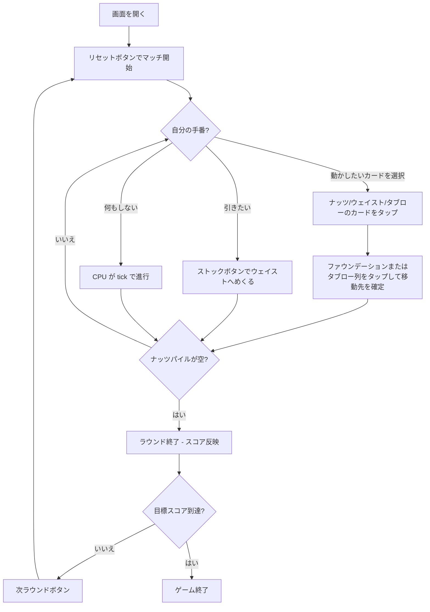

# ナーツ（Web版）遊び方

## ゲーム概要

Nertz は複数プレイヤー（既定4人）が同時並行でクロンダイク風ソリティアを進める対戦型カードゲームです。Web版では自分の盤面を画面下部に、共有ファウンデーションを中央に、CPU プレイヤーの進捗を上部に表示し、CPU は一定間隔（既定700ms）の自動ティックでリアルタイムに進行します。

## 起動方法

```sh
go run ./cmd/trumpcards web  # CLI経由でWebサーバーを起動
go run ./cmd/server          # 直接Webサーバーを起動
```

ブラウザで `http://localhost:8080` にアクセスし、ナビゲーションバーから「ナーツ / パウンス」を選択します。
ナビバーのJA/ENボタンで日本語・英語を切り替えられます。

## ルール

### 盤面と移動

- 各プレイヤー専用の52枚デッキ。盤面はナッツパイル13枚 + 4列タブロー + ストック/ウェイスト。
- タブロー: 赤黒交互で値-1。空き列には任意のカードを置けます。
- ファウンデーション: 中央に共有。Aで開始しスート固定で K まで積み上げます。

### リアルタイム進行

- 人間が手を打たない間も、CPU は内部タイマー（`tick`）で進行します。Web GUI からは追加の操作は不要で、画面下部の自分の盤面のみ操作してください。
- 人間プレイヤーは「Undo」ボタンで直前の自分の操作だけ取り消せます。

### 得点とゲーム終了

- ナッツパイルを空にしたプレイヤーが「Nertz」をコールしてラウンド終了。
- 得点: ファウンデーションへの貢献 +1 / 残ナッツ -2。累積スコアが目標値（既定100）を超えたプレイヤー勝利。

## ゲームの流れ



## 画面の操作方法

### プレイ中

1. 動かしたいカード（ナッツトップ / ウェイストトップ / タブロー任意位置）を **タップして選択**。選択中のカードは黄色で強調されます。
2. 移動先のファウンデーション、または別のタブロー列をタップすると移動が確定します。
3. 出せるカードがない／一手遅らせたいときは、ストックボタン（残数表示）をタップしてウェイストへめくります。
4. 取り消したいときはフッターの「Undo」ボタン（直前の自分の操作のみ取り消し）。

### ラウンド終了 / ゲーム終了

- ラウンド終了時はフッターに「次ラウンド」ボタンが現れます。タップで新しい手札を配り直します。
- マッチ勝者が確定するとリセットボタンのみが残ります。

### キーボードショートカット

| キー | アクション | 有効条件 |
|------|-----------|---------|

（このゲーム用のキーボードショートカットは未実装です。）

## 画面構成

```
┌──────────────────────────────────────────────┐
│ NavBar: ホーム / ゲーム選択 / JA・EN          │
├──────────────────────────────────────────────┤
│ PhaseIndicator: フェーズ / Tutorial / Manual  │
├──────────────────────────────────────────────┤
│ Round 1 / Moves 12 / 各プレイヤースコア      │
│ Message Box                                   │
│ ┌──────────────────────────────────────────┐ │
│ │ Foundations (共有: 16枠)                  │ │
│ └──────────────────────────────────────────┘ │
│ CPU 1 / CPU 2 / CPU 3 サマリ                 │
│ ┌──────────────────────────────────────────┐ │
│ │ あなたの盤面                              │ │
│ │  ナッツ / ウェイスト / ストック           │ │
│ │  タブロー (4列)                           │ │
│ └──────────────────────────────────────────┘ │
│ Action Log (ラウンド終了後に開く)             │
├──────────────────────────────────────────────┤
│ Footer: Reset / Next Round / Undo            │
└──────────────────────────────────────────────┘
```

## 遊び方のコツ

- 中央のファウンデーションは早い者勝ち。CPU が次に置きそうなスート / 値を予想して、自分の番で先に置くと得点を伸ばせます。
- ナッツパイルのトップを最優先で処理。タブローを介して下のカードを表に出す動きが基本です。
- 余裕があるときに `Undo` を試して最善手を考え直してOK。CPU は tick で淡々と進むので、慌てて操作するよりは正確さ重視です。
- 目標スコアを75〜150あたりで調整すると1ゲームの長さを好みに合わせられます。
