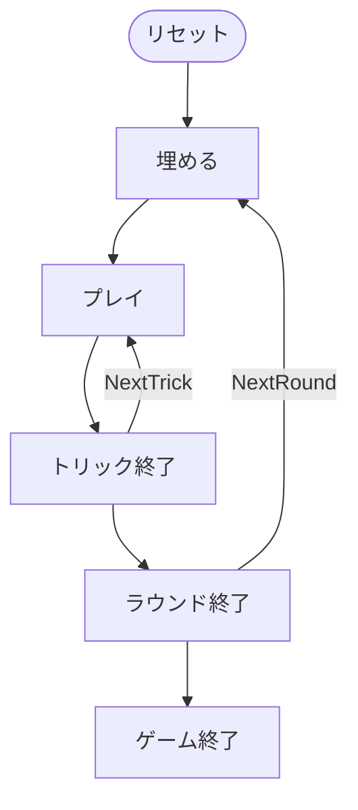

# ナインティナイン（Web版）遊び方

## ゲーム概要

3人（プレイヤー1人 + CPU 2人）で遊ぶトリックテイキング型カードゲームです。36枚のデッキを使い、各ディール開始時に手札12枚から3枚を「埋める（ビッド）」ことで、埋めたカードのスート合計（♦=0 / ♠=1 / ♥=2 / ♣=3）が宣言ビッド（0〜9）になります。埋めた後は手札9枚で9トリックを戦い、宣言したトリック数をちょうど獲得できれば得点が入ります。先に目標スコア（100点）に到達したプレイヤーが勝者です。

## 起動方法

```sh
go run ./cmd/trumpcards web  # CLI経由でWebサーバーを起動
go run ./cmd/server          # 直接Webサーバーを起動
```

ブラウザで `http://localhost:8080` にアクセスし、ナビゲーションバーから「ナインティナイン」を選択します。

## ルール

### 基本ルール

- 36枚のデッキを3人に配布（各12枚）
- 切り札スートはディール番号で固定ローテーション（♠→♥→♣→♦）
- ビッドフェーズ: 手札から正確に3枚を選んで埋める。埋めた3枚のスート合計が宣言ビッド（0〜9）
- 埋めた後、手札は9枚になり9トリックを戦う（フォロースート必須）
- トリックの勝者: 切り札が出ていれば最高の切り札、なければリードスートの最高値

### 得点

- **ビッド成功（ちょうど獲得）**: 10 + ビッド数 + ボーナス
  - 単独成功: +30 / 2人成功: +20 / 3人全員成功: +10
- 先に目標スコア（100点）へ到達したプレイヤーが勝利

### CPU難易度

- **Easy**: ランダム
- **Normal**: 基本戦略（デフォルト）
- **Hard**: 戦略的なプレイ

## ゲームの流れ

ゲームの進行は `internal/domain/NinetyNine.go` のフェーズ機械そのものです。各ノードは同ファイルの `NinetyNinePhase` 定数、矢印ラベルはその遷移を行うメソッド名です。



## 画面の操作方法

### ビッド（埋める）フェーズ

1. 手札から埋める3枚をクリックして選択します
2. **「埋める」** ボタンで確定します（選択は正確に3枚）

### カードのプレイ（プレイフェーズ）

1. 手札のカードをクリックして選択します
2. **「カードを出す」** ボタンで場に出します

### ヒント

- 各フェーズで **「ヒント」** ボタンを押すと推奨が表示されます

### トリック・ラウンドの進行

- トリック完了後 **「次のトリック」**、ラウンド完了後 **「次のラウンド」** で進みます

## 遊び方のコツ

- 埋める3枚で宣言ビッドが決まるため、取れそうなトリック数に合わせてスート合計を調整しましょう
- 切り札スートはディールごとに変わるので確認してから埋めましょう
- ちょうど宣言数を取ることが高得点の鍵です
