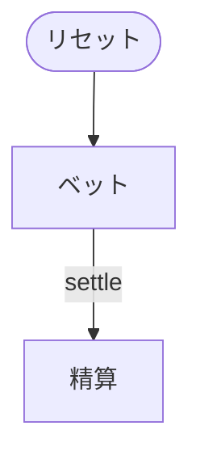

# 闘牛（Web版）遊び方

## ゲーム概要

52 枚 1 組の中国のギャンブルゲーム。人間 1 人 + CPU 3 人（うち 1 席が親）に **5 枚ずつ**配り、それぞれが親と 1 対 1 で勝負します。**手番の選択肢はなく**、賭けた時点で結果まで確定します。

## 起動方法

```sh
go run ./cmd/trumpcards web  # CLI経由でWebサーバーを起動
go run ./cmd/server          # 直接Webサーバーを起動
```

ブラウザで `http://localhost:8080` にアクセスし、ナビゲーションバーから「闘牛」を選択します。
ナビバーのJA/ENボタンで日本語・英語を切り替えられます。

## ルール

- 5 枚のうち **3 枚の合計が 10 の倍数**になれば「牛あり」。**残り 2 枚の下 1 桁**が役
- 下 1 桁 **0 = 牛牛**（最強）、1〜9 = 牛1〜牛9、作れなければ **無牛**（最弱）
- 点数は A = 1、2〜10 は額面、**絵札は 10**
- **同点は最高ランクの札**（K > Q > J > 10 > … > **A が最弱**）→ **スート**（♠ > ♥ > ♣ > ♦）
- 配当は **牛牛 3 倍 / 牛7〜9 2 倍 / それ以外 等倍**。**勝った側の役の倍率**が適用される

## ゲームの流れ

ゲームの進行は `internal/domain/NiuNiu.go` のフェーズ機械そのものです。各ノードは同ファイルの `NiuNiuPhase` 定数、矢印ラベルはその遷移を行うメソッド名です。



## 画面の操作方法

| 操作 | 説明 |
|------|------|
| 賭け金ボタン | 額を選んでベットし、配って精算まで一気に進む |
| 次の局へ | 精算後に次の局を始める |
| CLI トグル | 同じゲームをコマンド入力で操作するモードに切り替える |

## 画面構成

- **上部**: フェーズ、チップ残高
- **中央上段**: 親の手（局が終わるまで伏せ札。**サーバーが中身を送らない**）
- **中央**: 各席の手。**牛を作った 3 枚が強調表示**され、役名と倍率が併記される
- **下部**: 賭け金ボタン、結果表示、アクションログ

## 遊び方のコツ

- **絵札と 10 は同じ 10 点**。絵札が多い手は牛が付きやすい
- **牛7 以上で倍率が付く**ので、同じ「牛あり」でも価値が大きく違う
- 選択の余地がないゲームなので、賭け金の管理がすべて
