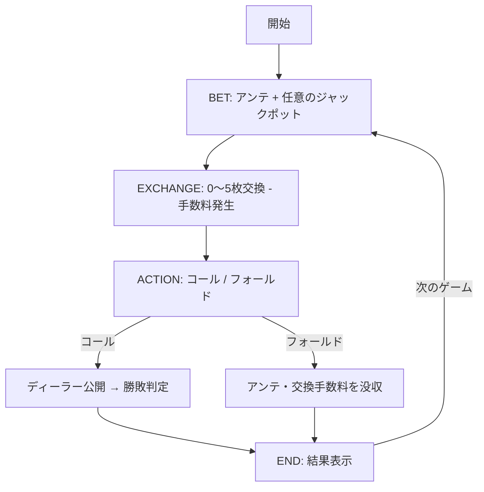
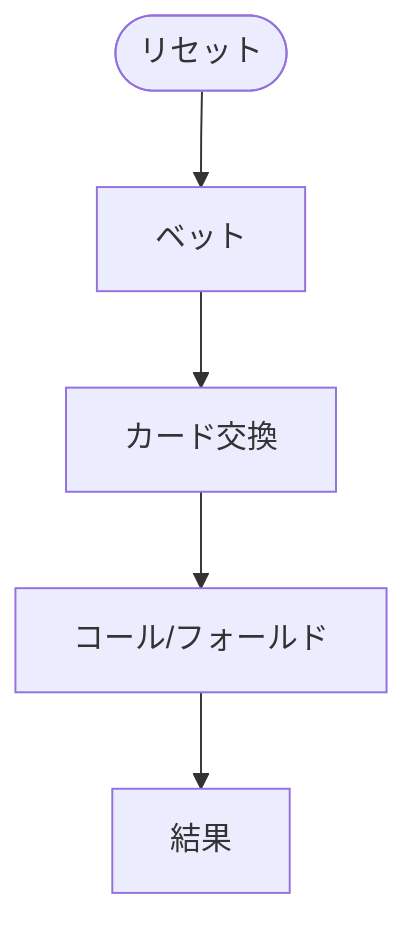

# オアシスポーカー（Web版）遊び方

## ゲーム概要

カリビアンスタッドポーカーの派生で、ベットとコール/フォールドの間に **手札交換フェーズ** が追加されたカジノポーカーです。アンテと同額の手数料を 1 枚ごとに支払うことで、最大 5 枚まで手札を交換して役を作り直せます。

## 起動方法

```sh
go run ./cmd/trumpcards web   # CLI 経由で Web サーバーを起動
go run ./cmd/server           # 直接 Web サーバーを起動
```

ブラウザで `http://localhost:8080` にアクセスし、ナビゲーションから「オアシスポーカー」を選択します。

## ルール

### 基本ルール

- 52 枚のトランプ（ジョーカーなし）を使用
- プレイヤーとディーラーにそれぞれ 5 枚ずつ配る
- アンテベット後、手札を 1〜5 枚交換できる（または交換しない）
- 交換手数料は **アンテ × 交換枚数**
- 交換完了後、コール（プレイ）またはフォールドを選択
- ディーラーは「A と K を含む」または「ペア以上」でクオリファイ

### 操作

| フェーズ | 操作 |
|----------|------|
| ベット | アンテとオプションのジャックポットを入力し「ベット」ボタン |
| 交換 | 交換したいカードをタップで選択し「交換」または「ステイ」 |
| コール / フォールド | 「コール」または「フォールド」を選択 |
| 結果 | 「次のゲーム」で次の手へ |

### 手札ランキング（強い順）

| ランク | 説明 |
|--------|------|
| ロイヤルフラッシュ | 同じスートの A-K-Q-J-10 |
| ストレートフラッシュ | 同じスートの連続 5 枚 |
| フォーカード | 同じランク 4 枚 |
| フルハウス | スリーカード + ペア |
| フラッシュ | 同じスートの 5 枚 |
| ストレート | 連続する 5 枚 |
| スリーカード | 同じランク 3 枚 |
| ツーペア | ペア 2 組 |
| ワンペア | 同じランク 2 枚 |
| ハイカード | 上記以外 |

### 配当

**プレイ配当倍率（プレイヤー勝ち時、ディーラー資格あり）:**

| 役 | 倍率 |
|----|------|
| ロイヤルフラッシュ | 100:1 |
| ストレートフラッシュ | 50:1 |
| フォーカード | 20:1 |
| フルハウス | 7:1 |
| フラッシュ | 5:1 |
| ストレート | 4:1 |
| スリーカード | 3:1 |
| ツーペア | 2:1 |
| ペア以下 | 1:1 |

**ジャックポット（サイドベット）:** カリビアンスタッドと同一倍率（ロイヤルフラッシュ 20000x ほか）。プレイヤーの最終ハンドのみで判定され、フォールドしても評価されます。

### フェーズ遷移



## ゲームの流れ

ゲームの進行は `internal/domain/OasisPoker.go` のフェーズ機械そのものです。各ノードは同ファイルの `OasisPokerPhase` 定数、矢印ラベルはその遷移を行うメソッド名です。



## 画面の操作方法

フェーズごとに押せるボタンが切り替わります。

### ベットフェーズ（`BET`）

1. ベット入力にチップ額を入れ、アンティを置きます。
2. 置いた時点でカードが配られ、`EXCHANGE` フェーズへ進みます。

### 交換フェーズ（`EXCHANGE`）

1. ディーラーの**表向き1枚**を見て、勝負を続けるか判断します。
2. 交換したい手札をクリックして選び、「交換」を押します（追加のチップが必要です）。
3. 交換しない場合はそのまま「コール」を押します。
4. 勝ち目がないと判断したら「フォールド」でアンティを捨てて降ります。

### 結果

役が比較され、チップが精算されます。「リセット」で次のハンドを始めます。

## 画面構成

上から順に、ページのコンポーネント構成そのままの並びです。

```
┌──────────────────────────────────────────────────┐
│  オアシスポーカー                                │
│  チップ: 900   フェーズ: EXCHANGE                │
├──────────────────────────────────────────────────┤
│  ディーラー                                      │
│  [♠4][??][??][??][??]   ← 1枚だけ表向き          │
├──────────────────────────────────────────────────┤
│  あなた                                          │
│  [♦A][♣K][♥4][♠10][♠3]                           │
├──────────────────────────────────────────────────┤
│  ベット入力（チップ額）                          │
├──────────────────────────────────────────────────┤
│  メッセージ / ヒント / 設定 / 棋譜               │
├──────────────────────────────────────────────────┤
│  [交換] [コール] [フォールド] [リセット]         │
└──────────────────────────────────────────────────┘
```

- **チップ / フェーズ**: 持ちチップと現在のフェーズ（`BET` → `EXCHANGE` → 勝負）
- **ディーラー**: **1枚だけ表向き**で残りは伏せ札。この1枚を見て降りるか続けるかを決めるのがこのゲームの要です
- **あなたの手札**: 5枚。交換フェーズでは交換したい札を選びます
- **ベット入力**: `ChipBetInput` で額を指定してアンティを置きます
- **メッセージ / ヒント**: 直前の操作の結果と、ヒントボタンを押したときの推奨手
- **設定 / 棋譜**: 難易度などの設定と、これまでの手の履歴（折りたたみ式）
- **リセット**: 新しいゲームを開始します
- **CLIモード切替**: 画面右上のトグルで、CUI 版と同じテキスト表示に切り替えられます
